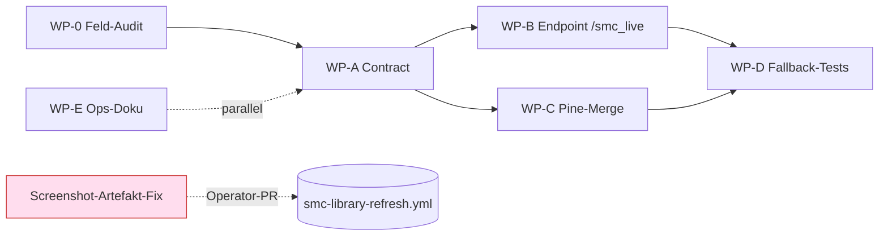

# Umsetzungsplan — Live-Overlay Phase 1 (parallel zum Daily-Run)

> **Quelle:** abgeleitet aus `docs/AGENT_HANDOVER_news_overlay_2026-06-06.md` und der
> Strategie `docs/live_overlay_request_get_strategy_2026-06-04.md`.
> **Erstellt:** 2026-06-06 · **Status:** Plan (noch keine Implementierung)
> **Leitprinzip:** Jedes Arbeitspaket ist **additiv** und läuft auf einem **eigenen Branch**,
> sodass es **parallel** zum täglichen Library-Refresh abgearbeitet werden kann, ohne den
> Produktiv-/Publish-Pfad anzufassen.

---

## 1. Ziel & Architektur-Erinnerung

**Modell: Slow Baseline + Fast Overlay.**

- **Slow Baseline (bestehend, unangetastet):** `scripts/generate_smc_micro_base_from_databento.py`
  erzeugt 2×/Tag `pine/generated/smc_micro_profiles_generated.{pine,json}`. Die gebackenen
  `mp.*`-Konstanten sind und bleiben der **sichere Fallback**.
- **Fast Overlay (neu, Phase 1):** Ein zusätzlicher Endpoint `GET /smc_live` liefert ein
  **flaches JSON** mit denselben Feldern, aber frischer (~5 min). Das Pine-Skript
  `SMC_TV_Bridge.pine` zieht es per `request.get()` (Premium-only) und **überschreibt
  feldweise** den gebackenen Wert — nur wenn frisch und vorhanden.

**Kerninvariante:** Overlay darf nur *ergänzen/verschärfen*, nie *lockern*. Bei Stale/Down
fällt Pine still auf `mp.*` zurück. Kein Premium ⇒ unverändert Baseline.

---

## 2. Parallel-Sicherheit — was NICHT angefasst wird

Damit die Arbeit gefahrlos neben dem Daily-Run läuft, gilt für **alle** WP:

| Tabu (nicht editieren) | Grund |
|---|---|
| `.github/workflows/smc-library-refresh.yml` (2×/Tag 16:00/20:00 UTC) | Live-Publish-Pfad; ändert Cron-/Handoff-Semantik. Pin `test_workflow_databento_handoff_timeouts`. |
| `.github/workflows/smc-databento-production-export-sharded.yml` | Kanonischer Producer-Cron. |
| `.github/workflows/adr0023-magnitude-shadow-daily.yml` | ADR-0023 Daily-Scheduler. |
| `scripts/generate_smc_micro_base_from_databento.py` (Publish-/Bake-Logik) | Slow-Baseline-Producer; Read-only referenzieren erlaubt, **nicht** mutieren. |
| `pine/generated/smc_micro_profiles_generated.{pine,json}` | Generierte Artefakte; werden vom Cron committet (Merge-Konflikt-Gefahr). |

**Erlaubt (additiv):** `smc_tv_bridge/**` (Endpoint), `SMC_TV_Bridge.pine` (nur der Bridge,
nicht die Core-Libraries), neue `tests/**`, neue `docs/**`, neue `spec/**`-Schemas.

Jeder WP-Branch folgt `concern(scope): subject`, ist Single-Concern, und durchläuft vor jedem
Push die 7 Pin-/Drift-Guards (85 Tests). **Nie `git add -A`** (untracked `synthetic/`,
`artifacts/databento_reference_cache/` in Ruhe lassen).

---

## 3. Arbeitspakete (WP-0 … WP-E)

### WP-0 — Feld-Quellen-Audit *(Vorbedingung, kein Code)*
- **Ziel:** Für jedes Phase-1-Feld die produzierende Python-Funktion + Artefakt festhalten.
  Grundlage steht schon: der JSON-Sidecar `smc_micro_profiles_generated.json` listet
  `enrichment_blocks` (`flow_qualifier`, `news`, `event_risk`, `compression_regime`,
  `layering`, `regime`, `session_context`, `signal_quality`, …). Schema:
  `spec/smc_microstructure_profile.schema.json` (v3.0.0).
- **Entscheidung je Feld:** *frisch on-demand* (News über `smc_integration/sources/live_news_snapshot_json.py`, 5 min)
  vs. *baked-frisch* (nur so frisch wie 2×/Tag — dann kein Overlay-Mehrwert, bewusst zurückstellen).
- **Ergebnis:** Tabelle Feld → Block → Producer → Frische-Klasse → Phase-1-B1/B2.
- **Parallel-safe:** ja (nur Lesen/Doku). **Liefert:** `docs/live_overlay_field_source_map.md`.
- **Abhängigkeit:** keine — **zuerst**.

### WP-A — JSON-Contract „smc-live-overlay/1"
- **Ziel:** Flaches, versioniertes Vertragsschema (Pine `f_getField` kann nur flache
  `"key":value`-Paare). Felder: `schema`, `symbol`, `tf`, `asof_ts`, `stale`, plus flache
  Daten-Keys im Stil `flow_rel_vol`, `squeeze_on`, `vix_level`, `news_bearish_count`, …
- **Dateien:** `spec/smc_live_overlay.schema.json` (neu), Pydantic-Modell + Golden-Sample
  in `smc_tv_bridge/contracts/` (neu), Contract-Test `tests/test_smc_live_overlay_contract.py`.
- **CI-Gate:** reiner Python-/JSON-Schema-Test → läuft ohne Live-TV/Keys. **Parallel-safe:** ja.
- **Abhängigkeit:** WP-0 (Feldnamen). Blockt WP-B + WP-C.

### WP-B — Endpoint `GET /smc_live` *(bestehenden Service erweitern!)*
- **Ziel:** In `smc_tv_bridge/smc_api.py` einen Endpoint ergänzen (Muster wie das bestehende
  `/smc_tv`, das bereits zu flachen Pine-Keys serialisiert). Liest Snapshot/Meta über die
  vorhandene `load_raw_meta_input`-Kette, mappt auf das WP-A-Schema, setzt `asof_ts = int(time.time())`
  und `stale = (now - asof) > MAX_AGE`.
- **Split:**
  - **B1:** Felder, die *heute* frisch verfügbar sind (News via 5-min-Snapshot, `SQUEEZE_ON`,
    `rel_vol`). → echter Mehrwert sofort.
  - **B2:** Felder, die einen On-Demand-Enrichment-Hook brauchen (VIX, Flow-Delta, ATS, Heat).
    Bis dahin entweder weglassen (Pine fällt feldweise auf `mp.*`) oder baked-frisch markieren.
- **CI-Safe-Test:** `SMC_USE_MOCK=1` nutzt den vorhandenen `_mock_snapshot()`-Pfad ⇒ keine
  FMP/Databento-Keys nötig. Tests: `tests/test_smc_live_overlay_endpoint.py` (Mock-Snapshot →
  Contract-konform; Off-Universe → leeres, valides Contract; Stale-Flag-Logik).
- **Parallel-safe:** ja (nur neue Route + Tests, kein Publish-Pfad). **Abhängigkeit:** WP-A (→ WP-0).

### WP-C — Pine-Overlay-Merge in `SMC_TV_Bridge.pine`
- **Ziel:** Den auskommentierten `request.get()`-Pfad hinter `i_enabled` (default false)
  aktivieren; `OVERLAY_MAX_AGE_SEC` + Frische-Check (`timenow/1000 - asof_ts < MAX_AGE`);
  pro Feld Resolver `resolved = (overlay_fresh and has_field) ? overlay : mp.<baked>`.
  `f_getField`-Keys exakt auf das flache WP-A-Schema ausrichten.
- **Wichtig:** Nur die **Bridge** anfassen, nicht die Core-Libraries. **Event-Risk-Felder noch
  NICHT** verdrahten (Phase 2, Escalation-only).
- **CI-Gate:** `npm run tv:test` / `tsc:check` bleiben grün (aktuell 116/116). **Parallel-safe:** ja.
- **Abhängigkeit:** WP-A (Keys). Idealerweise nach WP-B (gegen echten Endpoint testbar).

### WP-D — Fallback- & Safety-Nachweis
- **Ziel:** Belegen, dass Endpoint-Down/Stale ⇒ Pine nutzt `mp.*` (kein Clear durch Lücke).
  Simulation per Mock; Mini-Tabelle „Szenario → erwartetes Verhalten". Kurzdoku in der Bridge.
- **CI-Gate:** Python-Mock-Test + Pine-Lint. **Parallel-safe:** ja.
- **Abhängigkeit:** WP-B + WP-C.

### WP-E — Ops/Host-Notizen + bekannter Workflow-Gap *(Phase-3-Seed, teils NICHT parallel-safe)*
- **Ziel (parallel-safe):** Doku zu Hosting/Cache/CDN/Monitoring des Endpoints (`docs/live_overlay_ops.md`).
- **Ziel (NICHT parallel-safe → Operator-Review):** Der Handover nennt eine Lücke — die
  `*-error.png`-Screenshots des TV-Preflights werden in `smc-library-refresh.yml` **nicht** als
  CI-Artefakt hochgeladen. Fix ist klein, **berührt aber den Daily-Workflow** ⇒ **separater PR,
  bewusst außerhalb dieses Parallel-Plans**, mit Operator-Freigabe.
- **Abhängigkeit:** keine (Doku) / Operator (Workflow-Edit).

---

## 4. Abhängigkeits- & Parallelitäts-Graph

- **Sofort parallel startbar:** WP-0, WP-A, WP-E-Doku.
- **Danach parallel:** WP-B und WP-C (beide nur von WP-A abhängig).
- **Zuletzt:** WP-D (Integration). **Außerhalb:** Screenshot-Fix (Operator).

---

## 5. Branches & CI-Gate je WP

| WP | Branch (`concern(scope): subject`) | Primäres CI-Gate | Parallel-safe |
|----|-----------------------------------|------------------|:---:|
| WP-0 | `docs/live-overlay-field-source-map` | Doku (kein Code-Gate) | ✅ |
| WP-A | `feat/smc-live-overlay-contract` | `pytest` Contract + JSON-Schema | ✅ |
| WP-B | `feat/smc-live-overlay-endpoint` | `pytest` (`SMC_USE_MOCK=1`) + Pin-Guards | ✅ |
| WP-C | `feat/tv-bridge-overlay-merge` | `npm run tv:test` / `tsc:check` | ✅ |
| WP-D | `test/smc-live-overlay-fallback` | `pytest` + Pine-Lint | ✅ |
| WP-E | `docs/live-overlay-ops` | Doku | ✅ |
| (Gap) | `ci/library-refresh-error-screenshots` | Workflow-Smoke | ❌ Operator |

---

## 6. Offene Fragen (vor B2/C final klären)

1. **Feld-Frische (WP-0):** Welche Phase-1-Felder außer News sind *on-demand* frisch
   beschaffbar, welche nur baked-frisch? Entscheidet B1 vs. B2.
2. **Flatten-Konvention (WP-A):** Verbindliche Key-Namen + Typen (Pine kennt nur string/float
   über `f_getField`). Booleans als `0/1`? Tickerlisten als CSV-String?
3. **`MAX_AGE`-Schwelle (WP-C):** Konkreter Sekundenwert für „frisch" (Vorschlag aus Strategie übernehmen).
4. **Hosting (WP-E):** Wo läuft `/smc_live` produktiv, mit welchem Cache vor `request.get()`?

---

## 7. Definition of Done (Phase 1)

- `GET /smc_live?symbol=&tf=` liefert Contract-valides, flaches JSON; `stale` korrekt; Off-Universe
  sauber; Mock-Pfad CI-grün ohne Keys.
- `SMC_TV_Bridge.pine` überschreibt feldweise nur bei frischem Overlay, sonst `mp.*`; `tv:test` grün.
- Nachgewiesener Fallback bei Down/Stale (WP-D).
- Kein Edit an Daily-Workflows/Generator/generierten Artefakten; alle Pin-Guards grün.
- Event-Risk bleibt Phase 2 (Escalation-only) — hier bewusst nicht verdrahtet.
