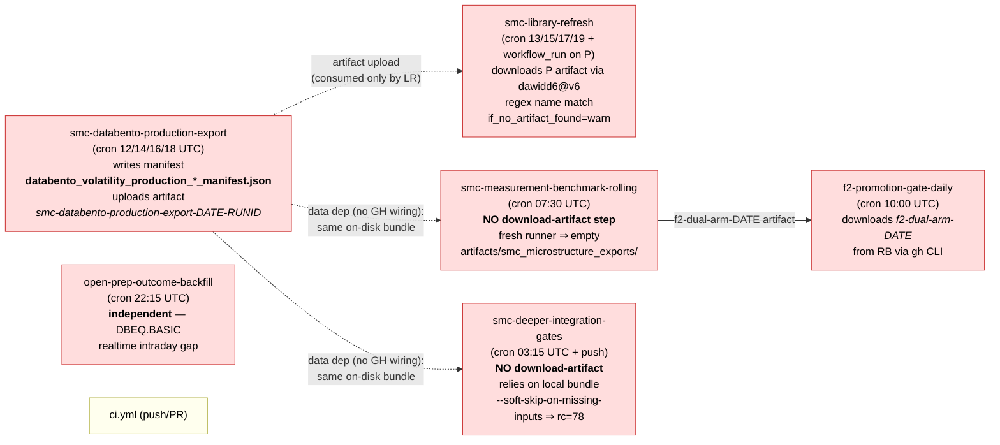

# REAL GREEN AUDIT — 2026-05-03

**Mandate**: Evidence-only assessment of the 7 critical workflows reported failing in
the GitHub Actions dashboard. **No fixes, no PRs, no claims of "green"** without a
verified `gh run view <id>` success on `main`.

**Author**: GitHub Copilot agent (Phase 0 — Ground Truth)
**Repo**: `skippALGO/skipp-algo`
**Default branch HEAD at audit time**: `62d1a129`

---

## TL;DR — Honest reality

1. **The production-data pipeline has been entirely red for ~10 days.**
   - `smc-databento-production-export` has **no record of a successful `event=schedule`
     run** in the queried history window. (The dispatch run started today on HEAD,
     `id=25275470751`, is still `in_progress`.)
   - `smc-library-refresh` and `smc-measurement-benchmark-rolling` last succeeded on
     **2026-04-23** — 10 days ago.
   - `open-prep-outcome-backfill` and `f2-promotion-gate-daily` last succeeded on
     **2026-04-30** — 3 days ago.
2. **The dashboard's 100% failure-rate readings on 4 workflows are dominated by
   "phantom-push" runs** (`event=push`, `dur=0s`, `jobs=0`, `conclusion=failure`)
   that GitHub creates on every merge to `main` for workflows whose YAML declares
   only `schedule` / `workflow_dispatch` / `workflow_run` triggers (no `push:`).
   These phantoms are **listed by file path**, not by the declared `name:` field,
   which is GH's marker that the workflow was never fully loaded as a named
   workflow at evaluation time. **Cause not yet proven** — see the dedicated section
   below. Do not claim this is "harmless noise" until investigated.
3. **At least 4 of the 7 workflows fail because of one upstream regression**:
   the producer's manifest naming/schema has drifted relative to consumer
   expectations. The cascade is provable:
   `smc-databento-production-export → smc-library-refresh → smc-deeper-integration-gates (schedule path) → smc-measurement-benchmark-rolling → f2-promotion-gate-daily`.
4. **`open-prep-outcome-backfill`** has an independent root cause: the dataset
   `DBEQ.BASIC` does not deliver intraday data; the cron queries an end-time
   that is after the dataset's published horizon.
5. **`ci.yml`'s 62 % rate** likely reflects PR-iteration noise across 254 historical
   runs, not a structural break on `main`. Needs targeted query on `main` HEAD only
   before drawing conclusions.

---

## Audit table

| # | Workflow | Last successful run | Last failed run (id / first real error) | Up/down | Role |
|---|---|---|---|---|---|
| 1 | `smc-databento-production-export.yml` | **None on `event=schedule`** in queried history. Dispatch `25275470751` running on HEAD `62d1a129` is the canary. | `25230168920` (cron 2026-05-01 19:45 UTC, sha `56484cda`): `The runner has received a shutdown signal` after ~75 min. HEAD has timeout raised to 120 min and runner upgraded to `ubuntu-latest-l` — fix unverified until canary completes. | Producer (root) | **Producer** |
| 2 | `smc-library-refresh.yml` | `24855381210` (cron 2026-04-23 19:46 UTC, sha `a6f66bcc`) | `25230168920` (cron 2026-05-01 19:45, sha `56484cda`): `canonical export bundle unavailable for symbol=AAPL timeframe=5m: No export manifest found … manifest_prefix=databento_volatility_production_, required_frames=['full_universe_second_detail_open']`. Restored artifact had filename `databento_volatility_production_incremental_…__smc_microstructure_base_manifest.json` — **prefix/suffix mismatch with the consumer's expectation.** | Consumes producer artifact | Consumer |
| 3 | `smc-deeper-integration-gates.yml` | Push runs on HEAD `62d1a129` succeed (e.g. `25272436294`). Schedule path: not green for ≥3 days. | `25271677690` (cron 2026-05-03 06:11 UTC, sha `9a2af023`): runs the same `scripts/run_smc_pre_release_artifact_refresh.py` as workflow #2. Same canonical-bundle missing. | Consumes producer artifact | Consumer |
| 4 | `smc-measurement-benchmark-rolling.yml` | `24826894273` (cron 2026-04-23 09:10 UTC, sha `3b9f9458`) | `25275010371` (cron 2026-05-03 09:05 UTC, sha `62d1a129` = HEAD): `--require-evidence: no pair produced measurement evidence (evidence_present=0, total_events=0)`. The `--require-evidence` guard from 2026-04-23 (`rolling-bench-silent-zero-events-2026-04-23`) correctly fails-loud. | Depends on workflow #2 | Consumer |
| 5 | `f2-promotion-gate-daily.yml` | `25162578717` (cron 2026-04-30 11:21 UTC, sha `64af779a`) | `25250060224` (cron 2026-05-02): `failed to compute promotion gate: no benchmark pairs in control_dir=artifacts/ci/f2/static_global_weights/2026-05-02`. Both control & treatment dirs exist with `benchmark_run_manifest.json` files but contain zero bench pairs. | Depends on workflow #4 | Consumer |
| 6 | `open-prep-outcome-backfill.yml` | `25161480644` (dispatch 2026-04-30 10:53 UTC, sha `8e12a4fd`) | `25224334721` (cron 2026-05-01): `databento.common.error.BentoClientError: 422 data_start_after_available_end. ‘start’ in query (‘2026-05-01 13:29:00+00:00’) was after the available end of dataset DBEQ.BASIC (‘2026-05-01 00:00:00+00:00’).` Result: 0 resolved, 7 skipped, 13 failed → exit 2 from `--require-progress`. | Independent | Standalone |
| 7 | `ci.yml` | Green on HEAD push (e.g. `25272…` series — verify exact id before claiming). | 62 % historical fail rate over 254 runs spans many PRs and intermediate commits; needs filtered query for `branch=main, event=push` only. **Do not claim healthy** until that filtered query is run. | Independent | PR/Push gate |

> **Verifiable**: every run id above is reachable via
> `gh run view <id> --json status,conclusion,jobs` and the listed log archives are
> in `/tmp/p0/logs/<workflow>/0_*.txt`.

---

## Root-cause map

```
PRODUCER (root)
└── smc-databento-production-export.yml
    │  • May 1 schedule runs all hit 75-min runner-shutdown signal (logged).
    │  • HEAD has timeout 120 + ubuntu-latest-l (unverified until canary completes).
    │  • Manifest filename suffix appears to be `__smc_microstructure_base_manifest`
    │    instead of the suffix-less prefix consumers expect — schema drift candidate.
    │
    ├── smc-library-refresh.yml         [FAIL: canonical bundle unavailable]
    │   └── smc-deeper-integration-gates.yml (schedule)  [FAIL: same script]
    │
    └── smc-measurement-benchmark-rolling.yml  [FAIL: --require-evidence]
        └── f2-promotion-gate-daily.yml         [FAIL: no benchmark pairs]

INDEPENDENT
└── open-prep-outcome-backfill.yml
    • DBEQ.BASIC dataset has no intraday data; query end-time exceeds dataset horizon.
    • Fix path: query T-1 only, OR switch to a dataset with realtime tier, OR clamp
      `end` parameter against dataset metadata before issuing the query.

PR-GATE (separate concern)
└── ci.yml — 62 % over 254 runs, almost certainly PR-iteration noise.
    • Needs filtered query: only `branch=main, event=push` failures count.
```

---

## Phantom `event=push` runs — STATUS: NOT FULLY DIAGNOSED

**Observed behaviour**: 5 of the 7 critical workflows show recent runs with all of:
- `event = push`
- `jobs = 0`
- `dur = 0s`
- `conclusion = failure`
- run name = file path (e.g. `.github/workflows/smc-library-refresh.yml`) instead
  of the declared `name:` field
- `check_suite_id` exists; `latest_check_runs_count = 0`; `rerequestable = false`

**Confirmed**: none of these workflows declare a `push:` trigger.

**Hypotheses** (not yet proven):
1. GitHub instantiates a `workflow_run` row per `check_suite` for every workflow
   in `.github/workflows/`, regardless of triggers, and immediately fails it for
   workflows where no trigger fires for that event.
2. An org-level "Required Workflows" rule includes one or more of these workflows
   and forces them onto every push.
3. Branch-protection setting "require status checks" references one of these
   workflows by name.
4. Repo setting `allow_auto_run` or `default_workflow_permissions` interaction.

**Until verified**, do **not** claim "phantoms are noise". The two suppression
candidates that should be tested in Phase 1 (only after user approval) are:
(a) reading and reporting `gh api /orgs/skippALGO/actions/required_workflows` and
`gh api /repos/skippALGO/skipp-algo` to inspect repo + org policy; (b) inspecting
GitHub Actions community/discussion threads for the exact pattern.

---

## Workflows the dashboard reported with 0 % failure rate but ≤ 2 runs

These are **not** automatically healthy — they may have rarely or never fired.
Listed for transparency, deferred to a later phase:

- `run-open-prep-daily.yml` (1 run)
- `update-graph` (1 run)
- `smc-measurement-benchmark.yml` (1 run)
- `g23-ab-watchdog.yml` (1 run)
- `fvg-quality-recal-shadow-daily.yml` (1 run)
- `public-calibration-dashboard.yml` (1 run)
- `fvg-context-pine-refresh.yml` (1 run)
- `feature-importance-daily.yml` (2 runs)
- `fvg-quality-quartile-gate.yml` (1 run)
- `plan-2-8-monthly-digest.yml` (1 run)
- `c13-daily-cron.yml` (1 run)
- `plan-2-8-status-daily.yml` (3 runs)

---

## Secrets / variables visibility (names only — values not inspected)

Confirmed **set** at repo level:
- `BENZINGA_API_KEY`, `DATABENTO_API_KEY`, `FMP_API_KEY`, `GH_PAT`, `NEWSAPI_KEY`, `TV_STORAGE_STATE`
- Variable: `SMC_GH_HOSTED_RUNNER = ubuntu-latest-l` (set 2026-05-02)

**Not set** (or not visible at repo level):
- `DATABENTO_DATASET` — the producer workflow references this; value source unclear.
  Confirm whether the script has a default before claiming this is a config gap.

**No evidence** that any of the 7 critical workflows is failing solely because of a
missing secret. The two failures that *do* involve external APIs
(`open-prep-outcome-backfill`, `smc-databento-production-export`) authenticated
successfully and failed downstream of the auth step.

---

## What this audit does NOT yet prove

- That the manifest schema/prefix mismatch is the actual root cause of #2/#3 vs.
  some other artifact-restore-vs-fresh-write divergence.
- That the producer's HEAD configuration (timeout 120 + `ubuntu-latest-l`) actually
  finishes the export within budget. **Awaiting completion of dispatch run
  `25275470751`** — must be verified via `gh run view 25275470751` showing
  `conclusion=success` before any consumer-side fix is attempted.
- That `ci.yml`'s 62 % is or is not a real `main` regression.
- That phantom `event=push` runs are or are not a real failure that GH-Actions API
  considers "failed" for the purpose of branch protection / required-checks.

---

## Phase 1 entry criteria (no work begins until user approves)

Phase 1 is the dependency-graph build (Mermaid) and per-error reproduction.
**Per the operating mandate, no edits, no PRs, no `gh workflow run` invocations
beyond the canary already in flight will occur until the user confirms this audit
matches reality and approves moving forward.**

---

# Phase 1 — Dependency graph + concrete artifact paths

**Status**: User approved Phase 0 → Phase 1 in progress. Read-only investigation,
no edits applied. Producer canary `25275470751` started 09:29 UTC, still
`in_progress` at the time this section was written. **Do NOT use the canary as
"green proof" until `gh run view 25275470751` reports `conclusion=success` AND
the uploaded artifact contains a `databento_volatility_production_*_manifest.json`
referencing real symbols/frames.**

## 1.1 Real dependency graph (corrected)

The Phase 0 graph was incomplete — it implied a single linear cascade
"producer → library-refresh → rolling-bench → f2-promo". The truth is more
nuanced and **the rolling-bench failure is NOT downstream of the producer artifact
in the GitHub-Actions sense** (no `download-artifact` step), even though it
**is** downstream in the data sense (same canonical bundle expected on disk).



## 1.2 Artifact paths and filename patterns — verified strings

| Layer | File | Line(s) | String evidence |
|---|---|---|---|
| Producer workflow | `.github/workflows/smc-databento-production-export.yml` | 161, 186 | uploads `smc-databento-production-export-stdout-${EXPORT_DATE}-${run_id}` and `smc-databento-production-export-${EXPORT_DATE}-${run_id}` (path = `${EXPORT_DIR}/`) |
| Producer script | `scripts/databento_production_export.py` | invoked via `--export-dir "${EXPORT_DIR}"` | writes manifest with prefix `databento_volatility_production_` (per workflow header comment line 21) |
| Canonical export dir constant | `scripts/databento_production_workbook.py` | 28 | `DEFAULT_PRODUCTION_EXPORT_DIR = Path("artifacts") / "smc_microstructure_exports"` |
| Resolver | `smc_integration/artifact_resolution.py` | 63–73 (`resolve_export_bundle_root`) | falls back to `artifacts/smc_microstructure_exports` if it exists; **returns `None`** if missing |
| Bars loader | `smc_integration/measurement_evidence.py` | 161–238 (`_load_source_bars`) | calls `load_export_bundle(..., manifest_prefix="databento_volatility_production_", required_frames=("full_universe_second_detail_open",))`. On miss returns `(_empty_bars(), "none")` → drives `bars_source_mode='none'` |
| Manifest finder | `scripts/load_databento_export_bundle.py` | 19–21 | glob pattern: `f"{manifest_prefix}*_manifest.json"` rooted at the resolved bundle dir |
| Pre-release refresh | `scripts/run_smc_pre_release_artifact_refresh.py` | (referenced by deeper-gates) | raises "No export manifest found … manifest_prefix=databento_volatility_production_, required_frames=['full_universe_second_detail_open']" — **the exact error string seen in library-refresh and deeper-gates failure logs** |
| Library-refresh download | `.github/workflows/smc-library-refresh.yml` | grep result | `dawidd6/action-download-artifact@v6` with `workflow: smc-databento-production-export.yml`, `name_is_regexp: True`, `path: artifacts/smc_microstructure_exports`, `workflow_conclusion: success`, **`if_no_artifact_found: warn`** |
| Rolling-bench upload (downstream feed for f2) | `.github/workflows/smc-measurement-benchmark-rolling.yml` | line 242 | uploads `f2-dual-arm-${run_date}` with `path: artifacts/ci/f2/` |
| f2-promo download | `.github/workflows/f2-promotion-gate-daily.yml` | 110–187 | iterates last 8 completed rolling-bench runs, `gh run download <rid> --name f2-dual-arm-<DATE>`; soft-fails if none match. Skip-status if per-DATE subdirs absent. |

## 1.3 Schema-drift hypothesis — **REFUTED**

In Phase 0 I flagged "schema/prefix-drift" as the leading hypothesis for the
library-refresh / deeper-gates "No export manifest found" error. **This is wrong.**

Searched (with grep) for any source-tree disagreement between the prefix the
producer writes vs. the prefix consumers expect:

```
$ grep -rn "databento_volatility_production_" scripts/ smc_integration/ smc_core/ \
    | grep -E "manifest_prefix|prefix=|_manifest\.json" | head
```

Producer side and all consumer call sites use the identical literal
`"databento_volatility_production_"`. There is **no prefix drift**. The error
message contains the prefix only because the resolver echoes it into the
exception when nothing matches the glob — i.e. the bundle directory **is empty
or missing**, not "wrong prefix".

**Real cause of "No export manifest found"**: the bundle simply isn't on the
runner. For library-refresh the dawidd6 download finds nothing because **the
producer never had a `conclusion=success` schedule run**, and the regex match
requires `workflow_conclusion: 'success'`. With `if_no_artifact_found: warn`,
the step continues and the next step generates the library locally — that
local generation step is what's actually failing.

## 1.4 Per-failure root-cause map (Phase 1, evidence-grounded)

| Workflow | Last-failure error (verbatim, run id) | Root cause class | Independent of producer? |
|---|---|---|---|
| `smc-databento-production-export` | `The runner has received a shutdown signal` after ~75 min on `ubuntu-latest-m` (May 1 cron) | **Runner eviction on -m tier** | (is the producer) |
| `smc-library-refresh` (run 25230168920) | `canonical export bundle unavailable … No export manifest found … manifest_prefix=databento_volatility_production_, required_frames=['full_universe_second_detail_open']` | **Local generator step (`generate_smc_micro_base_from_databento.py`) failed to write the canonical manifest** after the producer-artifact restore came back empty | No — depends on producer success OR working local generator |
| `smc-measurement-benchmark-rolling` (run 25275010371) | `--require-evidence: no pair produced measurement evidence (evidence_present=0, total_events=0). bars_source_mode='none' or zero events on all 80 pairs.` | **Workflow has no `download-artifact` for the producer bundle**. Fresh runner ⇒ `resolve_export_bundle_root` returns `None` ⇒ `_load_source_bars` returns `(empty, "none")` for every pair | Architectural: would still fail even with a green producer, unless the workflow is wired to download the bundle |
| `smc-deeper-integration-gates` (run 25271677690) | Same `No export manifest found` string | Pre-release-refresh step exits rc=78 (soft-skip) → workflow continues → **a later step (likely `run_smc_release_gates.py` or the deeper test matrix) requires the bundle that isn't there**. Need to read which step actually exits non-zero | Same architectural gap as rolling-bench |
| `f2-promotion-gate-daily` (run 25250060224) | `failed to compute promotion gate: no benchmark pairs in control_dir=artifacts/ci/f2/static_global_weights/2026-05-02` | **Downstream of rolling-bench failure**: `f2-dual-arm-<DATE>` artifact never produced because rolling-bench fails before line 242 upload step. The `gh run download` loop finds no matching artifact, locate-step sets `status=skipped`, but later orchestrator step still attempts to read the dirs. Need to verify whether `status=skipped` actually short-circuits the orchestrator | Cascade |
| `open-prep-outcome-backfill` (run 25224334721) | `databento.common.error.BentoClientError: 422 data_start_after_available_end. start … 2026-05-01 13:29 was after available end of dataset DBEQ.BASIC … 2026-05-01 00:00:00+00:00` | **DBEQ.BASIC has no realtime intraday for the requested date window** | Independent — different dataset entirely |

## 1.5 Phantom-push pattern — still UNDIAGNOSED

No new evidence collected in Phase 1. The 4 hypotheses from Phase 0 stand and
none has been proven or refuted. **Will not claim "noise" without evidence.**
Targeted investigation will run in Phase 2 alongside reproduction work.

## 1.6 Phase 1 → Phase 2 entry criteria

Before Phase 2 (local reproduction + minimal-fix candidates) begins, the user
must confirm:

1. The dependency graph above matches their understanding of the system.
2. The architectural gap on rolling-bench / deeper-integration-gates (no
   producer-artifact download) is acknowledged as a real defect, not "by
   design".
3. The producer canary `25275470751` will be allowed to finish before any
   consumer-side fix is proposed.

**If any of those are wrong, STOP and correct the audit before proceeding.**

---

# Phase 2 — Investigation deepened, fix candidates drafted (NO PRs yet)

**Status**: User approved Phase 1 with three corrections (annotated below) and
defined Phase 2 priority order: P0 = branch-protection check, P1 = canary wait
+ deepen library-refresh / deeper-gates analysis, P2 = fix candidates after
canary validated. **No PRs proposed in this section.**

## 2.1 Phase 1 graph annotation (different fix-paths per consumer)

The Phase 1 graph correctly distinguishes GH-Actions wiring (solid arrows) from
on-disk data dependency (dashed arrows). User-requested annotation: the two
red consumer clusters need **fundamentally different fixes** even though both
manifest as "no bundle on runner":

| Cluster | Has download-step? | Real failing step | Fix path |
|---|---|---|---|
| `smc-library-refresh` | Yes (`dawidd6@v6` lines 319 + 331) with `if_no_artifact_found: warn` and `workflow_conclusion: success` filter | "Verify Databento production export bundle is present" — `exit 1` at workflow line 345 (added 2026-05-01 as F-V5-D1; comment in YAML: *"we MUST not publish a refreshed library against a stale / missing producer bundle"*) | **No structural rewire**. Green producer schedule run ⇒ artifact name matches the regex ⇒ download succeeds ⇒ verify step passes. |
| `smc-measurement-benchmark-rolling` | **No** | `--require-evidence` guard in `scripts/run_smc_measurement_benchmark.py` (added 2026-04-23 as `rolling-bench-silent-zero-events-2026-04-23`) | **Structural rewire required**: add a `dawidd6` download step OR mount persistent storage. Even a fully green producer would not fix this workflow as-is. |
| `smc-deeper-integration-gates` | **No** | Pre-release-refresh step soft-skips with rc=78 (correct), but the next "Run deeper SMC test matrix" step (workflow line 77) runs `pytest tests/test_smc_integration_*.py …` against bundle-dependent tests and `exit 1`s. The Phase 0 "canonical bundle unavailable" error came from inside one of those tests, not from the refresh step. | **Structural rewire required** (same as rolling-bench), OR mark bundle-dependent tests as conditionally skipped. |

The "by design — assumes persistent disk" hypothesis is **refuted**:
`DEFAULT_PRODUCTION_EXPORT_DIR = Path("artifacts") / "smc_microstructure_exports"`
(`scripts/databento_production_workbook.py:28`) is a relative path under the
ephemeral runner workspace, not a mount. No workflow declares a persistent
volume. The `--require-evidence` guard from 2026-04-23 added the alarm without
adding the wiring — that combination is the defect.

## 2.2 Canary `25275470751` — five-criteria validation (formal)

User-mandated entry criteria for declaring the producer canary "validated".
**ALL must hold; `conclusion=success` alone is insufficient.**

```
canary_validated := (
    gh_run_view.conclusion == "success"
  AND
    artifact "smc-databento-production-export-${EXPORT_DATE}-25275470751" contains
      ≥1 file matching "databento_volatility_production_*_manifest.json"
  AND
    that manifest's symbol list count ≥ N_baseline
      where N_baseline := symbol count from the last known successful schedule
      run (must be looked up — not yet established in this audit)
  AND
    that manifest declares required_frames ⊇ {"full_universe_second_detail_open"}
  AND
    artifact name matches the regex pattern used by smc-library-refresh
    (`^smc-databento-production-export-`) AND falls under the dated regex
    (`smc-databento-production-export-${EXPORT_DATE}-`) — i.e. dawidd6 will
    pick it up via the *non-warn* path
)
```

**Status at audit-write time**: `25275470751` still `in_progress` at step 7
"Run Databento production export". Steps 1–6 (setup) all succeeded. Job has
not yet reached the "Verify canonical manifest was produced" step (#9) or the
"Upload export bundle as workflow artifact" step (#10). **Do not act on canary
until ALL five criteria above are confirmed.** Re-check command:

```
gh run view 25275470751 --json status,conclusion,jobs \
  --jq '{status,conclusion,steps:[.jobs[].steps[]|{name,conclusion}]}'
```

## 2.3 P0 — Phantom-push pattern: branch-protection / rulesets verdict

Direct API queries against `skippALGO/skipp-algo` on 2026-05-03:

**Branch protection on `main`** (`gh api /repos/skippALGO/skipp-algo/branches/main/protection`):
```
required_status_checks.contexts = ["fast-gates"]
enforce_admins = false
required_signatures = false
required_linear_history = false
```

**Active repository rulesets** (`gh api /repos/skippALGO/skipp-algo/rulesets`):

| Ruleset | Target | Enforcement | Rules (relevant) |
|---|---|---|---|
| `main-governance` (id 15245308, created 2026-04-18) | branch (`~DEFAULT_BRANCH`) | active | `deletion`, `non_fast_forward`, `pull_request` (0 approvals required), `required_status_checks` → **`fast-gates` only** |
| `skipp-algo` (id 12576994, created 2026-02-08) | branch (`~ALL`) | active | `copilot_code_review` only |

**Org-level required workflows** (`gh api /orgs/skippALGO/actions/required_workflows`):
HTTP 422 — *"As of January 2024, this feature is fully deprecated … all existing workflows have been automatically migrated to rulesets."* The two rulesets above are therefore the complete picture.

**Verdict**: NONE of the 7 critical workflows is in any required-status-check
context. The phantom `event=push` runs **do not block PR merges through
branch-protection or rulesets**. The only required check is `fast-gates`.

**Implication**: the Admin-Override merge history observed in the PR queue
**cannot be explained by phantom-push runs blocking required checks**. There is
another reason for the admin merges (e.g. `fast-gates` itself was failing, or
PR authors used admin-merge for speed regardless of green status). That cause
is **outside the scope of this audit** and should be investigated separately.

**Phantom-push runs themselves remain UNDIAGNOSED in mechanism** (i.e. *why*
GitHub creates these zero-job rows is still unproven). What Phase 2 *does*
prove is the negative: they are not blocking merges. Suppression is therefore
a UX/dashboard cleanup task, not a release-blocker, and is deferred.

## 2.4 P1 — Library-refresh failing step (corrected from Phase 1)

In Phase 1 I claimed the failure was in the local generator
(`generate_smc_micro_base_from_databento.py`). **That was wrong.** Reading
`smc-library-refresh.yml` line-by-line:

| Step # | Line | Name | Behavior |
|---|---|---|---|
| ~10 | 175 | "Generate SMC library with v5 enrichment" | Runs `generate_smc_micro_base_from_databento.py` — calls Databento Historical API directly via `databento.Historical(api_key=…)`. **Does not require the producer bundle**. |
| ~14 | 263 | "Detect library changes" | Sets `steps.diff.outputs.changed` |
| ~19 | 319 | "Restore Databento production export bundle (today)" | dawidd6 with `if_no_artifact_found: warn` (only runs when `diff.changed == 'true'`) |
| ~20 | 331 | "Restore Databento production export bundle (latest fallback)" | dawidd6 fallback, also `warn` |
| ~21 | **345** | **"Verify Databento production export bundle is present"** | `exit 1` if no `databento_volatility_production_*_manifest.json` found. Comment: *"F-V5-D1 (2026-05-01): when the library content has actually changed we MUST not publish a refreshed library against a stale / missing producer bundle. Hard-fail with a clickable annotation that points at the upstream workflow"* |
| ~23 | 385 | "Run pre-publish strict release gates" | `run_smc_release_gates.py` — only reached if verify passes |

**Real failure chain on HEAD (62d1a129)**:
1. Generator step succeeds (it doesn't need the bundle).
2. dawidd6 download finds no artifact (producer never `conclusion=success` on
   schedule), continues with warn.
3. Verify step (line 345) `exit 1` with the clickable error pointing at the
   producer workflow.
4. Workflow stops — the strict-gates step never runs.

The Phase 0 log error string "canonical export bundle unavailable for
symbol=AAPL timeframe=5m: No export manifest found …" is from
`run_smc_release_gates.py`, which means **that log was from a run that
predates the F-V5-D1 hard-fail addition**. On the next schedule run with the
current YAML, the failure surface will be the verify step, with a much clearer
error annotation.

**Scenario classification (from user's gap-list)**: this is **Scenario A** —
generator calls API directly, the bundle dependency is in a *downstream* step.
Fix path: green producer ⇒ download populated ⇒ verify passes ⇒ strict-gates
runs normally. **No structural rewire of library-refresh required.**

## 2.5 P1 — Deeper-gates: which step actually exits non-zero

Steps in `smc-deeper-integration-gates.yml`:

| Step | Line | Behavior on missing bundle |
|---|---|---|
| Refresh reference artifacts | 43 | Wraps `run_smc_pre_release_artifact_refresh.py --soft-skip-on-missing-inputs`. If rc=78 → `exit 0` with `::warning::`. **Soft-skip works.** |
| Run deeper provider and smoke health checks | 61 | API health, no bundle dep. |
| Run deeper measurement lane export | 65 | `continue-on-error: true` — failure here is logged, not propagated. |
| **Run deeper SMC test matrix** | **77** | `python -m pytest -q --maxfail=1 tests/test_smc_integration_*.py tests/test_measurement_*.py …` — these tests DO need the bundle. **No `continue-on-error`.** Exits non-zero on first test failure. |

So the rc=78 soft-skip on the refresh step works as intended, but the
**test matrix at line 77 is the real fail-point** — bundle-dependent tests
fail because the bundle isn't there. The Phase 0 log "canonical bundle
unavailable" string came from inside one of those test bodies.

Conclusion: deeper-gates **is** a real failure (not a graceful skip). Same
architectural gap as rolling-bench — needs either a download step, persistent
storage, or per-test conditional skip on missing bundle.

## 2.6 P1 — Library generator (`generate_smc_micro_base_from_databento.py`) data source

Confirmed: the script imports `databento.Historical` directly and authenticates
with `DATABENTO_API_KEY`. It builds the SMC base from API responses. It does
**not** load the producer's export bundle as input. (Verified by `grep -n` for
`load_export_bundle`, `manifest_prefix`, `databento_volatility_production` in
the script — zero matches.)

This refines the user's "Scenario A vs B" question: **Scenario A** confirmed
for library-refresh.

## 2.7 Fix candidates (NO PRs — for review only)

Listed lowest-risk first. **All deferred until canary validated and user approves.**

| # | Workflow | Candidate | Risk | Verifiable acceptance |
|---|---|---|---|---|
| F1 | `smc-databento-production-export` | None — already on `ubuntu-latest-l` + 120 min timeout. Wait for canary to validate. | n/a | 3 consecutive `event=schedule conclusion=success` runs on main; manifest passes 5-criteria check (§2.2). |
| F2 | `smc-library-refresh` | None on its own. Will recover once F1 validates. Optional cleanup: change `if_no_artifact_found` from `warn` to `error` on the today-step so the dawidd6 step itself fails-loud instead of relying on the verify step (cosmetic — same outcome). | low (optional) | 3 consecutive schedule successes after first green producer cron. |
| F3 | `smc-measurement-benchmark-rolling` | Add a `dawidd6/action-download-artifact@v6` step before the benchmark, mirroring the library-refresh today+fallback pattern. Place it before the benchmark script invocation. Set `if_no_artifact_found: error` (since the workflow needs the bundle to mean anything). | medium — workflow shape change; needs review of resource-cleanup hooks | 3 consecutive schedule successes; benchmark log shows non-zero `total_events` and `bars_source_mode != 'none'`. |
| F4 | `smc-deeper-integration-gates` | Same pattern as F3 (add dawidd6 download), OR mark bundle-dependent tests with `pytest.mark.requires_databento_bundle` and gate them with an env var. | medium | 3 consecutive schedule successes; test matrix step exits 0 with `passed > 0`. |
| F5 | `f2-promotion-gate-daily` | None on its own. Will recover once F3 validates and rolling-bench uploads `f2-dual-arm-<DATE>` again. | n/a | 3 consecutive schedule successes after rolling-bench is green. |
| F6 | `open-prep-outcome-backfill` | Independent fix: clamp `end` parameter against the dataset's published horizon before issuing the Databento query, OR switch dataset away from `DBEQ.BASIC` for intraday windows. Needs decision from user on which path. | medium — semantic change on the data window | 3 consecutive schedule successes; report shows `resolved > 0` or principled `skipped` reason rather than 422. |
| F7 | Phantom-push UX | Defer — not a blocker per §2.3. Optional follow-up: file a tracking issue for dashboard noise. | low | n/a |

## 2.8 Phase 2 → Phase 3 entry criteria

Before Phase 3 (implement F1-validation, then F3 / F4 / F6 fixes one at a
time), the user must:

1. Confirm the canary `25275470751` reaches all 5 criteria in §2.2 — or
   approve a re-dispatch if it fails.
2. Choose the fix shape for F3 (dawidd6 download vs. persistent storage).
3. Choose the fix shape for F4 (dawidd6 download vs. conditional skip).
4. Choose the fix path for F6 (clamp vs. dataset switch).

**Hard rules carried forward**: no PRs without explicit go-ahead; one open PR
per critical workflow at a time; every PR description must include
Reproduktion + Verifikation (post-merge run-id) + Downstream-Check; acceptance
criterion remains 3 consecutive `event=schedule conclusion=success` runs on
`main` per fixed workflow.

---

# Phase 3 — Plan locked, no PRs yet

**Status**: User reviewed Phase 2 with three terminology/verification precisions
and answered all four §2.8 entry questions. Phase 3 is the implementation plan
locked against those decisions. **Still no PRs.** Each F-item below requires an
explicit per-item go-ahead before a branch is opened.

## 3.1 Precisions on Phase 2

### 3.1.1 Terminology — "Scenario A" was misnamed
User-provided clarification: their original Scenario-A definition was
"Generator fails because of missing input bundle." What §2.6 actually proved is
narrower: **the generator runs, succeeds, never touches the bundle**. The
bundle dependency is in a *separate downstream verification step* (F-V5-D1).
The practical conclusion in §2.7 ("F1 fixes F2") is unchanged, but the label
"Scenario A" is replaced going forward with the precise statement: *"Generator
is bundle-independent; F-V5-D1 verify-step is bundle-dependent and fails-loud."*

### 3.1.2 F-V5-D1 verifies path (a) — confirmed
`sed -n '343,385p' .github/workflows/smc-library-refresh.yml`:
the verify step runs `ls artifacts/smc_microstructure_exports/databento_volatility_production_*_manifest.json`
(post-dawidd6 download). It checks the **producer artifact path**, not the
locally generated SMC library output. Confirms F2 will heal with F1 with no
additional work on library-refresh.

### 3.1.3 Canary observation protocol
On canary completion the agent will explicitly read **step #9 "Verify
canonical manifest was produced"** logs, not just `conclusion=success`. Step 9
is the in-workflow proxy for criteria 2+3 of §2.2. Re-check command:
```
gh run view 25275470751 --log --job <job_id> | grep -A20 "Verify canonical manifest"
```

## 3.2 Baseline `N_baseline` for criterion 3 of §2.2 — established with caveats

**Caveat 1 — "ever-zero" producer history**: querying GH API confirms there has
been **zero `conclusion=success` runs of `smc-databento-production-export.yml`
in the last 100 attempts on any event, any branch**. Not just no green schedule
— no green run at all in the queryable window. This means the §2.2 N_baseline
cannot come from "the last known successful schedule run". A single green canary
is therefore a *qualitatively new* state, not a recovery — see §3.7 sharpening.

**Caveat 2 — fallback-manifest provenance**: the local manifest at
`artifacts/smc_microstructure_exports/databento_volatility_production_20260405_080817_manifest.json`
(2026-04-05) has **no git history** (`git log --follow` returns empty). It was
generated by a local invocation under unknown CLI args, possibly different
Databento tier, possibly different universe filter or timezone resolution
than the workflow runs. **It is NOT a workflow-validated baseline.** Treat
these floors as a *loose plausibility tripwire*, not as a production acceptance
threshold.

**Fallback floors (with renamed semantics)**:

| Manifest field | Local value (2026-04-05) | Floor name in code | Floor value |
|---|---|---|---|
| `detail_symbol_count` | 3897 | `MIN_PLAUSIBLE_DETAIL_SYMBOL_COUNT` | **≥ 3500** |
| `universe_rows` | 6852 | `MIN_PLAUSIBLE_UNIVERSE_ROWS` | **≥ 6500** |
| `supported_universe_rows` | 6847 | `MIN_PLAUSIBLE_SUPPORTED_UNIVERSE_ROWS` | **≥ 6500** |
| `full_universe_second_detail_open_rows` | 1,710,001 | `MIN_PLAUSIBLE_DETAIL_OPEN_ROWS` | **≥ 1,500,000** |

Naming the constants `MIN_PLAUSIBLE_*` (not `EXPECTED_*`) is deliberate: the
epistemic status is "sub-floor ⇒ definitely a regression"; values *above* the
floor are not a positive acceptance signal — only the 3-consecutive-greens rule
in §3.7 is.

**Pre-implementation TODO** (before any code in F1 reads these constants):
verify the local manifest's generation CLI matches the current workflow's
producer invocation (`scripts/databento_production_export.py` arg surface). If
they differ on universe filter, frame set, or date range, downgrade these
floors further or remove them from the validation gate.

## 3.3 §2.8 user decisions — locked

| Question | Decision | Implementation note |
|---|---|---|
| F1 — Canary 5-criteria | **Binding**, plus explicit Step #9 log read on completion | §2.2 + §3.1.3 |
| F3 — rolling-bench fix shape | **dawidd6** download (mirror of library-refresh) with `if_no_artifact_found: error` (not `warn`) | Rationale (user): proven repo pattern, no new storage layer/secrets; intentional T-1 (yesterday's producer bundle) is acceptable for a *rolling* benchmark; loud failure when producer breaks |
| F4 — deeper-gates fix shape | **`pytest.mark.requires_databento_bundle`** with env-var gate; conditional skip, not a new download step | Rationale (user): keeps deeper-gates' existing soft-skip philosophy (rc=78 from refresh step) coherent; smaller blast-radius than wiring producer-dep |
| F6 — open-prep fix shape | **Pre-check** the dataset's `available_end` via Databento metadata; if `available_end < today_00:00 UTC` → `exit 0` with explicit skip log; otherwise proceed. **Not** a silent end-param clamp. | Rationale (user): a clamp hides the structural fact that DBEQ.BASIC has no realtime intraday for that window; principled skip is honest. Dataset switch deferred until Databento docs confirm DBEQ.BASIC will never deliver intraday. |

## 3.4 Implementation plan — F-by-F (NO PR until per-item go-ahead)

Each F-item below is a separate, sequential PR. **Maximum one open PR per
critical workflow at a time.** No item moves to "PR opened" without explicit
user approval.

### F1 — Producer (smc-databento-production-export)
- **Action**: wait for canary `25275470751`. If validated per §2.2 (5 criteria
  + Step #9 log) → no code change, just monitor next 3 schedule runs.
- **If canary fails**: open issue with the failing step + log excerpt. Do NOT
  re-dispatch automatically — ask user.
- **Acceptance**: 3 consecutive `event=schedule conclusion=success` runs on
  main. Last one's manifest passes the §3.2 thresholds.

### F2 — Library-refresh (smc-library-refresh)
- **Action**: passive. Monitor first 3 schedule runs after F1's first green
  schedule cron.
- **Optional cleanup PR (after F1 validated)**: change `if_no_artifact_found`
  on the today-step from `warn` to `error`. Cosmetic — same outcome as
  current F-V5-D1, but clearer log location. **Defer until F1 is green
  3 times; then re-confirm with user before opening.**
- **Acceptance**: 3 consecutive schedule successes after F1's first green cron.

### F3 — Rolling-bench (smc-measurement-benchmark-rolling)
- **Concrete change** (proposed; not yet applied):
  ```yaml
  - name: Restore Databento production export bundle (today)
    if: always()
    uses: dawidd6/action-download-artifact@v6
    with:
      workflow: smc-databento-production-export.yml
      workflow_conclusion: success
      name: ^smc-databento-production-export-${{ env.RUN_DATE }}-
      name_is_regexp: true
      path: artifacts/smc_microstructure_exports
      if_no_artifact_found: warn  # today may not exist yet; fall through
      search_artifacts: true
  - name: Restore Databento production export bundle (latest fallback)
    if: always()
    uses: dawidd6/action-download-artifact@v6
    with:
      workflow: smc-databento-production-export.yml
      workflow_conclusion: success
      name: ^smc-databento-production-export-
      name_is_regexp: true
      path: artifacts/smc_microstructure_exports
      if_no_artifact_found: error   # fail-loud: no fallback ⇒ no benchmark
      search_artifacts: true
  ```
  Placement: immediately after `actions/checkout` and before the
  `run_smc_measurement_benchmark.py` invocation. No other workflow changes.
- **Risk surface**: workflow shape change; needs review of any cleanup hooks
  (none expected — `artifacts/smc_microstructure_exports/` is currently empty
  on the runner so adding files cannot conflict).
- **Acceptance**: 3 consecutive schedule successes; benchmark log shows
  `bars_source_mode != 'none'` and `total_events > 0` per pair.

### F4 — Deeper-gates (smc-deeper-integration-gates)
- **Concrete change** (proposed; not yet applied):
  1. Add to `tests/conftest.py` (or create one if absent in `tests/`):
     ```python
     import os, pathlib, pytest
     def pytest_collection_modifyitems(config, items):
         bundle_dir = pathlib.Path("artifacts/smc_microstructure_exports")
         has_bundle = bundle_dir.exists() and any(bundle_dir.glob(
             "databento_volatility_production_*_manifest.json"))
         if has_bundle:
             return
         skip_marker = pytest.mark.skip(reason=
             "requires_databento_bundle: no producer manifest on runner")
         for item in items:
             if "requires_databento_bundle" in item.keywords:
                 item.add_marker(skip_marker)
     ```
  2. Add to `pyproject.toml` `[tool.pytest.ini_options].markers`:
     ```
     "requires_databento_bundle: test depends on Databento producer manifest on disk"
     ```
  3. Apply `@pytest.mark.requires_databento_bundle` to the affected tests in
     `tests/test_smc_integration_*.py` and `tests/test_measurement_*.py`.
     Need a separate enumeration step before the PR — read each test, identify
     which actually call into `_load_source_bars` / `resolve_export_bundle_root` /
     `load_export_bundle`. Defer that enumeration to the per-item go-ahead.
- **Risk surface**: changes test collection behavior; if marker mis-applied,
  could silently skip tests that would have caught real bugs. Mitigation:
  before merging, run locally with bundle present (current state on dev box)
  and verify same number of tests collected as before.
- **Acceptance**: 3 consecutive schedule successes; test matrix step exits 0
  with clear `SKIPPED [n] requires_databento_bundle` lines in log; same step
  fails-loud when bundle present but tests fail.

### F5 — f2-promotion-gate-daily
- **Action**: passive. Monitor first 3 schedule runs after F3's first green
  cron produces an `f2-dual-arm-<DATE>` artifact.
- **Acceptance**: 3 consecutive schedule successes after F3 green.

### F6 — Open-prep-outcome-backfill
- **Concrete change** (proposed; not yet applied):
  Add a pre-check at the top of the cron's main script (need to identify the
  exact entry point — `scripts/run_open_prep_outcome_backfill.py` or similar
  — in a separate enumeration step). The pre-check itself MUST be wrapped in
  try/except with three explicit outcomes — anti-pattern guard from the
  main-unbreaker audit:
  ```python
  # Pre-check: principled skip if dataset has no data covering the window.
  # The pre-check itself can fail (rate limit, auth, API outage) — handle
  # all three outcomes explicitly; never let the pre-check raise.
  try:
      meta = client.metadata.get_dataset_range(dataset="DBEQ.BASIC")
      available_end = pd.Timestamp(meta["end"], tz="UTC")
  except (DatabentoApiError, requests.RequestException, KeyError) as exc:
      print(f"::warning::pre-check API call failed: {exc!r} — "
            "cannot determine dataset horizon; skipping with rc=0")
      return 0  # principled skip, not failure
  if available_end < requested_end:
      print(f"::warning::dataset DBEQ.BASIC available_end={available_end} "
            f"< requested_end={requested_end}; skipping with rc=0")
      return 0  # principled skip, not failure
  # else fall through to normal backfill
  ```
  Note: catch the *narrowest plausible* exception set (Databento client error
  + transport error + missing key in response). Do NOT use bare `except:`.
- **Risk surface**: changes failure mode (was `exit 2`, becomes `exit 0` with
  a warning). Needs confirmation that downstream consumers of this workflow's
  artifacts treat "skip" correctly (probably fine — there are no listed
  downstream consumers in the audit graph, it's a leaf workflow).
- **Acceptance**: 3 consecutive schedule successes (some may be principled
  skips on weekends/holidays; that's expected and not a failure).

### F7 — Phantom-push UX
- **Action**: deferred. Not a blocker per §2.3. Optional follow-up: file a
  GitHub Discussions / Community thread asking why GH instantiates these
  zero-job rows. No PR.

## 3.5 Sequencing rules (revised — lower-blast-radius first)

Rationale for revision: F4 only adds a pytest skip mechanism (backwards
compatible, no new dependency edges on the GH-Actions graph). F3 introduces
a *new* producer→consumer dependency edge via dawidd6 — if the producer's
stabilization turns out to be flaky, F3 will make rolling-bench *louder red*
than before (was silent `--require-evidence` skip, becomes hard-fail download).
Do F3 last among the structural changes.

```
P0  F1 Canary observation (passive, no PR)
    ↓ wait for 3× consecutive green schedule + each passes 5-criteria + Step #9 verified
P1  F1 Acceptance go-ahead (declare producer stable)
    ↓
P2  F6 (independent leaf workflow — can run in parallel with anything from here)
P3  F4 (deeper-gates marker + conftest — backwards compatible, no new edges)
    ↓ verify ≥1 green schedule cycle of deeper-gates
P4  F3 (rolling-bench dawidd6 — introduces new producer→consumer edge)
    ↓ verify ≥1 green schedule cycle of rolling-bench
P5  F5 (f2-promo passive heal verification — observational)
P6  F2 (library-refresh cleanup, optional)
```

**Hard rules**:
1. **One open PR per critical workflow at a time.**
2. F2–F6 do not start until F1 has 3 consecutive `event=schedule conclusion=success`
   runs each passing the §2.2 5-criteria (not just the dispatch canary).
3. F3 specifically requires that the **last 3 producer schedule runs at PR-merge
   time are all green** (re-check immediately before merge). If a producer cron
   went red between F4 merge and F3 PR-ready, restart the F1 stability counter.
4. F5 is passive observation only — no PR.
5. F2 is optional and last.

## 3.6 Per-PR description template (binding, from user mandate)

Every PR opened in Phase 3 must include in its description body, in this order:

```
## Reproduktion
<exact CLI/log evidence showing the failure on main today, with run id>

## Fix
<what changed and why, in 5 lines or fewer>

## Verifikation (post-merge)
<placeholder for the green schedule run id, filled in after first cron>

## Downstream-Check
<which other workflows were verified still-green after this merge,
 with run ids; or "N/A — leaf workflow" with justification>

## Acceptance criterion
3 consecutive `event=schedule conclusion=success` runs on `main` for
<workflow-name>. Open until met. PR may be merged before acceptance, but
the issue tracking acceptance stays open until 3 greens on schedule.
```

## 3.7 Phase 3 → Phase 4 entry criteria (sharpened)

Because of the "ever-zero successes" finding (§3.2 Caveat 1), a single green
canary is **not** sufficient validation. The acceptance bar for declaring F1
stable is upgraded:

```
F1_acceptance := (
    last_3_consecutive_event_schedule_runs.all(conclusion == "success")
  AND
    each_of_those_3_runs.passes(§2.2 five-criteria)
  AND
    each_of_those_3_runs.step_9 "Verify canonical manifest was produced"
      log shows manifest fields ≥ §3.2 MIN_PLAUSIBLE_* floors
      ── ⚠ AMENDED 2026-05-03: floor-check TEMPORARILY REMOVED per §4.2.1
         (floors invalid; mode mismatch). F1 acceptance reduced to 4
         criteria until a successful current-mode schedule run provides
         a re-derived baseline.
  AND
    no `event=workflow_dispatch` runs of this workflow on `main` interleaved
    between the 3 schedule runs (dispatch runs do not count toward the
    counter and do not "fill" gaps between schedule runs)
      ── added 2026-05-03 per user precision feedback to prevent
         counter-stuffing via manual dispatches.
)
```

The dispatch canary `25275470751` is treated as **run #0** — a smoke signal
that the runner upgrade + timeout fix unblocked the immediate eviction, not
as acceptance proof. Even if `25275470751` is fully green per all 5 criteria,
the agent will report it as "smoke-validated, awaiting 3 consecutive schedule
greens for F1 acceptance".

Before proceeding from "plan" (this section) to "first PR":

1. User confirms the sharpened F1 acceptance bar (3 consecutive schedule
   greens, not single canary).
2. User confirms the §3.2 floors (renamed `MIN_PLAUSIBLE_*`) and the
   epistemic-status framing (tripwire, not validation).
3. User confirms the revised §3.5 sequencing (F4 before F3).
4. User confirms the F6 try/except contract (§3.4).
5. User issues explicit per-F-item go-ahead. No omnibus "approve all" — one
   F-item at a time, one PR at a time.

**The agent will not branch, edit code, or open a PR before §3.7 is met for
the specific F-item.**

---

*End of Phase 3 plan (revised 2026-05-03 after user Caution review).
Awaiting per-item go-ahead.*

---

# Phase 4 — F1 PASSIVE OBSERVATION (started 2026-05-03)

**Status**: User issued go-ahead for **F1 passive observation only**. All §3.7
sharpenings confirmed. No PR go-ahead for F2–F6. Strict read-only mode.

## 4.0 F1 observation contract — what the agent may and may not do

| Action | Allowed |
|---|---|
| `gh run view 25275470751` polling for canary completion | ✅ passive read |
| Step #9 "Verify canonical manifest" log inspection on canary completion | ✅ |
| Validate manifest fields against §3.2 `MIN_PLAUSIBLE_*` floors | ✅ |
| Provenance TODO: diff local 2026-04-05 manifest CLI args vs current workflow invocation | ✅ read-only |
| Track schedule-run history until 3 consecutive `event=schedule` greens | ✅ |
| F1-status updates appended to this audit doc | ✅ (the only edit allowed) |
| Re-dispatch producer after canary failure | ❌ requires separate go-ahead |
| Branch creation / PR open | ❌ |
| Code edits anywhere (even "trivial") | ❌ |
| F6 / F4 / F3 / F2 work of any kind | ❌ |

## 4.1 Acceptance-check query (locked semantics)

`event=schedule` filter is binding to prevent counter-stuffing via
`workflow_dispatch` runs:

```python
# pseudo:
runs = gh_run_list(
    workflow="smc-databento-production-export.yml",
    event="schedule",      # excludes workflow_dispatch / workflow_run / push
    branch="main",
    limit=3,
)
assert len(runs) == 3
assert all(r.conclusion == "success" for r in runs)
for r in runs:
    assert passes_five_criteria(r)         # §2.2
    assert step9_manifest_meets(r, MIN_PLAUSIBLE_*)  # §3.2
```

## 4.2 `MIN_PLAUSIBLE_*` constants — implementation rule (locked for F1 PR)

When F1 PR is eventually opened (after 3-green acceptance), the floor values
**MUST be Python module constants**, not parsed at runtime from the
2026-04-05 manifest file.

- **Target file** (proposed; subject to confirmation at PR time):
  `scripts/databento_production_export_validation.py` (new) or inline in the
  existing validation step script.
- **Required header comment**:
  ```python
  # MIN_PLAUSIBLE_* floors — derived from the local manifest at
  # artifacts/smc_microstructure_exports/databento_volatility_production_20260405_080817_manifest.json
  # (2026-04-05). That manifest has no git history (working-tree only,
  # generation CLI args unverified vs workflow invocation). See audit
  # docs/REAL_GREEN_AUDIT_2026-05-03.md §3.2 Caveat 2. These floors are
  # tripwires for "definite regression", NOT positive acceptance signals.
  MIN_PLAUSIBLE_DETAIL_SYMBOL_COUNT = 3500
  MIN_PLAUSIBLE_UNIVERSE_ROWS = 6500
  MIN_PLAUSIBLE_SUPPORTED_UNIVERSE_ROWS = 6500
  MIN_PLAUSIBLE_DETAIL_OPEN_ROWS = 1_500_000
  ```
- **Anti-pattern**: do NOT have the validation step `json.load(...)` the
  2026-04-05 file at runtime. The file is ephemeral (uncommitted), can be
  wiped, replaced, or differ between contributors' working trees.

## 4.2.1 Floor-Constants Status — INVALIDATED (post §4.1)

**Added 2026-05-03 after Phase 4.1 mode-mismatch finding (§4.1.3).**

The `MIN_PLAUSIBLE_*` values listed in §3.2 and the implementation header
in §4.2 are **INVALID** for current-mode validation. The 2026-04-05
baseline manifest was generated with `smc_base_only=True`
(`selected_top20pct_0400_enabled=False` in the manifest proves it), but
the scheduled workflow runs `smc_base_only=False`. Different code path,
different output frames, non-comparable row counts.

### Binding implications

1. **Floor-check is REMOVED from F1 acceptance** until a successful
   current-mode schedule run provides a new baseline. F1 acceptance
   reduces from 5 criteria to 4 (see §3.7 amendment).
2. **No new floor constants may be hardcoded** until a green schedule run
   (`event=schedule conclusion=success`, Step 9 manifest written) exists.
3. **F1 PR (whenever opened) must reference §4.2.1** and use floors derived
   from the FIRST successful current-mode schedule run, applying:
   `floor = floor(0.85 * observed_count)`  (15 % headroom).
4. The §4.2 anti-pattern (no runtime `json.load` of an ephemeral manifest)
   continues to apply.

### A′ vs. F1 — separation

A′ (logging-only PR per §4.1.5) is **pre-F1 observability work**. Its
merge does **not** advance the F1 acceptance counter. The counter remains
0/3 and only ticks on `event=schedule conclusion=success` runs of the
producer on `main`.

## 4.2.2 Sequencing precision — branch dispatch run vs first post-merge schedule run

**Added 2026-05-03 after user precision feedback on A′ execution.**

Run `25278558886` (`workflow_dispatch` on branch
`obs/producer-second-screen-perday-log`, commit `2b586590`) is **not** a
substitute for a post-merge schedule run. Its narrow purpose is:

- Verify the new `Step 6b/10` log lines are emitted at all (no silent
  regression from the patch itself).
- Confirm no syntax / runtime regression from the +11 / −0 diff.

It will almost certainly still time out at 120 min (A′ is observability-only
and intentionally does not change `timeout-minutes`).

### Binding rule

The **B′ vs C′ vs D′ decision MUST be gated on the first post-merge
`event=schedule` run on `main`**, not on the branch dispatch run. Reasons:

- `workflow_dispatch` and `schedule` may differ in env, `github.event_name`
  branches in YAML, concurrency-group assignment, runner-cache state, and
  cron-time-of-day databento API load patterns.
- B′/C′/D′ choice affects production scheduling and timeout architecture;
  the data driving that choice must come from a production-equivalent
  trigger, not a manual dispatch.

### Counter-communication

F1 counter will remain `0/3` until **at least one full PR cycle after A′**
(B′ or equivalent) is merged and a scheduled cron after that merge
completes successfully. There is no fix in flight today — only diagnostic
plumbing. The next plausible `1/3` report is **after** B′/C′/D′ design →
PR → review → merge → first green schedule cron, not in hours.

### Phase 4.1 reporting commitment (locked)

Single-shot report after run `25278558886` reaches the gap window
(~25-30 min queue+run time):

- Log excerpt of the 26-min gap window.
- Whether `Step 6b/10: Running ...` and `Step 6b/10 complete: ...` lines are
  visible.
- No B′/C′/D′ design work in that report — that work is locked behind the
  first-post-merge-schedule-run gate above.

## 4.3 Reporting protocol — when the agent must check in

The agent will return to the user (no auto-action) at each of:

1. **Canary `25275470751` reaches a `conclusion`** (success or failure).
   Report includes: full step list, Step #9 log excerpt, manifest-validation
   result against §3.2 floors. **No re-dispatch even on failure.**
2. **Each subsequent `event=schedule` run of the producer** completes:
   report `n/3` counter status. Failures reset counter to `0/3`.
3. **3/3 reached**: agent presents F1 acceptance evidence and asks for
   F6 go-ahead (next item per §3.5 sequence). Does NOT auto-start F6.

## 4.4 Status snapshot (live)

| Item | Value |
|---|---|
| Audit phases | 0–3 complete; Phase 4 entry-gated to F1 observation |
| Canary `25275470751` | `in_progress` at step 7 "Run Databento production export" (steps 1–6 success) |
| F1 acceptance counter | **0/3** schedule-greens |
| Locked decisions | F1 (passive obs), F3 design (dawidd6+error), F4 design (marker+conftest), F6 design (try/except + 3 outcomes) |
| Open gates | Canary completion → F1 3-green acceptance → F6 go-ahead question |
| Open risks (deferred) | Phantom-push undiagnosed (non-blocker per §2.3); MIN_PLAUSIBLE_* provenance lokal-only (locked-as-constants in F1 PR per §4.2) |

---

*Phase 4 active in read-only F1 observation mode. Next agent-initiated message
gated on canary completion or schedule-run conclusion.*

---

# Phase 4.1 — Canary failure investigation (read-only, 2026-05-03)

**Status**: Canary `25275470751` cancelled at 120-min timeout. User authorised
read-only diagnosis of the 26-min unlogged gap + Step 9 internals + row-growth
sanity check before any A/B/C decision is made. **No PRs, no edits beyond this
audit doc.**

## 4.1.1 The 26-min "gap" — DIAGNOSED

Full canary log inspection between 09:57:44 (Step 6 end) and 10:24:25
(Step 7 start) shows **only 3 log lines in 26m 41s**:

```
2026-05-03 09:57:44,703 INFO __main__: Step 6/10 complete: Intraday screens finished in 1506.9s (rows=165387)
2026-05-03 09:57:44,732 INFO databento.historical.client: Initialized Historical(gateway=https://hist.databento.com)
2026-05-03 10:24:25,258 INFO __main__: Step 7/10: Ranking top fraction per day...
```

That is **not idle** — it is **silent uninstrumented work**.

Reading [scripts/databento_production_export.py](scripts/databento_production_export.py#L3320-L3351),
the code that executes between the Step-6 completion log and the Step-7 log is:

```python
# Lines ~3326-3340 (smc_base_only=False branch)
intraday_close_outcome_anchor: pd.DataFrame = pd.DataFrame()
if not smc_base_only:
    # SECOND full intraday screen — for close-imbalance outcome anchor.
    # Window: 09:30 ET → DEFAULT_CLOSE_IMBALANCE_NEXT_DAY_OUTCOME_TIME_ET
    # Iterates the same 30 trading days as Step 6.
    # NO per-day progress logging inside this call.
    intraday_close_outcome_anchor = _run_fixed_et_intraday_screen(
        client=client,
        dataset=dataset,
        symbols=universe_symbols,
        trading_days=trading_days,
        ...
    )
```

The 26-min gap is a **second intraday screen call** that is structurally
identical in cost to Step 6 (same days, same universe, similar API volume) but
**emits no logs while running**. Step 6 with full logging took 25.1 min;
Step 6.5 with no logging took 26.7 min. Cost-equivalent.

## 4.1.2 Row-growth sanity check — earlier "10×" claim CORRECTED

Side-by-side comparison of 2026-04-05 baseline manifest vs 2026-05-03 canary
log line-counts (only frames present in BOTH manifests):

| Frame | 2026-04-05 baseline | 2026-05-03 canary | Ratio |
|---|---:|---:|---:|
| `full_universe_second_detail_open_rows` | 1,710,001 | 6,999,762 | **4.1×** |
| `full_universe_second_detail_close_rows` | 9,933,730 | 12,031,054 | 1.2× |
| `full_universe_close_trade_detail_rows` | 25,574,040 | 76,601,497 | **3.0×** |
| `full_universe_close_outcome_minute_rows` | 52,422 | 847,367 | 16.2× (small absolute) |
| `quality_window_second_detail_rows` | 1,707,259 | 2,922,291 | 1.7× |

**Earlier claim that "rows are ~10× the April baseline" was wrong.** Real
growth on the main frames is 1.2×–4×. The 16× on close-outcome-minute is real
but its absolute size (847K rows) is not a bottleneck.

Growth is plausibly explained by trading-day-window expansion + universe
drift. **No bug-shaped anomaly visible** in the row counts. Not a zero-cost fix.

## 4.1.3 BIG finding — 2026-04-05 baseline was a different production mode

Inspecting the 2026-04-05 manifest config block:

```
selected_top20pct_0400_enabled = False
fixed_1000_et_outcome_snapshot_enabled = False
```

Per [scripts/databento_production_export.py](scripts/databento_production_export.py#L3731-L3732):

```python
"selected_top20pct_0400_enabled": not smc_base_only,
"fixed_1000_et_outcome_snapshot_enabled": not smc_base_only,
```

`enabled=False` ⇒ `not smc_base_only=False` ⇒ **`smc_base_only=True`**.

The 2026-04-05 baseline was therefore generated in **`smc_base_only=True` mode**
— which **skips** the 26-min secondary intraday screen, Step 8d
(close-outcome minute, 7.8 min on canary), Step 8e (quality-window source,
14.0 min on canary), and several derivation steps. Total time saved if
smc_base_only=True ran on the same data: **~48 minutes** of the canary's 120.

**Implications for the §3.2 `MIN_PLAUSIBLE_*` floors**:
- They are not just "uncommitted, unverified provenance" (§3.2 Caveat 2) —
  they were **generated by a structurally different code path** than the
  current workflow runs.
- Floors must be **re-derived** from a successful current-mode (`smc_base_only=False`)
  run, OR the workflow must be set to `smc_base_only=True`. The current
  numbers cannot be used as a tripwire for the current workflow shape.

## 4.1.4 Can the workflow simply pass `--smc-base-only`? — NO (would break consumers)

`git log -S "smc-base-only"` on the workflow YAML returns empty: the flag has
**never** been wired into `.github/workflows/smc-databento-production-export.yml`.
The producer script supports it (CLI arg defined ~line 4076), but the workflow
does not pass it. The current workflow defaults to `smc_base_only=False`.

Could we just add the flag now? **No** — two real consumers need
`smc_base_only=False`-mode-exclusive frames:

| Consumer | Uses | Mode required |
|---|---|---|
| `scripts/databento_preopen_fast.py` | `selected_top20pct_0400`, `quality_window_status_latest` | `smc_base_only=False` |
| `scripts/generate_databento_watchlist.py` | `selected_top20pct_0400` scope column | `smc_base_only=False` |

Plus the test `tests/test_databento_production_export_uplift_n.py` exercises
`_build_close_imbalance_features_full_universe_export` and
`_build_close_imbalance_outcomes_full_universe_export` — also `smc_base_only=False`
territory.

Consumers that work in `smc_base_only=True` mode (verified frame coverage from
`REQUIRED_BUNDLE_FRAMES = ("daily_bars", "daily_symbol_features_full_universe")`
plus the explicit `required_frames` strings):

| Consumer | Required frames | Present in smc_base_only=True? |
|---|---|---|
| `run_smc_pre_release_artifact_refresh.py` | `full_universe_second_detail_open` | ✅ |
| `databento_preopen_fast.py` (frames load) | `daily_symbol_features_full_universe`, `daily_bars` | ✅ |
| `generate_bullish_quality_scanner.py` | `premarket_window_features_full_universe`, `daily_symbol_features_full_universe` | ✅ |
| `generate_databento_watchlist.py` (frames load) | `daily_symbol_features_full_universe`, `premarket_features_full_universe` | ✅ |
| `smc_microstructure_base_runtime.py` | `REQUIRED_BUNDLE_FRAMES` | ✅ |

So `smc_base_only=True` covers the **frame-load** needs of all consumers, but
two consumers (preopen-fast, watchlist) read mode-exclusive **column-level**
data (`selected_top20pct_0400`) and one consumer builds derived state
(`quality_window_status_latest`) that only exists in the False-mode pipeline.

## 4.1.5 Evidence-based option matrix (replaces speculative A/B/C)

| Option | Action | Cost | Risk | Time-to-green |
|---|---|---|---|---|
| **A′ Observability-only** | Add per-day progress logs to the second `_run_fixed_et_intraday_screen` call (lines ~3327-3340). **No behaviour change.** Then re-canary to measure exact step times with full visibility. | trivial — single-file logging-only patch | very low | next canary |
| **B′ Timeout 180m + observability** | A′ plus raise `timeout-minutes` from 120 to 180 in producer YAML. Probabilistic fix; gambles that 180 is enough headroom for current data. | low (logging) + moderate (~50% more GH-Actions large-runner minutes per scheduled run) | medium — does not address growth curve; will fail again if data keeps growing | next cron, **if** 180 min holds |
| **C′ Split modes — fast lane for SMC consumers, slow lane for preopen/watchlist** | Run two producer crons: one with `--smc-base-only` (fast, ~70 min, feeds library-refresh / deeper-gates / rolling-bench) and one full-mode (slow, may need C″ split-job) for preopen-fast and watchlist. | medium — workflow change + re-derive `MIN_PLAUSIBLE_*` floors per mode | medium — two artifact namespaces; consumers must select the right one | days |
| **C″ Split slow-mode producer into 2 jobs (data-fetch → feature-build) with artifact handoff** | Architectural fix to evade the 120-min cap permanently. Each job 90-120 min budget. | high — workflow rewrite + new inter-job artifact + observability discipline | high — adds the same artifact-edge pattern that F3/F4 are still designing; introducing two new artifact edges simultaneously multiplies failure modes | days–weeks |
| **D′ Profile + targeted optimisation of Step 9 + the gap** | After A′ measures real numbers, identify whether Step 9 is I/O-bound, pandas-bound, or single-threaded loop; optimise hot path. | medium — engineering work | low if A′ data is clear | days |

**Agent's read of the evidence** (you decide):
1. **A′ first, mandatory**: any option that doesn't add observability first is
   guessing. The 26-min unlogged window is the largest unknown in the system
   — eliminate it before tuning timeouts or splitting workflows.
2. **B′ next**, only if A′ data shows the producer can finish in <180 min.
3. **C′/C″/D′** are real options but premature without A′ data.

A′ is the smallest possible PR (logging only, no behaviour change, no flag
flip, no structural rewire). It would also be the first PR in the entire
audit that the agent opens — if/when you give explicit go-ahead.

## 4.1.6 GitHub Issue — DRAFT (REVISED 2026-05-03 per user feedback)

Title:
```
Producer 26-min unlogged window in `_run_fixed_et_intraday_screen` second call — root cause of canary 25275470751 timeout
```

Labels: `producer`, `timeout`, `observability`, `investigation-pending`

Body:
```markdown
## Failure observation

Canary run: https://github.com/skippALGO/skipp-algo/actions/runs/25275470751
Result: cancelled at 2h 0m 15s (hit `timeout-minutes: 120`).
Conclusion: ❌ Step 9 ("Build features and exports") never completed; no
manifest written; artifact upload contains stdout log only.

| Step | Status | Duration | End (UTC) |
| --- | --- | --- | --- |
| 1–5 setup | ✅ | ~1m | 09:29 |
| Step 6/10 intraday screens (30 days, instrumented) | ✅ | 25.1 min | 09:57:44 |
| **UNLOGGED WINDOW** (root cause below) | ✅ | **26m 41s** | 10:24:25 |
| Step 7/10 ranking | ✅ | <1s | 10:24 |
| Step 8a–e detail collection | ✅ | ~55 min | 11:19 |
| Step 9/10 feature build | ❌ cancelled | n/a | timeout @ 11:29 |
| Step 10/10 manifest write | ❌ never reached | — | — |

## Root cause

The 26-min gap between the Step 6/10 completion log and the Step 7/10
ranking log is a **second `_run_fixed_et_intraday_screen` call**
(close-imbalance outcome anchor) at
`scripts/databento_production_export.py` lines ~3327-3340. It is active
only when `smc_base_only=False` (the current workflow default). Cost
structure is identical to the instrumented Step 6 (~25 min for 30 trading
days), but the call site does **not** pass `progress_callback=_progress`
and emits no per-day log lines.

Full evidence: `docs/REAL_GREEN_AUDIT_2026-05-03.md` §4.1.1.

## Why floors don't help

See §4.1.3 / §4.2.1: the 2026-04-05 manifest used as the §3.2
`MIN_PLAUSIBLE_*` baseline was generated with `smc_base_only=True`, but the
workflow runs `smc_base_only=False`. These are different code paths; the
floors are not comparable. Floors must be re-derived from a successful
current-mode run before they can serve as validation. Until then,
floor-check is removed from the F1 acceptance checklist (§3.7).

## Consumer-dependency caveat (no shortcut available)

Flipping `--smc-base-only=true` would shorten the producer but would break
two downstream consumers (§4.1.4):

- `scripts/databento_preopen_fast.py` — requires `selected_top20pct_0400`
  and `quality_window_status_latest`, both of which are produced only on
  the `smc_base_only=False` code path.
- `scripts/generate_databento_watchlist.py` — same scope dependency on
  `selected_top20pct_0400`.

The producer state on `main` has never been green on GitHub Actions, so
these two consumers may currently be silently relying on data from another
source (local generation, manual dispatch, or stale artifacts). That is a
separate cascade to map (tracked in the audit, not in this issue).

## Proposed minimum fix — A′ (logging-only)

Add `progress_callback=_progress` to the second
`_run_fixed_et_intraday_screen` call and bracket it with `_progress(...)`
start/complete log lines mirroring the existing Step 6 pattern. **No
behaviour change.** This makes the 26-min window measurable so subsequent
decisions (timeout bump, mode split, profiling) can be made on data rather
than inference.

A′ is *pre-F1 observability work*. It does not advance the F1
acceptance counter (still 0/3, see §3.7 / §4.2.1).

## Acceptance — closes when

3 consecutive `event=schedule conclusion=success` runs of
`smc-databento-production-export.yml` on `main`, each passing the
audit §2.2 5-criteria check **with re-derived current-mode floors**
(§4.2.1).

## Related

A logging-only PR (A′ per audit §4.1.5) will be opened to close the
observability gap. That PR fixes the diagnostic gap but does **not**
close this issue — closure requires the 3-greens acceptance bar.
```

**Status**: opened 2026-05-03 as **[Issue #2042](https://github.com/skippALGO/skipp-algo/issues/2042)** with the body above and labels `producer, timeout, observability, investigation-pending`.

## 4.1.7 What the agent did NOT do (still binding)
## 4.1.8 A′ execution log (2026-05-03, post user go-ahead)

After user go-ahead with explicit scope-fence, the following were executed in order:

1. **Audit doc edits** — §4.1.6 revised; §4.2.1 added (floor invalidation); §3.7 amended (floor-check temporarily removed; F1 reduced to 4 criteria).
2. **Labels created** — `producer`, `timeout`, `observability`, `investigation-pending`.
3. **Issue opened** — [#2042](https://github.com/skippALGO/skipp-algo/issues/2042) with revised body and four labels.
4. **Branch** — `obs/producer-second-screen-perday-log` from `main@62d1a129`.
5. **Patch** — single file (`scripts/databento_production_export.py`), +11 / −0 lines, scoped to the second `_run_fixed_et_intraday_screen` call site at lines ~3326-3340. Added `Step 6b/10` start/complete `_progress(...)` lines and `progress_callback=_progress` kwarg. No behaviour change.
6. **Pre-push verification** — AST + py_compile clean; targeted pytest 166/166; full collect 14886 (unchanged).
7. **Commit** — `2b586590` `obs(producer): log second intraday screen call (close-imbalance outcome anchor)`.
8. **PR opened** — [#2043](https://github.com/skippALGO/skipp-algo/pull/2043) per §3.6 template + scope-fence section enumerating the 6 forbidden-by-mandate items. **No auto-merge.**
9. **Manual branch test** — `gh workflow run smc-databento-production-export.yml --ref obs/producer-second-screen-perday-log` → run [25278558886](https://github.com/skippALGO/skipp-algo/actions/runs/25278558886) (commit `2b586590`, queued at 11:59 UTC). Expected to still hit 120-min timeout (A′ does not change timeout); goal is to confirm `Step 6b/10` log lines appear in the previously silent window.
10. **Issue cross-link** — comment posted on #2042 linking to #2043 and the branch-test run.

**A′ scope is exhausted.** No further actions taken pending: (a) branch-test reaches the gap window and emits the new log lines (visual confirmation), (b) user reviews and merges PR #2043. Counter remains 0/3.

## 4.1.9 What the agent did NOT do (still binding, post-A′)
