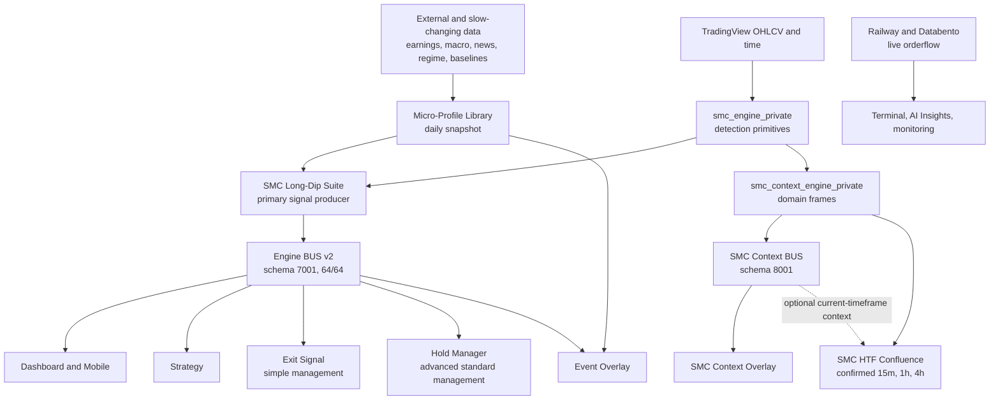

# SMC Extended Pine Architecture and Rollout Plan

| Field | Value |
| --- | --- |
| Status | Accepted target architecture; implementation in progress (R0 complete, R1–R3 partial) |
| Decision date | 2026-07-26 |
| Baseline | `origin/main@88914dedce0da3cb31cdcbd64b455011522b3acc` |
| Decision owner | skipp-dev |
| Scope | TradingView Pine product surfaces, Pine libraries, BUS contracts, companion lifecycle, rollout automation, and operator migration |
| Related | [SMC Bus Roadmap](smc-bus-roadmap.md), [SMC Context Semantics](smc-context-semantics.md), [SMC Hold Manager Plan](SMC_Hold_Manager_Plan.md), [Pine Script Naming](PINE_SCRIPT_NAMING.md), [TradingView Runtime Validation](tradingview-runtime-validation.md), [Pine Legacy Index](../PINE_LEGACY.md) |

The executable requirement status is maintained in
[`pine_extended_migration_traceability.json`](../artifacts/governance/pine_extended_migration_traceability.json).
That matrix is the claim source of truth for R0–R8: repository readiness and
live TradingView evidence are separate requirements, open work has an explicit
gate, and CI rejects phase-completion claims without repository evidence.

## 1. Purpose

This document is the implementation and rollout baseline for extending the
current SMC TradingView architecture without destabilizing the active Long-Dip
Suite, its frozen Engine BUS v2, or the current operator layouts.

It records the accepted decisions to:

1. retain `SMC_Long_Dip_Suite.pine` as the primary setup and trade-plan
   producer;
2. retain and freeze the existing Engine BUS v2 contract at schema `7001`;
3. introduce a separate Context BUS v3 at schema `8001`;
4. make `SMC_Hold_Manager.pine` part of the standard rollout after its
   mandatory readiness gates pass;
5. rebuild HTF Confluence from real confirmed multi-timeframe chart data;
6. keep live orderflow authoritative in Railway/Databento rather than
   misrepresenting a daily Pine snapshot as live orderflow;
7. consolidate structure, imbalance, zone, sweep, and pool presentation into
   one Context Overlay;
8. move durable profile baselines into the Micro-Profile Library and live
   profile context into the Dashboard or Context surface;
9. archive superseded standalone companion implementations only after their
   replacement and rollback gates pass; and
10. extend CI and TradingView operations so an inventoried script cannot again
    remain outside compile, save, source-hash, binding, and layout verification.

This is an architecture and migration contract. It does not itself authorize
or perform TradingView publishing, GitHub publication, or production changes.

## 2. Definitions

### 2.1 Managed script

A managed script is present in the canonical Pine surface registry and is
covered by:

- repository inventory;
- lifecycle classification;
- Pine source validation;
- TradingView saved-script naming;
- compile verification;
- source-hash verification; and
- an explicit deployment mode.

Managed does not mean that the script is added to every default chart layout.

### 2.2 Standard rollout

Standard rollout means:

- the script is a supported product surface;
- it is saved and source-hash verified by automation;
- its required BUS bindings are verified;
- its operator documentation is current;
- its alerts and state semantics have passed the applicable gates; and
- it has a documented rollback path.

Standard rollout does not mean automatic order execution. Event Overlay, Exit
Signal, and Hold Manager remain indicators and decision-support surfaces.

### 2.3 Optional managed script

An optional managed script receives the same source, compile, and hash
protection as a standard script but is not included in the default layout.

### 2.4 Archived script

An archived script is retained for provenance under `pine/legacy/`, excluded
from active product claims, active imports, TradingView save targets, binding
targets, and production compile expectations.

Archived is not the same as deleted.

### 2.5 Shadow rollout

A shadow rollout makes a new producer or consumer visible to operators and
collects parity, performance, and correctness evidence without allowing it to
change the Engine BUS v2 trade decision or replace the current default layout.

## 3. Current Baseline

### 3.1 Active Engine BUS v2

`SMC_Long_Dip_Suite.pine` is the primary producer. It owns:

- setup detection;
- long lifecycle state;
- entry readiness;
- trigger and invalidation;
- stop and targets;
- quality score;
- execution gates;
- event and regime blockers; and
- the current 64-channel hidden BUS.

The Engine BUS v2:

- uses schema version `7001`;
- is frozen at 64 of 64 TradingView plots;
- has no free producer slots;
- serves Dashboard, Strategy, Breakout, Alerts, Mobile, and other current
  consumers; and
- must not receive `CTX` channels or new context payloads.

### 3.2 Current automated TradingView save targets

At the baseline commit, `automation/tradingview/config/consumer-rollout.json`
contains these managed save targets:

1. SMC Long-Dip Suite
2. SMC Breakout Overlay
3. SMC Confluence Hub
4. SMC Long-Dip Alerts
5. SMC Long-Dip Dashboard
6. SMC Long-Dip Mobile
7. SMC Long-Dip Strategy
8. SMC Setup Check

The corresponding binding verification covers seven consumers and excludes the
Suite producer.

The default mainline automation does not cover Event Overlay, Exit Signal,
Hold Manager, Volume Profile Overlay, or the stale context companions.
Dedicated scopes now cover R1 companions, Hold Manager shadow, and the local
R4 Context Bus/Overlay sources; those dedicated scopes are not evidence that a
private compile, binding, or layout rollout has already occurred.

### 3.3 Existing Context BUS building blocks

`SMC++/smc_context_engine_private.pine` provides:

- `StructureFrame`;
- `ImbalanceFrame`;
- `ZoneFrame`;
- `SweepFrame`;
- `PoolFrame`;
- `SessionFrame`;
- `ContextFrame`;
- `build_structure_frame`;
- `build_imbalance_frame`; and
- `build_zone_frame`;
- `build_sweep_frame`;
- `build_pool_frame`;
- `build_session_frame`; and
- `build_context_frame`.

These frames derive confirmed per-bar context from `smc_engine_private`; they
do not use the removed per-symbol snapshot fields.

Repository implementation of the four R3 frames, golden rule parity, explicit
Pine-only detection semantics, and deterministic repository replay vectors was
completed on 2026-07-28. The operational R3 gate completed on 2026-07-29 after
the private library compiled, version `/4` was privately published, and all
fifteen registered TradingView replay cases passed at their exact checkpoints.

R4 now has local, non-deployed implementations for:

- `SMC_Context_Bus.pine`;
- the frozen schema `8001` manifest with 60 channels and four reserves;
- `SMC_Context_Overlay.pine`; and
- a dedicated source-save/preflight and 60-binding contract.

Operational compile, producer publication, source-hash, binding, performance,
parity, layout, and rollback evidence remain open. The traceability matrix
therefore keeps R4 `in_progress`.

### 3.4 Companion orphan condition

Twelve companion scripts are present in product or inventory definitions but
are absent from the automated save rollout:

- `SMC_Event_Overlay.pine`
- `SMC_Exit_Signal.pine`
- `SMC_Hold_Manager.pine`
- `SMC_Volume_Profile_Overlay.pine`
- `SMC_Orderflow_Overlay.pine`
- `SMC_HTF_Confluence.pine`
- `SMC_Structure_Context.pine`
- `SMC_Imbalance_Context.pine`
- `SMC_Liquidity_Context.pine`
- `SMC_Liquidity_Structure.pine`
- `SMC_Session_Context.pine`
- `SMC_Profile_Context.pine`

Seven of these reference 81 fields removed from the current generated
Micro-Profile Library. They cannot compile against the currently imported
library contract:

| Script | Missing fields |
| --- | ---: |
| SMC HTF Confluence | 12 |
| SMC Imbalance Context | 22 |
| SMC Liquidity Context | 13 |
| SMC Liquidity Structure | 8 |
| SMC Profile Context | 13 |
| SMC Session Context | 2 |
| SMC Structure Context | 11 |

These missing fields must not be restored as dummy constants merely to make old
scripts compile. The old snapshot model is the wrong transport for live
per-bar context.

## 4. Architectural Invariants

The implementation must preserve these invariants.

### 4.1 Engine ownership

The Long-Dip Suite remains the sole owner of the supported long setup and
trade-plan decision.

No Context BUS field may silently become a new trade gate. Any later use of
Context BUS data in a trade decision requires separate evidence, an explicit
architecture decision, and a measured rollout.

### 4.2 BUS separation

Engine BUS v2 and Context BUS v3 are separate producers and contracts.

| Contract | Purpose | Schema | Prefix |
| --- | --- | ---: | --- |
| Engine BUS v2 | setup, lifecycle, executable plan, quality, blockers | 7001 | `BUS ` |
| Context BUS v3 | structure, imbalance, zones, sweeps, pools, live context | 8001 | `CTX ` |

No `CTX ` channel may appear in Engine BUS v2. No dashboard row wording may be
encoded as the primary contract of Context BUS v3.

### 4.3 Domain-first Context BUS

Context BUS v3 exports directly interpretable domain data:

- booleans;
- enums or stable integer codes;
- numeric levels;
- counts;
- ages;
- percentages; and
- explicit availability or freshness state.

The consumer owns display wording, colors, grouping, and presentation.

### 4.4 Confirmed-bar truth

Structure, imbalance, zone, sweep, pool, and HTF events used for alerts or
operator decisions are based on confirmed bars unless a separately named
intrabar mode is intentionally selected.

Intrabar and confirmed values must not share the same channel name.

### 4.5 `na` means unavailable

Unavailable levels use `na`, not `0.0`. Zero remains a valid numeric value only
where the domain explicitly permits it.

Consumers must fail closed on:

- wrong schema version;
- missing critical binding;
- stale required producer;
- impossible level ordering;
- future timestamps;
- unavailable required fields; or
- conflicting plan identity.

### 4.6 No false live-data claim

Daily snapshots may provide calendar, enrichment, and durable profile facts.
They must not be presented as barwise live structure, live orderflow, current
VWAP position, or current session state.

### 4.7 One detection source of truth

`smc_engine_private` owns reusable SMC detection primitives.

`smc_context_engine_private` composes those primitives into context frames.
Consumers must not reimplement subtly different BOS, CHoCH, FVG, Order Block,
sweep, or pool rules without an explicit parity exception.

### 4.8 Explicit user-mode exclusivity

Exit Signal and Hold Manager are both supported, but they are alternative
position-management modes.

- Simple mode: Exit Signal
- Advanced mode: Hold Manager

The default operator guidance must not enable both sets of actionable exit
alerts for the same assumed trade. Duplicate or conflicting exit alerts are a
release blocker.

## 5. Target Architecture



The Context BUS does not replace the Suite. Both producers share detection
libraries, but they have separate responsibilities and rollout paths.

## 6. Component Responsibilities

### 6.1 Micro-Profile Library

The generated Micro-Profile Library owns data that is slow-changing,
externally sourced, or valid as a daily snapshot.

Keep in the Micro-Profile Library:

- earnings calendar and ticker membership;
- macro event calendar and risk windows;
- market regime and daily news context;
- provider and data freshness;
- universe membership;
- durable ticker grades;
- average spread baselines;
- RTH dominance;
- historical session-quality baselines;
- calibrated family or ticker parameters; and
- other clearly timestamped daily enrichment.

Do not place in the Micro-Profile Library:

- current bar BOS or CHoCH;
- live FVG mitigation;
- active barwise Order Blocks;
- current VWAP position;
- current session state;
- live sweeps or liquidity pools;
- live orderflow;
- assumed position state; or
- broker fill state.

Every snapshot-derived consumer must surface freshness and apply snapshot
values to historical bars only where that behavior is explicitly intended.

### 6.2 SMC Engine Library

`smc_engine_private` remains the source of truth for:

- structure detection;
- swing and pivot state;
- BOS and CHoCH;
- FVG detection and lifecycle;
- Order Block tracking;
- engine object types; and
- shared low-level SMC calculations.

### 6.3 Context Engine Library

`smc_context_engine_private` owns reusable, confirmed-bar context frames.

Required final frame set:

1. Structure Frame
2. Imbalance Frame
3. Zone Frame
4. Sweep Frame
5. Pool Frame
6. Session Frame
7. Aggregated Context Frame

The aggregated builder must avoid duplicate stateful detector execution. A
single structure instance must feed dependent zone and context frames where
the underlying engine semantics require shared state.

### 6.4 Engine BUS v2

Engine BUS v2 remains byte- and schema-compatible for current consumers.

Hold Manager may consume existing domain-level channels including:

- `BUS SchemaVersion`
- `BUS Armed`
- `BUS Confirmed`
- `BUS Ready`
- `BUS Trigger`
- `BUS Invalidation`
- `BUS StopLevel`
- `BUS Target1`
- `BUS Target2`
- `BUS QualityScore`
- `BUS StateCode`
- `BUS SourceKind`
- `BUS ZoneActive`

No new Hold-specific v2 channel is permitted without first proving that the
required state cannot be derived from the frozen contract.

### 6.5 Hold Manager

Hold Manager becomes a standard supported companion after its rollout gates
pass.

Its product contract is:

- long-only for the initial standard version;
- one assumed SMC plan-trade at a time;
- indicator and decision support, not order execution;
- primary plan source is Engine BUS v2;
- manual plan values are an explicitly labelled fallback;
- entry is an assumed fill after an accepted price touch, not broker
  confirmation;
- time-stop starts at accepted entry, never at arming;
- stop may move only in the protective direction;
- exit alerts are edge-triggered; and
- missing or mismatched BUS state is fail-closed.

Required Hold Manager state model:

1. `FLAT`
2. `ARMED`
3. `IN_TRADE`
4. `CLOSED`

Required plan identity includes enough information to prevent a new setup from
silently overwriting an open assumed trade. At minimum it must distinguish:

- symbol;
- direction;
- trigger;
- initial invalidation;
- arming epoch or stable setup generation;
- source kind; and
- schema version.

State must be reconstructable after script reload or recompile from deterministic
historical BUS series and price events. A last-bar-only toggle latch is not
sufficient for standard rollout.

### 6.6 Exit Signal

Exit Signal remains the simple position-management option:

- BUS-driven;
- static stop plus R-multiple targets;
- optional break-even after Target 1;
- defensive exit after state collapse;
- no dynamic Chandelier or time-stop; and
- no order execution.

Exit Signal and Hold Manager may both be installed as managed scripts, but the
operator must select exactly one actionable exit-alert mode for a trade.

### 6.7 Event Overlay

Event Overlay becomes a standard managed companion.

It combines:

- daily event and earnings metadata from the Micro-Profile Library; and
- the canonical event-risk state from Engine BUS v2.

The UI must distinguish:

- exact scheduled event time;
- start of the pre-event restriction window;
- post-event or cooldown window; and
- hard block versus informational warning.

The vertical event marker must not claim to be the exact release time if it is
only the start of the pre-event window.

### 6.8 Context BUS v3

`SMC_Context_Bus.pine` is a hidden producer.

Contract requirements:

- schema version `8001`;
- `CTX ` channel prefix;
- no more than 60 channels;
- at least four unused reserve plots;
- stable domain channels rather than UI rows;
- confirmed-bar values by default;
- explicit availability and age;
- no dependency on removed Micro-Profile fields; and
- a generated manifest and freeze test before shadow rollout.

The initial channel groups are:

| Group | Example domain data |
| --- | --- |
| Meta | schema, ready, availability mask, confirmed epoch |
| Aggregate | bias, available-domain count, quality score |
| Structure | trend, BOS, CHoCH, direction, support, resistance, event age |
| Imbalance | active bull/bear FVG, bounds, BPR, void, bias, state |
| Zones | bull/bear OB bounds, new/broken edges, bias, state |
| Sweeps | direction, level, reclaim, quality, event age |
| Pools | buy/sell level, strength, magnet direction, imbalance |
| Session | code, killzone, range, opening range, directional context |

The consumer-driven budget review froze the exact order and encodings in
`artifacts/governance/smc_context_bus_v3_manifest.json`: 60 direct channels,
four reserved slots, and no packed UI-row transport. Any change to that
artifact, producer order, or consumer binding order fails the R4 freeze tests.

### 6.9 Consolidated Context Overlay

The Context Overlay replaces four standalone presentation surfaces:

- Structure Context
- Imbalance Context
- Liquidity Context
- Liquidity Structure

It consumes Context BUS v3 and exposes optional modules:

- Structure
- FVG, BPR, and Liquidity Void
- Order Blocks and zones
- sweeps and reclaims
- liquidity pools and magnet direction
- session and killzone
- compact Context Bias summary

The overlay does not run an independent alternative SMC detector.

### 6.10 HTF Confluence

The existing snapshot-based HTF Confluence implementation is superseded.

The rebuilt implementation must provide actual confirmed multi-timeframe
context for:

- 15 minutes;
- 1 hour;
- 4 hours;
- squeeze or compression;
- ATR regime;
- reversal context;
- HTF structure;
- bullish and bearish patterns;
- divergence;
- VWAP hold; and
- retracement quality.

Defaults are fixed 15m, 1h, and 4h so the product meaning is stable. Advanced
users may override them, but the displayed timeframe must always be explicit.

All product `request.security` calls use TradingView's documented
non-repainting HTF pair:

- every transported value is offset by one requested-context bar;
- `barmerge.lookahead_on` publishes that already-closed HTF value at the start
  of the next HTF interval;
- unavailable, equal-timeframe, lower-timeframe, and partial data fail closed;
  and
- no same-bar future leakage is accepted.

`lookahead_off` remains in the spike only as a diagnostic comparison for the
unoffset, still-open HTF bar. It is not a confirmed-value product path.

Before the channel contract is frozen, a Pine technical spike must verify that
stateful Context Frame builders behave safely inside `request.security`.

If they do not, HTF Confluence receives a dedicated compact MTF producer or a
separate stateless HTF calculation layer. It must not fall back to daily
snapshot fields.

### 6.11 Orderflow

Railway and Databento remain authoritative for real live orderflow:

- trades and quotes;
- aggressor side;
- delta;
- spread;
- relative activity;
- volume acceleration;
- imbalance;
- options flow where available; and
- PRE-A0/A0 context.

Pine cannot directly fetch an arbitrary Railway HTTP API. Therefore:

- the current Pine Orderflow Overlay is not marketed as live;
- the current implementation is archived after backend visibility is
  verified;
- live orderflow remains in Terminal, AI Insights, monitoring, and model
  features; and
- any future TradingView representation requires either a TradingView-native
  calculation, a supported custom feed or synthetic symbol, or an honestly
  named daily snapshot.

An optional future daily implementation must be named
`SMC Daily Flow Snapshot`, display its as-of timestamp, and remain outside the
standard rollout.

### 6.12 Profile Context

Profile Context is split by temporal semantics.

Micro-Profile Library:

- durable ticker grade;
- average spread baseline;
- RTH dominance;
- premarket and after-hours baseline quality;
- historical cleanliness or wickiness; and
- calibrated profile traits.

Dashboard or Context surface:

- current VWAP position and distance;
- current spread state if available;
- current session;
- current opening-range state;
- current live quality or trust effect; and
- explicit freshness.

The separate Profile Context pane is retired after the Dashboard replacement
has verified parity for the retained product fields.

## 7. Target Product Portfolio

### 7.1 Core managed surfaces

These remain managed throughout the migration:

- SMC Long-Dip Suite
- SMC Long-Dip Dashboard
- SMC Long-Dip Mobile
- SMC Long-Dip Strategy
- SMC Long-Dip Alerts
- SMC Setup Check
- SMC Breakout Overlay
- SMC Confluence Hub

### 7.2 New or newly governed standard surfaces

- SMC Event Overlay
- SMC Exit Signal
- SMC Hold Manager
- SMC Context BUS
- SMC Context Overlay
- rebuilt SMC HTF Confluence

Context BUS is a managed producer, not a visible UI component.

### 7.3 Optional managed surfaces

- SMC Volume Profile Overlay

Volume Profile receives compile, source-hash, performance, and saved-script
coverage but is not added to every default layout.

### 7.4 Retired standalone product surfaces

After their cutover gates pass:

- old SMC Orderflow Overlay
- old SMC Structure Context
- old SMC Imbalance Context
- old SMC Liquidity Context
- old SMC Liquidity Structure
- old SMC Profile Context

The old implementations of Session Context and HTF Confluence are archived,
but their root product names may be reused by their rebuilt implementations.

## 8. Archival Decisions

Archival is replacement-gated. No root script is moved merely because a new
architecture document exists.

| Current file | Decision | Replacement or destination | Archive gate |
| --- | --- | --- | --- |
| `SMC_Orderflow_Overlay.pine` | Archive current Pine implementation | Railway/Databento Terminal and AI Insights; optional future Daily Flow Snapshot | Backend live orderflow visible, documented, and monitored |
| `SMC_Structure_Context.pine` | Archive standalone implementation | Structure module in Context Overlay | CTX Structure parity, compile, binding, and shadow evidence pass |
| `SMC_Imbalance_Context.pine` | Archive standalone implementation | Imbalance module in Context Overlay | CTX FVG/BPR/Void parity and replay pass |
| `SMC_Liquidity_Context.pine` | Archive standalone implementation | Zone and liquidity modules in Context Overlay | CTX zone levels/counts/bias pass |
| `SMC_Liquidity_Structure.pine` | Archive standalone implementation | Sweep and Pool modules in Context Overlay | Sweep/Pool frames and consumer pass |
| `SMC_Profile_Context.pine` | Archive standalone implementation | Dashboard Quality/Trust and profile detail | retained profile fields visible and freshness-qualified |
| `SMC_Session_Context.pine` | Archive v1 source and replace root implementation | rebuilt live Session Context or Context Overlay module | confirmed time/session/DST replay passes |
| `SMC_HTF_Confluence.pine` | Archive v1 source and replace root implementation | rebuilt HTF Confluence | 15m/1h/4h confirmed-bar replay and no-lookahead gates pass |

### 8.1 Archive naming

Superseded source is moved under `pine/legacy/` with a versioned,
meaning-bearing filename where the root product identity is reused:

- `pine/legacy/SMC_HTF_Confluence_v1_snapshot.pine`
- `pine/legacy/SMC_Session_Context_v1_snapshot.pine`

Other retired standalone files may preserve their basename if the repository
resolver and drift guards permit it, or receive a `_v1_snapshot` suffix to
avoid collision with a replacement.

The move implementation must follow the repository Pine path resolver and
legacy drift rules. It must update:

- `PINE_LEGACY.md`;
- canonical surface registry;
- lifecycle classification;
- product manifest;
- saved-script rollout;
- tests;
- documentation;
- import refresh inventories; and
- any bare-name file resolver allowlists.

### 8.2 TradingView retirement

Repository archival and TradingView deletion are separate actions.

At cutover:

1. detach the old script from active layouts;
2. disable or recreate its alerts;
3. record its final saved source hash;
4. mark it deprecated in product documentation;
5. preserve the saved script during the rollback window; and
6. delete or rename the saved TradingView script only after the rollback
   window closes.

## 9. Rollout Strategy

The rollout is additive first and subtractive last. Existing active scripts
remain in place until their replacement is proven.

### Phase R0 — Baseline and governance

#### Implementation status — 2026-07-26

Merged in governance PR #4084 (`c2dbfe94849d72debd480303a252f2dab0124367`):

- canonical schema-v3 registry and compatibility views;
- exact eight-save-target and seven-binding-target gates;
- per-file classification of all physical root SMC surfaces and two planned
  Context surfaces;
- exact, non-growing debt contract for 81 unresolved micro-profile references
  across seven replacement-pending snapshot consumers;
- Pine declaration-name, Engine BUS, archive-isolation, manifest-parity, and
  Fast-CI gates; and
- corrected lifecycle documentation.

Implemented in the follow-up evidence hardening, but not itself live evidence:

- an explicit `--verify-only` execution plan that disables source save,
  producer refresh, binding repair, and layout save before browser launch;
- fail-fast rejection of writing flags in verify-only mode;
- schema-v2 evidence with the repository commit, exact rollout-config hash,
  product-manifest version, published-library state, repository source hashes,
  expected bindings, observed source hashes and selections, runtime errors, and
  explicit mutation counters;
- a clean-input gate proving that the config, manifests, and Pine sources match
  the reported repository commit; and
- scheduled and manually selectable verify-only workflow coverage.

Still pending immediately after these repository changes:

- a fresh read-only TradingView baseline tied to the exact merge commit;
- verified repository-versus-TradingView source hashes;
- layout and chart identifiers;
- active alert names; and
- an explicit rollback-evidence artifact.

Those items were closed on 2026-07-27 against
`8b0a3127c919ad85ea4864a113abb14f0e2025dc`:

- a write-mode producer refresh removed and re-added one Suite instance,
  force-rebound 108 Engine BUS inputs across seven consumers, and persisted the
  layout without saving any Pine source;
- a separate fresh `--verify-only` session checked eight of eight sources and
  108 of 108 bindings with zero source drift, binding mismatch, or runtime
  error;
- the published Micro-Profile Library remained at expected version 170;
- layout `vWgAWyfC` was identified as `SMC Suite` with all changes saved; and
- the complete, non-scrolling Alert Manager inventory contained zero active
  alerts and two manually stopped historical alerts.

The immutable source hashes, binding counts, layout identity, alert inventory,
raw-evidence SHA-256 values, zero-mutation inventory declaration, and rollback
target are recorded in
[`tradingview_r0_rollback_baseline_2026-07-27.json`](../artifacts/monitoring/tradingview_r0_rollback_baseline_2026-07-27.json).
The raw browser reports remain operator-local and are identified by hash rather
than falsely presented as repository artifacts.

Phase R0 is complete when that baseline artifact is part of `main`. Passing
local tests, merging automation alone, or finding an older green binding
snapshot is still not deployment evidence and must never be reported as such.

#### Changes

- create one canonical Pine surface registry;
- record file, product role, lifecycle, saved-script name, deployment mode,
  compile expectation, BUS dependencies, and archive state;
- derive or cross-check current manifests from that registry;
- add Event, Exit, Hold, Context, HTF, and archive decisions to the registry;
- record current TradingView source hashes, bindings, active layouts, alert
  names, and library versions;
- correct stale documentation that claims all companions are standalone; and
- remove production status from known broken snapshot consumers.

#### Exit criteria

- every Pine file is classified;
- every standard or optional managed script has a deployment mode;
- no operational script is absent from compile/save/hash governance;
- no archived script is an active target;
- current eight-script rollout remains unchanged and green; and
- a rollback baseline artifact exists.

#### Rollback

Revert governance-only changes. No TradingView behavior changes in R0.

### Phase R1 — Event Overlay and Exit Signal

Repository implementation status on 2026-07-28: deterministic Exit Signal
replay, a canonically derived private TradingView fixture, exact Event/Exit BUS
binding contracts, and a fail-closed private rollout preflight are implemented.
The separately authorized private TradingView fixture run on 2026-07-29
compiled source SHA-256
`84219393d70b3860ece56233ae5022592d6f8de655dfa6f3c75b5f8967e55c48`
and passed all eleven historical replay cases on `NASDAQ:AAPL` at 5 minutes.
The fixture was removed, replay was exited, and the private validation layout
was saved in its canonical empty state. The redacted evidence is
`artifacts/governance/smc_exit_signal_tradingview_replay_2026-07-29.json`.
The source-only unconfirmed-update case remains a canonical-code contract
because historical TradingView replay bars are confirmed.

R1 completed its separately authorized private product-layout rollout on
2026-07-29. `SMC Event Overlay` and `SMC Exit Signal` compiled from persisted
saved sources whose SHA-256 values match the repository, all ten BUS inputs
were bound to `SMC Long-Dip Suite`, and the alert-condition inventory matched
the declared two Event and six Exit conditions without creating or changing
an alert. The saved `SMC Simple Management R1` layout contains exactly one
Suite, one Exit Signal, and one Event Overlay; no Hold Manager or legacy
consumer remains in that layout.

The rollback drill removed both companions, explicitly saved the Suite-only
layout, and verified that state after reload. Both saved companions were then
re-added, all ten bindings were restored, the layout was explicitly saved
again, and a final reload passed with no compile diagnostic. Redacted evidence
is
[`smc_r1_live_rollout_evidence_2026-07-29.json`](../artifacts/governance/smc_r1_live_rollout_evidence_2026-07-29.json).
No script was published, no TradingView alert was mutated, and Railway was not
changed.

#### Event Overlay

- add to managed save targets;
- add BUS LeanPackA binding verification;
- verify library version pin;
- compile and save;
- validate exact-time versus pre-window wording;
- verify hard-block and informational alerts; and
- add to the appropriate standard layout.

#### Exit Signal

- add to managed save targets;
- define critical Engine BUS v2 bindings;
- validate schema and plan levels fail closed;
- add deterministic state and alert replay tests;
- compile, save, bind, and source-hash verify; and
- document Simple position-management mode.

#### Exit criteria

- source hash equals repository source;
- compile succeeds against published libraries;
- required bindings are verified;
- alert edges fire once in replay;
- no duplicate actionable exit mode is enabled by default; and
- current core consumers remain unchanged.

#### Rollback

Remove the new companions from the layout and disable their alerts. Core Suite
and existing consumers are unaffected.

### Phase R2 — Hold Manager standard readiness and rollout

#### R2.1 BUS integration

- replace manual plan input as the primary path with Engine BUS v2;
- bind schema, lifecycle, trigger, invalidation, stop, targets, quality,
  state, source, and zone state;
- retain an explicit manual fallback mode;
- make all missing or invalid critical bindings fail closed; and
- show binding and assumed-fill status in the UI.

#### R2.2 Deterministic state reconstruction

Repository implementation status: **complete**. The runtime in
`SMC_Hold_Manager.pine` rebuilds only from confirmed historical BUS and OHLC
series. It retains the accepted plan identity and generation, entry epoch,
protected high, Target-1 state, monotonic active stop, and terminal exit. A
timestamped recovery event is replayable after reload; a last-bar toggle is
not the source of truth. TradingView replay evidence remains a separate R2.4
gate.

- remove last-bar toggle state as the only arming mechanism;
- reconstruct plan and assumed trade state from historical BUS series and
  confirmed price events;
- preserve entry epoch, highest protected price, Target 1 state, active stop,
  and terminal exit state through recalculation;
- reject a new plan identity while an assumed trade is open; and
- provide an explicit reset/recovery path.

#### R2.3 Scope

- standard version is explicitly Long-only;
- no hidden or partial Short mode;
- no broker-fill claim;
- no auto-order path; and
- one assumed plan-trade at a time.

#### R2.4 Replay matrix

Repository preflight status: **passed; gate remains partial**. The executable
catalog in `scripts/smc_hold_manager_replay.py` runs all twenty cases against a
confirmed-bar transition model, pins the Hold Manager source hash, compares
reload traces, and records alert counts in
`artifacts/governance/smc_hold_manager_replay_preflight.json`. This is an
early drift and fixture gate only. It does not claim Pine compilation, chart
binding, TradingView Bar Replay, reload behavior in TradingView, or alert-log
evidence. R2.4 becomes complete only when an operator executes the same pinned
matrix in TradingView and retains matching hidden-diagnostic and alert-count
evidence.

TradingView preconditions were captured on 2026-07-27 for repository source
hash `f9a9369100b7ea25cbd2db6cf38dea0e0b00f186eb6b382e5a94397e415efdb6`.
The source compiled without diagnostics, was added to the isolated
`SMC Hold R2.4 Validation` layout, and all thirteen Engine BUS v2 inputs
remained bound to `SMC Long-Dip Suite` after reload. The bounded evidence is in
`artifacts/governance/smc_hold_manager_tradingview_preconditions_2026-07-27.json`.
It deliberately leaves the source readback hash and all twenty replay cases
pending. The next gate is a deterministic TradingView fixture that can drive
the complete BUS and OHLC scenario matrix; ordinary live chart data cannot
prove the pre-registered cases on demand.

The deterministic harness is generated from the canonical source by
`scripts/generate_smc_hold_manager_tv_fixture.py`. Its checked-in Pine output
under `tests/fixtures/pine/` rewires only the external BUS, OHLC, ATR, recovery,
and context feeds, embeds the canonical source hash, exposes cumulative pulse
counts plus a visible test-only readback table, and remains outside every
managed or publishable surface. The machine-readable execution contract is
`artifacts/governance/smc_hold_manager_tradingview_fixture_manifest.json`.
This closes the fixture-construction prerequisite. The later private
twenty-three-run execution closes the replay gate, but the harness is not the
canonical saved script and cumulative Pine counters do not prove TradingView
server alert delivery.
The canonical Hold Manager now derives Micro-Profile age from `mp.ASOF_DATE`,
uses the same greater-than-five-day T-1 threshold as the suite and monitoring,
and exposes both hidden `HM ContextStale` evidence and a visible remediation.
That flag is observability-only: it is absent from plan validity, entry,
management, exit, and alert predicates. The harness forces the flag only to
prove R2.4-17 non-interference deterministically.
The generated harness itself compiled and was added to the isolated validation
layout on 2026-07-27 without diagnostics; the canonical chart state was then
restored. That bounded compile evidence is retained in
`artifacts/governance/smc_hold_manager_tradingview_fixture_compile_2026-07-27.json`
and does not mark any replay case complete. Because the canonical source and
fixture hashes changed with the freshness diagnostic and readback table, both
preconditions had to be recaptured before replay execution. The current
fixture compile is retained separately in
`artifacts/governance/smc_hold_manager_tradingview_fixture_compile_2026-07-28.json`;
the older compile artifact remains immutable historical evidence. The
canonical compile-and-binding precondition still pins the prior source hash
and remains an open pre-cutover gate.

The twenty logical cases require twenty-three physical executions: sixteen
ordinary 5-minute runs, four independent R2.4-11 reset variants, two
same-cursor reload comparisons, and one daily run. The manifest pins every
logical checkpoint step. TradingView keeps the newest Bar Replay bar
unconfirmed, while the Hold runtime is intentionally confirmed-bar only.
Therefore the harness exposes both `raw_step` and `confirmed_step`: the
operator advances to the manifest's `replayStopSteps` value (logical checkpoint
+ 1) and must observe the exact logical checkpoint in `confirmed_step`.
Comparing expectations directly to `raw_step`, or inspecting a later
`confirmed_step`, is invalid because protected levels and edge pulses can
change after the decisive bar.

The first private matrix was executed on 2026-07-28 with canonical source hash
`1761e96aaf5e62412329bb7be10383c36fce4e471b98467f86e1ce63ba360813`
and fixture hash
`fd663a8e925b9491b831bb1e71bc4410fa811a914607187f9e9dec4f23090416`.
All twenty-three physical runs completed. Nineteen logical cases passed,
including all four R2.4-11 reset variants, both reload comparisons, and the
R2.4-20 daily case. R2.4-02 failed at both registered checkpoints: the
fixture had already entered and stopped near the beginning of the 204-bar
wait, so the visible state was `CLOSED` with `ENTRY=1`, `STOP=1`, and
`EXIT=1` instead of the expected delayed `IN_TRADE` state. This is a fixture
sequencing defect, not a product pass. The exact observations and restored
canonical chart state are recorded in
`artifacts/governance/smc_hold_manager_tradingview_replay_2026-07-28.json`.
That failure is retained as historical context; it is not evidence for the
corrected fixture.

The R2.4-02 sequencing repair excludes that case from the generic
early-trade feed, keeps it `ARMED` through the wait window, triggers only at
fixture step 204, and holds the next bar above the unchanged Chandelier stop.
The regenerated fixture has SHA-256
`2dadabfdf400e1adb11b597f609d7cd18a09c0642966fff426171886e4888f1d`.
After exact-hash approval, it was transferred only to the private
`SMC Hold Manager R2.4 Fixture TEST ONLY` script, compiled without diagnostics,
and executed in the isolated `SMC Hold R2.4 Validation` layout. All 23 physical
runs and all 20 logical cases passed. R2.4-02 was `IN_TRADE` with stop 100 and
one entry pulse at confirmed steps 204 and 205; the reload checks reconstructed
`ARMED` and post-Target-1 `IN_TRADE` state; the 1D case emitted exactly one
entry, time-stop, and exit pulse. The fixture was not published, and the
canonical two-chart, 5-minute, non-replay state was restored and saved.
The exact observations are in
`artifacts/governance/smc_hold_manager_tradingview_replay_2026-07-28.json`.
R2-REPLAY is therefore complete. The 2026-07-27 canonical binding precondition
artifact remains immutable historical evidence. The canonical precondition was
recaptured on 2026-07-28 for source hash
`1761e96aaf5e62412329bb7be10383c36fce4e471b98467f86e1ce63ba360813`:
the private saved script compiled, the Hold Manager and `SMC Long-Dip Suite`
were co-located on Chart #2, and all thirteen Engine BUS v2 bindings survived
layout save and page reload. TradingView's accessible Monaco surface did not
permit a complete saved-source export, so the source readback is explicitly
bounded to the visible first and last regions plus the no-unsaved-change state,
not misrepresented as an independently verified hash. The evidence is retained
in
`artifacts/governance/smc_hold_manager_tradingview_preconditions_2026-07-28.json`.
No publication, alert creation, shadow observation, or cutover occurred.
TradingView server-alert delivery remains a separate
`R2-SHADOW-CUTOVER` gate.

At minimum:

1. arm without entry;
2. delayed entry after a long wait;
3. time-stop starts only at entry;
4. entry and Target 1 on one bar;
5. entry and stop on one bar;
6. gap across entry;
7. gap across stop;
8. break-even after Target 1;
9. Chandelier stop never decreases;
10. Target 2 full exit;
11. reset during each state;
12. reload during Armed;
13. reload during In Trade;
14. new plan while In Trade;
15. schema mismatch;
16. missing BUS input;
17. stale Micro-Profile context;
18. event warning without forced false exit;
19. no duplicate edge alerts; and
20. non-intraday timeframe behavior.

#### R2.5 Shadow and standard cutover

- add Hold Manager to managed save/compile/hash coverage and refresh its
  private saved script; this is not external TradingView publication;
- bind it in a non-default validation layout;
- run replay evidence;
- observe at least five complete US market sessions or an equivalent
  pre-registered replay/live evidence set;
- compare assumed entry and exit transitions with Exit Signal and Strategy;
- enable Hold Manager as the Advanced standard mode;
- keep Exit Signal as the Simple standard mode; and
- ensure only the chosen mode has actionable exit alerts.

The executable, pre-registered shadow contract is
`artifacts/governance/smc_hold_manager_shadow_contract.json`; the checked-in
observation state is
`artifacts/governance/smc_hold_manager_shadow_observations.json`. The evaluator
`scripts/evaluate_smc_hold_manager_shadow.py` is fail-closed and does not treat
the absence of observations as success. Before activation it returns
`not_started` and writes the canonical verdict to
`artifacts/governance/smc_hold_manager_shadow_evidence.json`. The canonical
product-cut manifest now exposes the isolated
`smcHoldManagerShadow` preflight scope through
`automation/tradingview/preflight-hold-manager-shadow.json`. That scope checks
the private validation saved script and all thirteen Hold Manager BUS
bindings without adding the still-planned surface to production rollout
targets.

The private managed saved-script refresh and isolated binding preflight were
completed on 2026-07-28. The authenticated headless runner failed closed before
editor mutation because its Pine Editor surface was not visible. A visible
Chrome fallback against the same private account, saved script, layout, source
hash, and `smcHoldManagerShadow` contract then passed after chart reload with
no visible compile error and all thirteen `SMC Long-Dip Suite` BUS bindings in
the exact registered order. This did not create alerts, publish a script, or
start shadow observation. Evidence:
`artifacts/governance/smc_hold_manager_shadow_preflight_2026-07-28.json`.

The controlled receiver is implemented in
`services/live_overlay_daemon/hold_manager_shadow_receiver.py`, with six
source-pinned message templates in
`artifacts/governance/smc_hold_manager_shadow_alert_templates.json`. It is
fail-closed unless a dedicated body token, persistent SQLite ledger, and the
explicit acceptance switch are configured. The fixed webhook URL contains no
secret; the token is excluded from persistence and audit fields. Contract,
timestamp, payload-size, duplicate-delivery, and per-channel tests are in
`tests/test_hold_manager_shadow_receiver.py`.
The source hash uses the R2.4 replay contract's narrow pin normalization:
only the automated `smc_micro_profiles_generated` import version is frozen to
the evidenced version 175; every other source change still moves the hash.

The receiver was deployed and configured fail-closed in `live_overlay_daemon`
on 2026-07-28. Its dedicated 64-character token was not recorded, its
persistent destination is
`/app/data/smc-hold-manager-shadow.sqlite3`, and the authenticated state showed
`accepting=false` with zero events, attempts, and duplicates. Both `/health`
and `/ready` returned HTTP 200. Redacted evidence is retained in
`artifacts/governance/smc_hold_manager_shadow_receiver_railway_2026-07-28.json`.
The six private TradingView alerts (`R2 SHADOW · HM_ENTRY/HM_T1/HM_T2/`
`HM_STOP/HM_TIMESTOP/HM_EXIT_ANY`) were created on 2026-07-28 in the
authorized controlled browser session after a token rotation, and the operator
confirmed the six correctly configured alerts on 2026-07-29 (redacted
attestation:
`artifacts/governance/smc_hold_manager_shadow_alerts_2026-07-28.json`;
TradingView alert state is not machine-verifiable from the repository, so the
evidence is an operator attestation, not an automated readback). The
delivered-alert half of the observation chain is wired: `/state` exposes a
per-session breakdown and
`scripts/reconcile_smc_hold_manager_shadow_deliveries.py` fills
`deliveredServerAlerts` from the receiver ledger fail-closed.

With the separately granted operator authorization the shadow was activated
on 2026-07-28 at 22:41 UTC — after the XNYS close, i.e. exactly at the agreed
observation boundary: `HOLD_MANAGER_SHADOW_ACCEPTING=1` (deployment
`059b2883-3e5e-44ad-a781-d3f12c46fb51`), state readback `accepting=true` with
an empty ledger (evidence:
`artifacts/governance/smc_hold_manager_shadow_activation_2026-07-28.json`).
`R2-SHADOW-CUTOVER` is now `in_progress` (traceability `partial`): the
evaluator reports `blocked` by design until the five complete XNYS sessions
(first evaluable: 2026-07-29), the required edges, and the rollback drill
exist. The rollback drill is operator-pre-authorized and executes only after
the observation criteria pass.

Shadow activation requires separate authorization for controlled TradingView
alert creation. Under the
managed-script definition in section 2.1, neither public nor invite-only
TradingView publication is required or permitted by this contract. Once
activated, the ledger must contain every US-equity session in activation order
and evaluate the first five complete XNYS sessions; sessions may not be
cherry-picked. If at least one `HM_ENTRY`, one `HM_EXIT_ANY`, and one terminal
exit edge (`HM_T2`, `HM_STOP`, or `HM_TIMESTOP`) have not occurred, observation
continues for no more than ten sessions and promotion remains blocked.

For every recorded session:

- the source hash, validation layout, Suite producer, schema 7001, and bindings
  must match;
- expected Pine edges must equal delivered TradingView server alerts for all
  six Hold channels;
- runtime errors, false exits, duplicate actionable exits, and unclassified
  transition differences must all be zero;
- Hold transitions must be compared with both Exit Signal and Strategy; and
- `hold_manager` must be the only actionable exit-alert mode.

Promotion additionally requires the registered rollback drill: disable Hold
alerts before removing Hold, re-enable Exit Signal before disabling Hold,
leave Suite and BUS schema unchanged, save the restored layout, and reverify
bindings after reload. The current checked-in state remains `not_started`; no
TradingView publication, alert creation, shadow observation, or rollback drill
has been performed.

#### Exit criteria

- all replay cases pass;
- state reconstruction is deterministic;
- no false or duplicate exit alert in the evidence window;
- source, compile, binding, and library hashes pass;
- standard Long-only documentation is current; and
- rollback to Exit Signal is documented and tested.

#### Rollback

Disable Hold alerts and remove Hold from the active layout. Re-enable Exit
Signal Simple mode without changing Suite or Engine BUS v2.

### Phase R3 — Complete Context Engine Library

Repository implementation status on 2026-07-29: the complete seven-frame
library, golden scoring parity, Pine-only detection specification,
deterministic repository replay vectors, private TradingView compile, private
library publication, and runtime replay are complete.

On 2026-07-29 the runtime gate received a generated, source-derived Pine
fixture. It converts the complete canonical library source into a test-only
indicator and drives private injected-input seams shared by the live Sweep,
Pool, Session, and aggregate Context builders. Its fifteen cases and exact
checkpoints are pinned in
`artifacts/governance/smc_context_engine_tradingview_fixture_manifest.json`.
The fixture is not a managed surface and must never be published. The private
library source hash
`16d0fc5ae7255d9970c4b9b50a85debb82168121426140a50a6a1c6e7f55b210`
compiled and was published only as `preuss_steffen/smc_context_engine_private/4`.
The subsequent update dialog offered `v5`, independently confirming that `/4`
is the current published predecessor. The non-publishable fixture hash
`2ff1811ff43c3bc92de91982a095d9d3628bd45d2d1a60c8d3fb7ee643d3fec2`
then compiled in `SMC Context Engine R3 Validation` on `NASDAQ:AAPL` 5m. All
fifteen cases returned `FIXTURE PASS = 1` at their registered checkpoints,
including the step-22 freshness expiry. Replay was exited, the fixture was
removed, the private library was restored in the editor and chart, the
Watchlist panel was restored, and the layout was saved. Redacted evidence is
retained in
`artifacts/governance/smc_context_engine_tradingview_replay_2026-07-29.json`.
No public publication, alert, Railway mutation, or managed-layout rollout
occurred. R3-REMAINING-FRAMES and R3-PUBLISH are complete; R5 still owns
cross-DST runtime replay.

#### Changes

- finish Sweep Frame;
- finish Pool Frame;
- finish Session Frame;
- add aggregated Context Frame;
- ensure dependent frames reuse the same stateful structure result;
- extend golden parity for scoring and rule layers;
- document Pine-only detection semantics separately from Python-golden rules;
- publish a versioned private library; and
- verify every active importer against the published version.

#### Exit criteria

- library contract tests pass;
- golden parity passes where a Python truth source exists;
- Pine-only rules have explicit fixtures and replay evidence;
- no removed Micro-Profile field is reintroduced as compatibility debt;
- library compile succeeds; and
- publish inventory and version snapshot are current.

#### Rollback

Keep the last published Context Library version pinned. No Context BUS consumer
is active yet.

### Phase R4 — Context BUS and Context Overlay shadow

#### Changes

- implement `SMC_Context_Bus.pine`;
- freeze schema `8001`;
- allocate no more than 60 channels;
- reserve at least four channels;
- generate manifest and consumer binding contract;
- implement consolidated Context Overlay;
- add source-save and binding automation;
- add performance budgets;
- publish producer before consumer;
- run the overlay in a shadow layout; and
- compare its structure and zone results with Suite and Breakout evidence.

#### Exit criteria

- zero `CTX ` channels in Engine BUS v2;
- zero Engine BUS schema drift;
- Context BUS manifest and freeze tests pass;
- all critical CTX bindings are verified;
- no lookahead or future-bar leakage;
- acceptable TradingView execution time and object counts;
- source and library hashes match;
- shadow discrepancies are explained or fixed; and
- Context Overlay remains non-gating.

#### Rollback

Remove Context Overlay and Context BUS from the layout. The Engine BUS and all
current consumers remain untouched.

### Phase R5 — Rebuild HTF Confluence and Session

Repository implementation status on 2026-07-30: the first private TradingView
compile rejected the published Context Engine `/4` inside `request.security`
with `CE10061` because its collection-backed builders have side effects. This
is the pre-registered condition for choosing the dedicated compact stateless
HTF calculation layer. The fallback test-only source, generated 15-case
manifest, DST matrix, and operator runbook test 15m, 1h, 4h, lower/equal
timeframe rejection, regular and extended data, the independent US/European
DST transition gaps, realtime repaint behavior, and profiler budgets.
The fallback compiled privately and passed all 15 cases. The initial 12-case
run, profiler, request-site, drawing-object, memory, and runtime-error evidence
are recorded in
`smc_htf_context_r5_spike_tradingview_2026-07-30.json`. The live
regular-session repaint observation and both historical autumn DST equivalents
are recorded in
`smc_htf_context_r5_temporal_closeout_tradingview_2026-07-30.json`.
`R5-HTF-SPIKE` is complete. The matching 2026 checkpoints remain optional
non-blocking revalidation targets.

Repository implementation status for `R5-REBUILD` on 2026-07-30: the two
snapshot-era sources are preserved under `pine/legacy/`, while the root
products have been replaced locally by live confirmed-data implementations.
HTF Confluence uses exactly three stateless 15m/1h/4h request sites with the
confirmed-offset plus `barmerge.lookahead_on` pattern and fails closed when a
requested frame is equal to or below the chart frame. Session Context owns no
MTF request and derives Asia, London, NY AM, and NY PM from their independent
IANA timezones. The Product Cut exposes both scripts through the private
`smcR5HtfSession` preflight scope. This makes the repository implementation
testable; it is not deployment evidence. Private compile, the 11-case rebuild
manifest, source-hash verification, layout evidence, and rollback remain open.

Compile-gate status on 2026-07-31: **closed.** Both root companions compile and
run green on the private validation layout — every preflight axis true for both
targets, runtime smoke included
(`smc_r5_htf_session_rebuild_preflight_green_2026-07-31.json`). Reaching that
took two fixes, and the second one is the reason the first was briefly believed
not to work: the CE10156 line-wrapping fix in the HTF source, and the preflight
stale-instance fix that stopped the gate from re-measuring the pre-fix chart
instance. The replay, live-observation and rollback cases are untouched by
this, so `R5-REBUILD` stays `partial`.

Compile-gate diagnosis on 2026-07-31: the first private preflight of the
rebuilt root companions
(`smc_r5_htf_session_rebuild_tradingview_2026-07-31.json`) passed
`R5-REBUILD-COMPILE-SESSION` but failed `R5-REBUILD-COMPILE-HTF` — the applied
chart instance reported `Compilation error: CE10156` and zero of the 20 HTF
plot titles reached the Data Window. The badge carries only the code, so the
diagnosis was taken from the compiler itself: Pine is translated server-side,
and posting the source to `pine-facade/translate_light` returns the verdict in
full. For the pre-fix source (sha256 `7fed7538…`, the hash the failing evidence
pins) it answers

```json
{"code":"CE10156","message":"Syntax error at input {value}",
 "ctx":{"value":"\"end of line without line continuation\""},
 "start":{"line":57,"column":6}}
```

Line 57 column 6 is the standalone `[` that opens the `_confirmed_tuple()`
return. Root cause: the rebuilt HTF source wrapped that return and its three
tuple destructures with continuation lines indented by multiples of four
spaces, which Pine reserves for local blocks — so the parser reached end of
line after `[` with no continuation. The spike source wraps everything at five
spaces and compiled on the same layout; the root source now uses that proven
style. Verified after the reformat: `translate_light` returns `success: true`
with the full 88-symbol table (down to `status = series table`, the file's last
construct), `save/new_draft` returns compiled IL, and a chart instance added
from that source publishes all 20 HTF plot titles to the Data Window with the
status table rendering three confirmed frames.

Two verification traps were paid for here and must not be repeated. First, the
`compile_ok` axis of the preflight only scans for a visible error marker in the
editor body; it reported `true` for a source the compiler rejects, because
TradingView can reveal a Pine error only after Add to chart (the CE10271
incident; see `getVisibleChartScriptError`). Second, and more dangerous:
`addCurrentScriptToChart` skips insertion when a legend match already exists
(`add-to-chart-already-present`). Re-running the gate after a source fix
therefore re-measures the STALE instance and reports the old failure, which
reads exactly like the fix not working. A compile re-run after a source change
must force a fresh instance, or remove the old one first.

#### HTF technical spike

- test stateful Context Frame calls under `request.security`;
- test fixed 15m, 1h, and 4h series;
- test lower-chart and higher-chart timeframe combinations;
- test regular and extended session data;
- verify DST behavior;
- verify the one requested-context bar offset plus
  `barmerge.lookahead_on` non-repainting pair;
- compare an unoffset `lookahead_off` diagnostic arm during an open realtime
  HTF bar;
- verify confirmed HTF-bar publication; and
- measure request and execution budgets.

#### Implementation

- archive the old snapshot implementations under their versioned legacy paths;
- rebuild root `SMC_HTF_Confluence.pine` with confirmed stateless HTF tuples;
- rebuild Session Context as a compact standalone IANA-timezone consumer;
- expose explicit timeframe, source-close, availability, and freshness labels;
- compile, save, bind, and source-hash verify; and
- run historical replay across session and HTF boundaries.

#### Exit criteria

- no current snapshot masquerades as HTF state;
- no repaint from incomplete HTF bars;
- session and DST fixtures pass;
- all intended HTF features are either implemented or visibly marked
  unavailable;
- old saved-script source remains available during rollback; and
- default Pro layout decision is recorded.

#### Rollback

Restore the previous saved script only as a deprecated reference, not as a
standard product claim. Remove the new HTF consumer from the layout while
keeping Context BUS operational.

### Phase R6 — Profile integration and live orderflow destination

#### Profile

- define retained durable profile fields;
- keep only durable fields in Micro-Profile generation;
- add current VWAP/session/spread presentation to Dashboard or Context;
- surface freshness and unavailable states;
- verify Quality/Trust wording; and
- retire the standalone Profile pane after parity.

#### Orderflow

- verify live Databento orderflow ingestion in Railway;
- expose the agreed live fields in Terminal or AI Insights;
- add freshness, provider, and lag monitoring;
- document why Pine is not the live orderflow destination;
- archive the misleading snapshot Pine implementation; and
- leave any Daily Flow Snapshot as a separate future decision.

#### Exit criteria

- no important Profile Context field is silently lost;
- no daily value is labelled live;
- Railway orderflow has visible freshness and source health;
- archived scripts are removed from active manifests and layouts; and
- operator documentation points to the new locations.

### Phase R7 — Archive superseded companions

Archive each old script only after its individual gate in section 8 passes.

For every move:

1. record replacement evidence;
2. remove active saved-script and binding targets;
3. update canonical registry;
4. update lifecycle and product manifests;
5. update `PINE_LEGACY.md`;
6. move source under `pine/legacy/`;
7. update path resolver and drift tests;
8. remove `_KNOWN_ORPHANS` allowances;
9. update user documentation and chart combinations;
10. detach old TradingView layouts and alerts;
11. retain saved TradingView source through rollback window; and
12. close with compile, source-hash, and inventory evidence.

The archival PR must fail if any active consumer still imports or references
the archived file.

### Phase R8 — Default layout cutover

#### Managed standard portfolio

- SMC Long-Dip Suite
- Dashboard or Mobile, according to layout
- Event Overlay
- Exit Signal or Hold Manager, never both actionable
- Context BUS and Context Overlay for the Pro context layout
- rebuilt HTF Confluence for the Pro HTF layout

#### Optional portfolio

- Breakout Overlay
- Volume Profile Overlay
- Setup Check
- Strategy
- Alerts
- Confluence Hub

Exact layout presets must respect the user's TradingView indicator-slot
subscription and chart performance.

#### Cutover actions

- publish libraries in dependency order;
- save producers before consumers;
- refresh producers after library publication;
- bind consumers;
- verify script titles and saved-script names;
- recreate alerts whose source or input binding changed;
- save layouts;
- capture hashes, bindings, screenshots, and alert inventory;
- run smoke and replay checks; and
- update onboarding and troubleshooting documentation.

#### Exit criteria

- every managed script has current source hash;
- every required binding is verified;
- no deprecated script remains on the default layout;
- no duplicate exit alert mode is active;
- layout and script-slot budgets pass;
- rollback layout is saved; and
- operator sign-off is recorded.

## 10. Verification Strategy

### 10.1 Repository gates

CI must enforce:

- complete physical Pine inventory;
- canonical surface registry completeness;
- active lifecycle classification;
- generated product manifest parity;
- indicator title, manifest name, and saved-script name equality;
- no active script in `_KNOWN_ORPHANS`;
- all `mp.*` references resolve for managed compile targets;
- all managed scripts appear in save/hash verification;
- all binding-required scripts appear in binding verification;
- no archived script appears in active imports or rollout;
- BUS v2 freeze;
- Context BUS schema and plot-budget freeze;
- Pine library dependency and publication order;
- alert bar-close and edge semantics; and
- future-time and stale-data rejection where applicable.

### 10.2 Pine semantic tests

Use:

- golden fixtures where Python has the same scoring or rule semantics;
- structural source tests for library and BUS contracts;
- deterministic state-machine mirrors for Exit and Hold;
- parity checks between Suite, Breakout, and Context frames;
- boundary tests for levels, ages, percentages, and unavailable values; and
- snapshot-versus-live usage tests.

Static substring tests do not prove runtime behavior and cannot be the only
evidence for a standard managed script.

### 10.3 TradingView operational evidence

Required evidence per release:

- successful library compile;
- successful producer compile;
- successful consumer compile;
- saved source hash;
- imported library version;
- source binding snapshot;
- layout membership;
- alert inventory;
- replay results;
- performance or execution-limit result; and
- timestamped rollout report.

### 10.4 Live and replay evidence

Trade-affecting or alert-facing transitions require:

- replay coverage across representative symbols and timeframes;
- extended-hours and regular-hours cases where supported;
- gap cases;
- session boundaries;
- reload or recompile;
- stale or unavailable data;
- schema mismatch;
- no duplicate alert; and
- documented expected behavior.

## 11. Publishing and Dependency Order

The publish order is mandatory:

1. low-level SMC dependencies;
2. `smc_engine_private`;
3. `smc_context_engine_private`;
4. generated Micro-Profile Library;
5. SMC Long-Dip Suite producer;
6. SMC Context BUS producer;
7. Dashboard, Mobile, Strategy, Event, Exit, and Hold consumers;
8. Context Overlay and HTF Confluence;
9. optional managed scripts;
10. binding refresh;
11. alert recreation;
12. layout save;
13. source-hash and runtime verification.

A consumer must never be saved against an unpublished library version.

## 12. Observability and Release Evidence

The rollout should produce one machine-readable state artifact with:

- repository commit;
- TradingView account and region identifier without secrets;
- script name;
- saved-script identifier;
- source SHA-256;
- compile status;
- imported library versions;
- producer identifier;
- schema version;
- binding map;
- layout identifier;
- alert names and enabled state;
- verification timestamp;
- rollout phase;
- rollback source hash; and
- operator verdict.

The artifact must distinguish:

- source saved;
- source compiled;
- producer applied;
- consumer bound;
- layout saved;
- alert active; and
- behavior verified.

No single `deployed: true` flag may collapse these states.

## 13. Rollback Policy

Every phase is independently reversible.

General rules:

- additive deployment before removal;
- preserve old layout during validation;
- preserve old saved source during rollback window;
- do not change Engine BUS v2 for Context migration;
- no data contract reuse between schema 7001 and 8001;
- disable new alerts before removing a script;
- re-enable Exit Signal before disabling Hold Manager if Hold is the active
  position-management mode;
- pin last known-good library versions;
- keep source hashes for both forward and rollback versions; and
- record why a rollback occurred.

Rollback must not depend on reconstructing an old script from memory or chat
history.

## 14. Risks and Controls

| Risk | Control |
| --- | --- |
| Context BUS duplicates expensive detection | shared context builders, single aggregated frame, performance budget |
| TradingView 64-plot cap | separate BUS v3, maximum 60 channels, four-channel reserve |
| Too many indicators for user subscription | named layout presets, managed versus default distinction |
| Hold infers a fill that did not occur at broker | explicit assumed-fill wording; no broker-position claim |
| Exit and Hold produce conflicting alerts | mutually exclusive actionable mode |
| Script reload loses Hold state | deterministic history reconstruction and reload replay |
| HTF repaint or future leakage | confirmed HTF bars, `lookahead_off`, boundary tests |
| Snapshot fields appear live | temporal ownership rules and freshness UI |
| Library consumer saved before producer publish | mandatory dependency order |
| Existing TradingView alerts retain old source | explicit alert inventory and recreation step |
| Archived root file still used remotely | detach layouts, disable alerts, rollback window, remote evidence |
| Saved-script name differs from Pine title | canonical registry and CI equality gate |
| Context becomes an unmeasured trade gate | shadow-only context and explicit later promotion decision |
| Pine live orderflow cannot reach Railway | keep live flow in Terminal/AI Insights or use a supported future feed |
| Context module semantics drift from Suite | shared engine SSOT and parity evidence |

## 15. Decisions Still Required During Implementation

These do not block this architecture decision, but they must be resolved before
their rollout phase.

### 15.1 Default layout presets

Recommended presets:

- Lite: Suite plus Mobile or Dashboard plus Event
- Simple management: Lite plus Exit Signal
- Advanced management: Lite plus Hold Manager
- Pro Context: Suite plus Dashboard plus Context BUS plus Context Overlay
- Pro HTF: Pro Context plus HTF Confluence
- Research: Pro HTF plus optional Volume Profile or Breakout

The same assumed trade must not use both Simple and Advanced actionable exit
alerts.

### 15.2 Context Overlay versus compact Session companion

Recommendation: put session and killzone in Context Overlay and Dashboard by
default. Keep a separate compact Session script only if mobile or layout tests
show a distinct user need.

### 15.3 HTF transport

Recommendation: first test direct use of Context Engine builders under
`request.security`. Add a dedicated MTF producer only if Pine runtime semantics
or resource limits require it.

### 15.4 Hold plan identity

Recommendation: derive a stable plan generation from symbol, direction,
trigger, invalidation, source kind, and arming transition. Do not use floating
point equality alone as identity.

### 15.5 Archive rollback window

Recommendation: retain deprecated TradingView saved scripts and layouts for at
least one complete rollout observation window after cutover. The exact number
of sessions should be pre-registered in the implementation plan.

### 15.6 Product tier and permissions

Recommendation: record which scripts are Lite, Pro, operator-only, or internal
in the canonical registry and ensure TradingView invite-only permissions match
that classification.

## 16. Completion Definition

The extended architecture is complete only when:

- Engine BUS v2 remains schema-compatible and green;
- Context Engine includes all agreed frames;
- Context BUS schema 8001 is frozen and published;
- Context Overlay is bound and verified;
- Event, Exit, and Hold are standard managed scripts;
- Hold is BUS-driven, Long-only, reconstructable, replay-tested, and
  fail-closed;
- HTF Confluence uses real confirmed 15m/1h/4h context;
- profile information is split by temporal semantics;
- live orderflow is visible in its Railway/Databento destination;
- old standalone context and snapshot implementations are archived;
- `_KNOWN_ORPHANS` no longer tolerates active production consumers;
- every managed script has compile/save/hash/binding evidence;
- default layouts contain no deprecated script or conflicting exit mode;
- rollback artifacts exist; and
- onboarding, chart combinations, architecture, and operations documentation
  describe the deployed reality.
