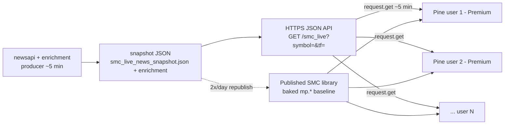

# Live Overlay via `request.get()` — Strategy & Planning

**Status**: Proposed (planning only — no implementation yet)
**Date**: 2026-06-04
**Author**: Engineering
**Scope**: Decoupling intraday-volatile enrichment fields from the 2×/day
library publish into a runtime `request.get()` "fast overlay" channel.
**Relates to**: [v5_5b_architecture.md](v5_5b_architecture.md),
[SMC_TV_Bridge.pine](../SMC_TV_Bridge.pine),
[SMC_Core_Engine.pine](../SMC_Core_Engine.pine)

**Product decision (2026-06-04, locked)**: The fast overlay is delivered
**exclusively** through Pine `request.get()` (TradingView Premium+). Any
solution that requires end users to install or self-host software (e.g. the
Streamlit terminal or a local bot) is **out of scope** — the per-user install
and support burden is a NO-GO. Non-Premium users remain on the 2×/day baked
baseline; the fast overlay is a **Premium-tier benefit**.

> This is a decision/planning document. It defines the problem, the field
> classification, the target architecture, the contract shape, risks, and a
> phased rollout. It deliberately does **not** change any Pine or Python code.
> Implementation follows in a separate change once this is reviewed.

---

## 1. Problem Statement

News and other enrichment values reach Pine users as **baked-in constants**
inside the published SMC library (e.g. `mp.NEWS_BEARISH_TICKERS`,
`mp.REL_VOL`, `mp.VIX_LEVEL`). Updating them means **re-publishing the
library** via the Playwright flow ([smc-library-refresh.yml](../.github/workflows/smc-library-refresh.yml)),
which runs **2×/day** (16:00 / 20:00 UTC) and is bounded by TradingView
publish rate limits, version governance, and the readonly preflight.

Several of these fields change **intraday** (order flow, squeeze state, VIX,
event-risk windows, breaking news). For those, a twice-daily snapshot is
effectively stale for most of the trading day. The publish channel **cannot**
be accelerated to minute cadence — TradingView does not permit it, and each
push is a new published version.

**Goal**: deliver intraday-fresh values (target ~5 min) to end users without
re-publishing, while preserving the existing baked-in baseline as a fallback.

---

## 2. Two Delivery Channels (Slow Baseline + Fast Overlay)

| Channel | Mechanism | Cadence | Audience | Backtestable |
| --- | --- | --- | --- | --- |
| **Slow baseline** (existing) | Baked `mp.*` constants, library republish | 2×/day | All users (all TV tiers) | Yes (deterministic) |
| **Fast overlay** (proposed) | Pine `request.get()` → HTTPS JSON endpoint | ~5 min (pull) | **TV Premium+ only** | No (live only) |

**Design rule**: the fast overlay **augments**, never replaces, the baseline.
When the overlay is fresh, it overrides the corresponding baked default at
runtime; when it is stale/absent/unreachable, Pine falls back to the baked
`mp.*` value. This keeps Lite/Basic users fully functional on the baseline and
keeps backtests deterministic (overlay is realtime-only).

**Tiering**: the fast overlay is a **Premium-only** feature by design (the
`request.get()` mechanism requires TV Premium+ anyway). This is the *only*
delivery path — there is intentionally no terminal/bot/self-host alternative
to support.



---

## 3. Field Classification — What to Decouple

Decoupling is justified **only** by intraday change rate. Static/EOD fields
stay baked. Source of field list: [SMC_Core_Engine.pine](../SMC_Core_Engine.pine)
manifest block (`mp.*` assignments).

> NOTE: This classification is by **field semantics**, not a measured update
> rate. Before implementation, the actual producer update frequency per field
> must be verified at the enrichment source (see §8 open questions).

### 3.1 🔴 High value — change minute-to-minute (Phase 1 candidates)

| Group | Fields | Why |
| --- | --- | --- |
| News (already identified) | `NEWS_BEARISH_TICKERS`, `NEWS_BULLISH_TICKERS`, `NEWS_CATEGORY_MAP`, `NEWS_COUNT_MAP`, `BREAKING_NEWS_TICKERS`, `HIGH_IMPACT_NEWS_COUNT`, `MOST_MENTIONED_TICKER` | Ad-hoc / breaking by definition |
| Flow Qualifier (v5.1) | `REL_VOL`, `REL_ACTIVITY`, `REL_SIZE`, `DELTA_PROXY_PCT`, `FLOW_LONG_OK`, `FLOW_SHORT_OK`, `ATS_VALUE/CHANGE_PCT/ZSCORE/STATE`, `ATS_SPIKE_UP/DOWN`, `ATS_BULLISH/BEARISH_SEQUENCE` | Order flow moves bar-by-bar |
| Compression / ATR | `SQUEEZE_ON`, `SQUEEZE_RELEASED`, `SQUEEZE_MOMENTUM_BIAS`, `ATR_REGIME`, `ATR_RATIO` | Squeeze release is an intraday timing signal |
| Market Tone / VIX | `VIX_LEVEL`, `TONE`, `GLOBAL_HEAT`, `GLOBAL_STRENGTH` | VIX moves continuously |
| Event Risk Light | `EVENT_WINDOW_STATE`, `EVENT_RISK_LEVEL`, `NEXT_EVENT_TIME`, `MARKET_EVENT_BLOCKED`, `SYMBOL_EVENT_BLOCKED`, `EVENT_PROVIDER_STATUS` | Block windows open/close intraday — **safety-critical** |

### 3.2 🟡 Medium value — change over the day, slower (Phase 2, optional)

| Group | Fields | Note |
| --- | --- | --- |
| Session Context | `SESSION_CONTEXT`, `IN_KILLZONE`, `SESSION_VOLATILITY_STATE` | Time-driven; Pine could even compute killzone locally |
| OB / FVG Lifecycle | `PRIMARY_OB_*`, `PRIMARY_FVG_*`, `FVG_FILL_PCT` | Mitigation/fill advances intraday |
| Structure State | `STRUCTURE_LAST_EVENT`, `STRUCTURE_FRESH`, `STRUCTURE_TREND_STRENGTH` | BOS/CHOCH events |
| Sector Rotation | `SECTOR_LEADING/LAGGING/STRONGEST/WEAKEST`, `SECTOR_BREADTH` | Moves slowly |
| Signal Quality | `SIGNAL_QUALITY_SCORE/TIER`, `SIGNAL_FRESHNESS` | Derived; follows inputs above |

### 3.3 🟢 Low value — quasi-static intraday → keep baked

`MARKET_PE_*`, `TREASURY_*Y_YIELD`, `YIELD_CURVE_*`, `SHORT_INTEREST_*`,
`EARNINGS_TODAY_TICKERS`, `EARNINGS_TOMORROW_TICKERS`, `HIGH_IMPACT_MACRO_TODAY`,
`UNIVERSE_TICKERS`, `MARKET_REGIME`, `TRADE_STATE`. EOD/daily — 2×/day publish
is sufficient. Decoupling these would waste API load for no freshness gain.

---

## 4. Target Architecture

### 4.1 One combined endpoint, not per-field

Do **not** expose 30 endpoints. Serve **one** "live overlay" JSON per symbol
that carries the 🔴 bundle (and optionally 🟡 in Phase 2). One request per
chart, cacheable, identical payload per (symbol, tf).

```
GET /smc_live?symbol=AAPL&tf=15m
→ 200 OK
{
  "schema": "smc-live-overlay/1",
  "symbol": "AAPL",
  "tf": "15m",
  "asof_ts": 1717500000,
  "stale": false,
  "flow":     { "rel_vol": 1.8, "delta_proxy_pct": 0.42, "long_ok": true, "short_ok": false, "ats_state": "ELEVATED", "ats_zscore": 2.1 },
  "squeeze":  { "on": false, "released": true, "momentum_bias": "BULLISH", "atr_regime": "EXPANSION", "atr_ratio": 1.4 },
  "market":   { "vix": 14.2, "tone": "RISK_ON", "global_heat": 0.6, "global_strength": 0.55 },
  "event":    { "window_state": "CLEAR", "risk_level": "LOW", "next_event_time": "", "market_blocked": false, "symbol_blocked": false, "provider_status": "ok" },
  "news":     { "bias": "BULLISH", "breaking": false, "high_impact_count": 0, "most_mentioned": "AAPL" }
}
```

- `asof_ts` + `stale` let Pine decide freshness independent of TV recalc timing.
- Flat-ish nested JSON; the existing [SMC_TV_Bridge.pine](../SMC_TV_Bridge.pine)
  `f_getField` parser already handles flat `"key":value` pairs and would be
  extended for the nested groups (or the payload flattened to `flow_rel_vol`
  style keys to reuse the parser verbatim — decide in §8).

### 4.2 Pine merge logic (baseline ← overlay)

Per field, a single resolver:

```
resolved = (overlay_fresh and overlay_has_field) ? overlay_value : baked_mp_value
overlay_fresh = (timenow/1000 - overlay.asof_ts) < OVERLAY_MAX_AGE_SEC
```

The baked `mp.*` value is **always** the safe default. No field becomes
unavailable if the overlay is down.

### 4.3 Serving layer

- A small HTTPS JSON API (FastAPI/Flask) reading the existing 5-min snapshot
  + enrichment artifacts, hosted centrally (by us, one service). This is
  **not** the Streamlit terminal — Streamlit is a human UI, cannot be consumed
  by Pine, and per the product decision is explicitly **not** a delivery path.
  Users install nothing: they only add the Bridge indicator to their chart.
- Cacheable behind a CDN; payload identical per (symbol, tf), so 200 users =
  trivial load with a short-TTL cache.
- Reuses the producer artifacts that already refresh every ~5 min.

---

## 5. Hard Constraints (must be acknowledged before build)

1. **Premium gate (accepted as the product model)**: `request.get()` is
   TradingView **Premium+ only**. Every decoupled field — not just news —
   inherits this. Lite/Basic users stay on the 2×/day baseline. This is
   **accepted and intended**: the fast overlay is a Premium-tier benefit, and
   no non-Pine fallback channel will be built or supported.
2. **HTTPS only, public**: TV requires the endpoint reachable over HTTPS with
   valid JSON.
3. **Not second-fresh**: `request.get()` is tied to bar updates / recalc and
   may be throttled/cached by TV. "~5 min" is realistic; "realtime seconds" is
   not. Set user expectations accordingly.
4. **Determinism / backtest**: baked values are reproducible; overlay values
   are live-only and non-historical. Keep the split clean: baseline =
   backtestable, overlay = realtime decoration only.

---

## 6. Safety: Event-Risk Fail-Safe (non-negotiable)

`MARKET_EVENT_BLOCKED` / `SYMBOL_EVENT_BLOCKED` are **safety-critical**. If the
overlay drives these and the endpoint fails, Pine must fail **toward
caution**, never toward "clear":

```
# On overlay unreachable/stale for event fields:
effective_blocked = baked_blocked OR overlay_blocked   # OR-combine, never replace-with-clear
# If overlay is stale, ignore its "clear" and keep baked/caution.
```

Recommendation: in Phase 1, treat event-risk as **augment-only escalation**
(overlay may add a block, never remove one) until the overlay's reliability is
proven in production.

---

## 7. Phased Rollout

| Phase | Content | Exit criteria |
| --- | --- | --- |
| **0 — This doc** | Strategy, field classes, contract shape, risks | Reviewed/approved |
| **1 — Endpoint + News+Flow+VIX overlay** | Stand up HTTPS JSON API from existing snapshot; wire `request.get()` in a Bridge indicator for News, Flow Qualifier, Squeeze/ATR, VIX/Tone | One symbol overlay live in a test chart; fallback verified when endpoint down |
| **2 — Event-Risk (escalation-only) + 🟡 group** | Add event-risk as augment-only block; add session/OB/FVG/structure | Fail-safe verified (endpoint kill → caution, not clear) |
| **3 — Productionize** | CDN/cache, monitoring, per-symbol fan-out, docs for users on enabling the Bridge indicator | 200-user load test; cache hit ratio acceptable |

---

## 8. Open Questions / To Verify Before Build

1. **Measured update frequency** of each 🔴 field at the producer source —
   confirm they really change intraday (this doc classifies by semantics).
2. **Payload shape**: nested JSON vs. flattened keys (`flow_rel_vol`) to reuse
   [SMC_TV_Bridge.pine](../SMC_TV_Bridge.pine) `f_getField` without a new parser.
3. **Hosting**: where the FastAPI endpoint runs (same box as producer? separate
   cloud service?) and how it gets the 5-min snapshot (shared volume vs. pull).
4. **Auth/abuse**: is the endpoint open or token-gated? Pine `request.get()`
   can pass a query param but cannot keep secrets — assume the payload is
   effectively public; do not expose anything sensitive.
5. **Symbol coverage**: only universe-covered tickers return data; define the
   404/empty contract for off-universe symbols.
6. **Premium entitlement**: how is Premium-only access enforced/communicated
   (TV publish as invite-only/Premium script vs. endpoint-side gating)? Note
   the endpoint cannot reliably authenticate the TV user, so "Premium-only" is
   enforced primarily via script access, not the API.

---

## 9. Decision Requested

Approve the **slow-baseline + fast-overlay** model and the Phase 1 field set
(News + Flow Qualifier + Squeeze/ATR + VIX/Tone, with Event-Risk deferred to
Phase 2 as escalation-only). On approval, implementation proceeds: define the
JSON contract precisely (§4.1), build the endpoint, and activate the
`request.get()` path in the Bridge indicator with baked-fallback merge logic.
