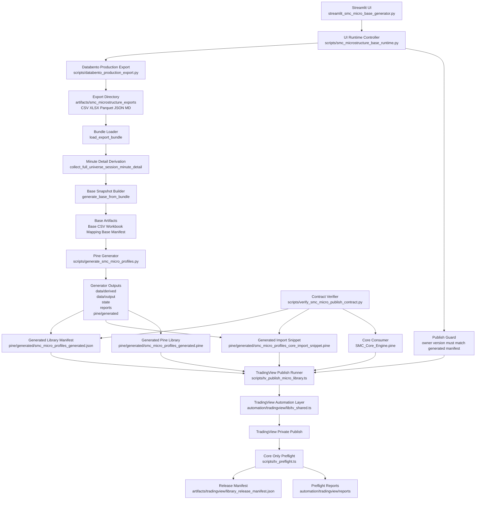

# SMC Microstructure UI Architecture Diagram

## Purpose

This document provides a visual architecture reference for the SMC microstructure UI pipeline.

Use it together with:

- [smc-microstructure-ui-audit.md](smc-microstructure-ui-audit.md)
- [smc-microstructure-ui-operator-runbook.md](smc-microstructure-ui-operator-runbook.md)
- [smc-snapshot-target-architecture.md](smc-snapshot-target-architecture.md)

## Canonical Contract Note

The Streamlit/publish pipeline described below is not the canonical contract for the new SMC snapshot and TradingView bridge work.

For all future structure/meta/layering/transport decisions, use:

- [smc-snapshot-target-architecture.md](smc-snapshot-target-architecture.md)

That document defines the target architecture for:

1. `SmcStructure`
2. `SmcMeta`
3. `ZoneStyle`
4. `SmcSnapshot`
5. the layering invariants
6. the JSON schema and reference examples

## Mermaid Diagram

## Diagram Interpretation

The diagram should be read in four zones.

### 1. UI And Orchestration Zone

The Streamlit entrypoint launches the UI runtime controller. That controller does not compute trading logic itself. It orchestrates the export, base derivation, library generation, and publish flows.

### 2. Data Acquisition And Base Derivation Zone

The Databento production export writes a broad artifact set into the export directory. The base runtime then reloads the export bundle, derives full-session minute detail, and writes a normalized base snapshot plus traceability artifacts.

### 3. Generator And Packaging Zone

The Pine generator consumes the base CSV and writes:

1. feature CSVs
2. list CSVs
3. persistent state
4. diff reports
5. generated Pine library
6. generated import snippet
7. generated manifest

These outputs together form the local release contract.

### 4. TradingView Release And Validation Zone

The publish runner is enabled only when the UI publish guard confirms that configured owner/version match the generated manifest.

The publish runner then uses the generated manifest, generated import snippet, generated library, and the core consumer file to:

1. verify contract alignment
2. publish the library to TradingView
3. revalidate that the core consumer still compiles against the published import path
4. write final release state and evidence artifacts

## Control Points Highlighted By The Diagram

The principal control points are:

1. export manifest and export directory artifacts
2. base manifest and mapping reports
3. generated Pine library manifest
4. generated core import snippet
5. explicit import in the core consumer
6. TradingView release manifest
7. post-publish preflight report

## Release Invariant

The main release invariant shown by the diagram is:

The generated manifest, generated import snippet, and core consumer import must all resolve to the same `owner/library/version` path.

No part of the system assumes that TradingView will resolve the latest version automatically.
