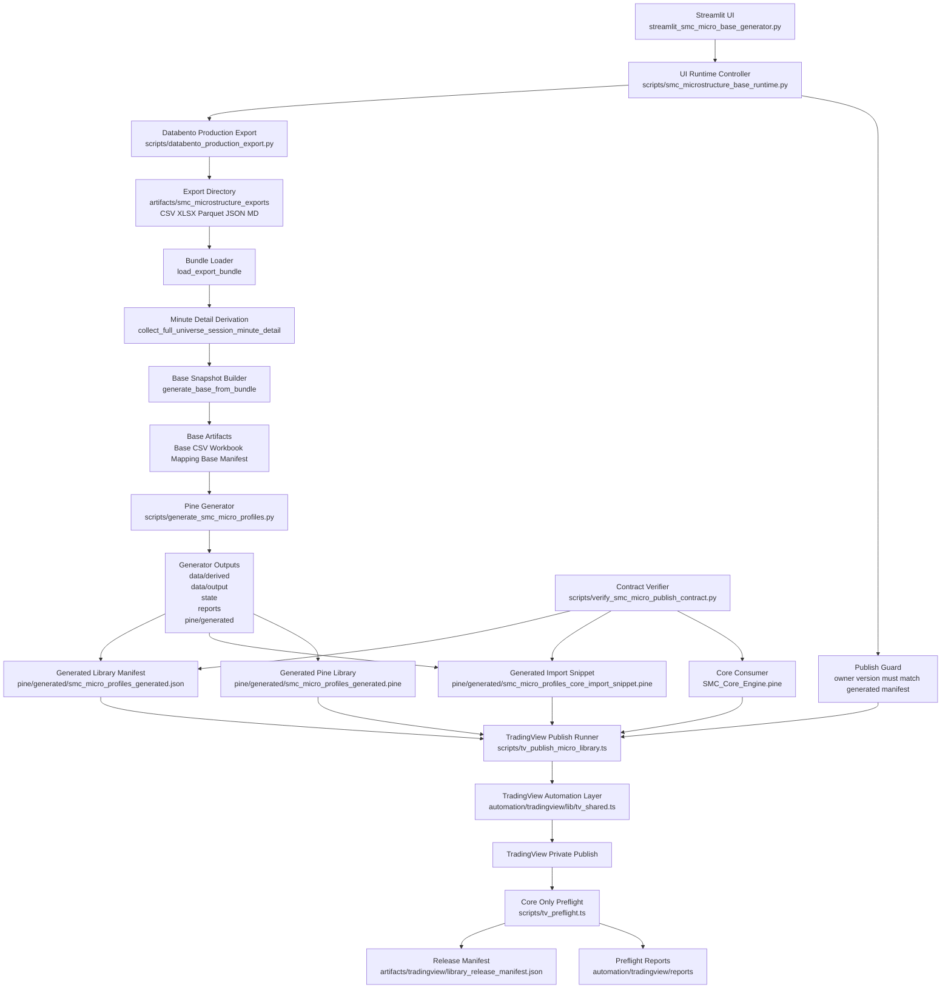

# SMC Microstructure UI Audit And Technical Review

## Purpose And Scope

This document describes the end-to-end technical architecture behind the SMC microstructure Streamlit UI, the Databento-backed scanner/export pipeline, the base-generator pipeline, the Pine library generation pipeline, and the TradingView upload and validation automation.

The intended audience is:

- technical reviewers
- auditors validating control points and release handling
- maintainers extending the scanner, generator, or TradingView automation
- operators responsible for running the UI and publishing the generated library

This document is meant to be sufficient for an engineering audit or architecture review. It focuses on:

- functional decomposition
- data flow and persisted artifacts
- release-contract invariants
- automation boundaries
- validation and failure handling
- operator responsibilities and non-automated decisions

It does not attempt to certify trading performance or signal quality. It documents the software system that derives, persists, packages, publishes, and validates microstructure profile data.

Companion documents:

- [smc-microstructure-ui-operator-runbook.md](smc-microstructure-ui-operator-runbook.md)
- [smc-microstructure-ui-architecture.md](smc-microstructure-ui-architecture.md)

## Embedded Architecture Diagram

The following diagram is embedded here so that the audit document remains self-contained during review handoff.

## System Overview

The SMC microstructure toolchain is composed of five layers:

1. UI entry layer
   - [../streamlit_smc_micro_base_generator.py](../streamlit_smc_micro_base_generator.py)
2. UI orchestration and base-derivation layer
   - [../scripts/smc_microstructure_base_runtime.py](../scripts/smc_microstructure_base_runtime.py)
3. Databento production export layer
   - [../scripts/databento_production_export.py](../scripts/databento_production_export.py)
4. Pine library generation layer
   - [../scripts/generate_smc_micro_profiles.py](../scripts/generate_smc_micro_profiles.py)
5. TradingView publication and runtime validation layer
   - [../scripts/tv_publish_micro_library.ts](../scripts/tv_publish_micro_library.ts)
   - [../scripts/verify_smc_micro_publish_contract.py](../scripts/verify_smc_micro_publish_contract.py)
   - [../scripts/tv_preflight.ts](../scripts/tv_preflight.ts)
   - [../automation/tradingview/lib/tv_shared.ts](../automation/tradingview/lib/tv_shared.ts)

From an operational perspective, the system executes four major phases:

1. Scan and export a full supported US-equity universe from Databento and metadata providers.
2. Derive a normalized microstructure base snapshot and supporting diagnostics.
3. Generate list state, Pine constants, import snippets, and release metadata from the base snapshot.
4. Optionally publish the generated Pine library to TradingView and validate that the core consumer can still import and compile against the published version.

The Streamlit runtime now supports an explicit SMC base-only export mode for the base-generator use case. In that mode, the export path skips the separate 04:00 preopen seed selection and the fixed 10:00 ET outcome snapshot because those branches are not required to derive the SMC microstructure base itself.

## Primary Scripts And Their Function

### 1. UI Entrypoint: `streamlit_smc_micro_base_generator.py`

File:

- [../streamlit_smc_micro_base_generator.py](../streamlit_smc_micro_base_generator.py)

Responsibility:

- provide a minimal Python entrypoint for the Streamlit application
- resolve project root and import the runtime implementation
- call `run_streamlit_micro_base_app()` and nothing else

Architectural role:

- this script intentionally contains no business logic
- it acts as a stable executable boundary for Streamlit
- all operational behavior lives in the runtime module

Audit implication:

- reviewers should treat this file as a thin launcher, not as the source of pipeline logic

### 2. UI Runtime And Base Orchestration: `scripts/smc_microstructure_base_runtime.py`

File:

- [../scripts/smc_microstructure_base_runtime.py](../scripts/smc_microstructure_base_runtime.py)

Responsibility:

- define the Streamlit UI and its controls
- resolve datasets and UI defaults
- orchestrate Databento export execution
- derive minute-level and symbol-day microstructure features
- build the base snapshot and write related artifacts
- invoke Pine library generation from a selected base snapshot
- invoke TradingView publication for the generated library
- guard publication by comparing configured owner/version against the generated manifest

This file is the main application controller.

It contains the runtime decisions for:

- dataset selection
- export output locations
- user action routing
- publish gating
- post-action reporting back into the UI

### 3. Pine Library Generator: `scripts/generate_smc_micro_profiles.py`

File:

- [../scripts/generate_smc_micro_profiles.py](../scripts/generate_smc_micro_profiles.py)

Responsibility:

- validate and coerce the base CSV against the schema
- derive scoring features and candidate list membership
- maintain persistent membership state with hysteresis
- apply manual overrides
- emit final list CSVs and diff reports
- generate a Pine library containing exported ticker constants
- generate a core import snippet
- generate a manifest that defines the authoritative import contract

This file is the transition point from data engineering into TradingView packaging.

### 4. Databento Production Export: `scripts/databento_production_export.py`

File:

- [../scripts/databento_production_export.py](../scripts/databento_production_export.py)

Responsibility:

- fetch and normalize the supported symbol universe
- pull daily bars and intraday measurements
- build ranked and full-universe exports
- generate exact-named and manifest-backed export artifacts
- provide the source bundle consumed by the base-runtime layer

This file is the market-data acquisition and production export backbone.

### 5. TradingView Publish And Validation Automation

Files:

- [../scripts/tv_publish_micro_library.ts](../scripts/tv_publish_micro_library.ts)
- [../scripts/verify_smc_micro_publish_contract.py](../scripts/verify_smc_micro_publish_contract.py)
- [../scripts/tv_preflight.ts](../scripts/tv_preflight.ts)
- [../automation/tradingview/lib/tv_shared.ts](../automation/tradingview/lib/tv_shared.ts)

Responsibility:

- validate that manifest, generated snippet, and core import path stay aligned
- open TradingView in an authenticated reusable browser session
- load the generated library into the Pine editor
- save and publish the library privately in TradingView
- verify the reopened published script identity and only accept version proof from script-context UI evidence; generic body-text version hits are fallback diagnostics only
- re-run a focused core-only TradingView preflight to verify that the core consumer still compiles against the published import path
- persist publish status and post-publish evidence into a machine-readable release manifest

This automation layer is a controlled release and runtime validation mechanism, not a trading or signal engine.

## High-Level Data Flow

The end-to-end flow is:

1. Operator launches the Streamlit UI.
2. UI collects credentials, dataset, lookback, export path, score profile, and library owner/version.
3. UI calls the Databento production export pipeline.
4. Export pipeline writes bundle and exact-named artifacts into the export directory.
5. UI runtime loads the export manifest and bundle.
6. UI runtime derives full-session minute detail and symbol-day microstructure features.
7. UI runtime writes the base snapshot, workbook, mapping report, and base manifest.
8. UI invokes the Pine generator using the latest base CSV.
9. Pine generator writes feature CSV, lists CSV, persistent list state, diff report, generated Pine library, core import snippet, and generator manifest.
10. UI optionally triggers TradingView publish.
11. TradingView publish runner validates the local contract, publishes the library, reopens the published script for script-context verification, runs a focused core-only preflight, and updates the library release manifest.

At no point does the system rely on implicit version discovery in TradingView. Version handling is explicit and encoded in the generated import path.

## UI Runtime Design

### Sidebar Inputs

The Streamlit UI exposes the following primary inputs in [../scripts/smc_microstructure_base_runtime.py](../scripts/smc_microstructure_base_runtime.py):

- Databento API key
- FMP API key
- export directory
- Databento dataset
- trading-day lookback
- bullish score profile
- force-refresh toggle
- XLSX output toggle
- TradingView library owner
- TradingView library version

The dataset input is no longer free text. It is resolved from:

1. Databento metadata when the API key is available
2. a deterministic fallback list built from `PREFERRED_DATABENTO_DATASETS` when metadata is unavailable

This lowers the operational risk of invalid dataset strings and ties the UI directly to the repo’s existing dataset selection logic.

### UI Actions

The UI exposes four primary actions:

1. `Run SMC Base Scan`
2. `Refresh Data`
3. `Generate Pine Library`
4. `Publish To TradingView`

These are action-oriented entry points into distinct pipeline phases.

### Session State

The UI persists the following objects in Streamlit session state:

- `smc_base_logs`
- `smc_base_result`
- `smc_pine_result`
- `smc_publish_result`

This allows the operator to inspect artifacts and results without rerunning earlier steps in the same browser session.

### Publish Guard

Before the publish action is enabled, the UI validates the generated library contract using `evaluate_micro_library_publish_guard(...)`.

That guard ensures:

1. the generated library manifest exists
2. the manifest is readable
3. the manifest owner matches the current UI owner
4. the manifest version matches the current UI version
5. the generated manifest, import snippet, and `SMC_Core_Engine.pine` import contract validate as exact code lines in the expected order

If these do not match, publish is blocked.

This is an important release control because the TradingView publish path uses the already generated Pine artifact. A mismatch between UI configuration and generated artifact metadata would otherwise allow operators to publish the wrong logical version.

The UI now shows both:

- configured publish target
- generated manifest contract
- publish-guard readiness state for owner/version and full contract validation

This makes misalignment auditable and operator-visible before the publish step.

## Scanner And Export Layer

### Production Export Pipeline

The full market-data export path is centered on `run_production_export_pipeline(...)` in [../scripts/databento_production_export.py](../scripts/databento_production_export.py).

The pipeline performs the following major phases:

1. validate inputs and resolve defaults
2. list recent trading days
3. optionally estimate costs, though the default operational mode skips cost estimation
4. fetch the raw US equity universe
5. enrich the universe with optional fundamentals
6. filter the universe against Databento support
7. load daily bars for the supported universe
8. run intraday screening and ranking logic
9. optionally collect second-level and minute-level detail across the full universe
10. build production export artifacts, exact-named files, and the manifest

This layer is designed to produce a broad, reproducible bundle that downstream layers can consume without contacting TradingView.

### Export Outputs

The production export writes a manifest-backed artifact set and returns:

- manifest payload
- exported path map
- exact-named path map
- ranked results
- intraday results
- daily bars
- daily symbol features for the full universe
- additional detail frames for open, close, premarket, and quality-window analysis

The export layer is therefore both:

- a data acquisition service
- a durable persistence layer for the downstream base-generator

### Exact-Named Exports

The production export also writes exact-named artifacts and an exact-named export state. This matters for auditability because it creates stable artifact names for downstream inspection and external tooling.

## Base Snapshot Derivation Layer

### Generator Objective

The base snapshot is the normalization boundary between raw or semi-raw Databento export data and the stable schema consumed by the Pine generator.

This layer answers the question:

How do we transform broad multi-session market data into one consistent symbol-level microstructure contract per `asof_date`?

### Minute-Level Session Detail

`collect_full_universe_session_minute_detail(...)` retrieves full-universe `ohlcv-1m` session detail from premarket through afterhours.

It:

- resolves schema availability end times
- batches symbols for retrieval
- reads from a file cache when possible
- writes day-level cache files when enabled
- classifies each minute into `premarket`, `regular`, `afterhours`, or `overnight`
- derives a trade-count proxy and other normalized output columns

This function is the minute-resolution bridge between the broader export bundle and the microstructure base derivation.

### Symbol-Day Feature Frame

The runtime layer builds a symbol-day feature frame from:

- minute-level session detail
- daily symbol features from the production export

These symbol-day features are then rolled into trailing 20-day per-symbol summaries inside `build_base_snapshot_from_bundle_payload(...)`.

### Base Snapshot Construction

For each symbol, the base snapshot includes:

- universe identity fields
- liquidity and spread measures
- session participation shares
- intraday cleanliness and consistency metrics
- reclaim, sweep, stop-hunt, and decay measurements

The base snapshot is then aligned to the schema’s `required_columns` and sorted by symbol.

This is a key audit boundary: after this step, downstream generator behavior is no longer dependent on arbitrary production-export column drift. Instead, it depends on a controlled schema contract.

### Mapping Status And Traceability

The base runtime constructs a `mapping_payload` that records:

- source bundle manifest path
- selected `asof_date`
- row count
- direct fields
- derived fields
- missing fields
- a row-wise mapping-status table with source sheet, source columns, and explanatory note

This mapping payload is written to:

- Markdown
- JSON
- XLSX sheet

That makes the transformation from production export to base contract auditable without reading code.

## Persisted Base Artifacts

The base runtime derives deterministic filenames via `build_default_output_paths(...)`.

The principal base-layer artifacts are:

- `__smc_microstructure_base_{asof_date}.csv`
- `__smc_microstructure_base_{asof_date}.xlsx`
- `__smc_microstructure_symbol_day_features.parquet`
- `__smc_microstructure_mapping_{asof_date}.md`
- `__smc_microstructure_mapping_{asof_date}.json`
- `__smc_microstructure_base_manifest.json`
- `__session_minute_detail_full_universe.parquet`

These artifacts serve different review needs:

- CSV for generator input and bulk inspection
- XLSX for operator review
- Parquet for dense machine-readable symbol-day and minute detail
- Markdown and JSON for transformation auditability
- base manifest for handoff into the Pine-library packaging phase

## Base Manifest Semantics

The base manifest written by `write_base_manifest(...)` records:

- `asof_date`
- source bundle manifest path
- generated base CSV and optional XLSX paths
- symbol-day parquet path
- mapping report paths
- recommended library import path
- `core_ready`
- `tradingview_publish_required`

This manifest is a handoff contract between:

- the data generation phase
- the library packaging and TradingView publication phase

## Pine Library Generation Layer

### Purpose

The Pine library generation layer consumes the base CSV and translates it into:

- list state
- exported list membership files
- Pine constants
- core import glue
- release metadata

### Schema Enforcement

The generator first loads [../schema/schema.json](../schema/schema.json) and validates the input base CSV against:

- required columns
- primary key uniqueness
- null constraints
- single `asof_date`
- configured value ranges

This is a hard validation step. The generator does not attempt silent schema recovery.

### Feature Bucketing And Candidate Rules

The generator computes bucket-relative percentile features and applies list-specific candidate rules across the seven supported exported lists:

- `clean_reclaim`
- `stop_hunt_prone`
- `midday_dead`
- `rth_only`
- `weak_premarket`
- `weak_afterhours`
- `fast_decay`

These candidate flags are not published directly. They feed a state machine with hysteresis.

### Persistent State And Hysteresis

The persistent membership state is stored in:

- `state/microstructure_membership_state.csv`

The generator maintains:

- `is_active`
- `active_since`
- `add_streak`
- `remove_streak`
- `last_score`
- `last_run_date`
- `candidate_active`
- `decision_source`
- `decision_reason`

This means list inclusion is not just a point-in-time thresholding result. It is a stateful decision process governed by the schema’s hysteresis configuration.

### Override Application

Optional overrides are loaded from:

- `data/input/microstructure_overrides.csv`

Overrides can force add or remove decisions for a given `asof_date`, symbol, and list.

The generator records overrides in `decision_source` and `decision_reason`, preserving traceability between machine logic and human intervention.

### Generator Outputs

The generator output paths are defined in [../schema/schema.json](../schema/schema.json):

- `data/derived/microstructure_features_{asof_date}.csv`
- `data/output/microstructure_lists_{asof_date}.csv`
- `state/microstructure_membership_state.csv`
- `reports/microstructure_lists_diff_{asof_date}.md`
- `pine/generated/smc_micro_profiles_generated.pine`
- `pine/generated/smc_micro_profiles_generated.json`
- `pine/generated/smc_micro_profiles_core_import_snippet.pine`

### Pine Library Structure

The generated Pine library contains:

- TradingView Pine version declaration
- `library("smc_micro_profiles_generated")`
- export constants such as `ASOF_DATE`, `UNIVERSE_ID`, `LOOKBACK_DAYS`, and `UNIVERSE_SIZE`
- one exported string constant per list, for example `CLEAN_RECLAIM_TICKERS`

Where a list becomes too large, the writer shards the symbol CSV string across multiple constants and concatenates them into the exported constant.

This is a practical implementation detail relevant to audit and maintenance because it reduces the risk of overlong inline Pine string literals.

### Core Import Snippet

The core import snippet is generated separately and contains:

- the authoritative import line using `owner/library/version`
- alias-to-effective-variable assignments used by the core

This snippet is part of the release contract and must remain aligned with the manifest and the core consumer.

### Generator Manifest

The generated library manifest records:

- `library_name`
- `library_owner`
- `library_version`
- `recommended_import_path`
- whether library publish is still required
- input and schema paths
- features, lists, state, diff-report, Pine library, and import snippet paths
- exported list names
- per-list counts

This manifest is the authoritative local contract for the library release.

## TradingView Upload And Automation Solution

### Why A Dedicated Upload Automation Exists

The Streamlit UI is a Python-based orchestration layer. TradingView publication is a browser automation problem. Those concerns are intentionally separated.

The upload automation therefore lives in a dedicated TypeScript/Playwright runner:

- [../scripts/tv_publish_micro_library.ts](../scripts/tv_publish_micro_library.ts)

This separation has two benefits:

1. the UI remains a deterministic local orchestrator
2. the TradingView release path can reuse the validated browser automation layer already used elsewhere in the repo

### Release Preconditions

Before publish, the runner verifies the local release contract:

1. generated manifest exists
2. generated import snippet exists
3. generated Pine library exists
4. core file exists
5. snippet import path matches manifest `recommended_import_path`
6. core import path for the library alias matches the same path
7. generated alias lines exist in the core file

This logic is implemented in both:

- Python verifier: [../scripts/verify_smc_micro_publish_contract.py](../scripts/verify_smc_micro_publish_contract.py)
- release runner: [../scripts/tv_publish_micro_library.ts](../scripts/tv_publish_micro_library.ts)

The duplication is deliberate. The Python verifier provides a lightweight local guard. The TypeScript runner enforces the same rule set during the automated publish path.

### TradingView Session Reuse

The publish runner requires a reusable authenticated TradingView session. It will not proceed when only a fresh login state is available.

This protects the release path from:

- anonymous TradingView state
- login popups during publish
- non-reproducible release runs

The underlying auth and browser session handling is provided by the TradingView automation layer in:

- [../automation/tradingview/lib/tv_shared.ts](../automation/tradingview/lib/tv_shared.ts)
- [../scripts/create_tradingview_storage_state.ts](../scripts/create_tradingview_storage_state.ts)

### Publish Flow

The publish runner executes the following sequence:

1. verify local manifest/snippet/core contract
2. open TradingView chart with reusable auth
3. open Pine editor
4. optionally open existing library script
5. load generated Pine library source into the editor
6. save the script under the generated library name
7. assert absence of visible compile errors
8. publish the script privately in TradingView
9. detect the published version from the TradingView UI
10. fail if the detected version does not match the expected manifest version
11. run a core-only preflight and mark release status based on that result

### Release Manifest

The machine-readable release tracking artifact is:

- [../artifacts/tradingview/library_release_manifest.json](../artifacts/tradingview/library_release_manifest.json)

It records:

- publish mode
- expected version
- published version
- publish status
- source manifest
- source snippet
- consumer files
- last referenced preflight report
- release notes

### Publish Status Semantics

The system uses explicit release states rather than implicit success assumptions:

- `manual_publish_required`
  - publish has not been completed or was not attempted
- `not_verified`
  - publish may have been attempted, but post-publish validation did not complete successfully
- `published`
  - publish succeeded and the core-only TradingView validation also passed

This is critical for auditability. A successful local generation does not equal a validated released library.

## Data Handoff Contracts

There are three major handoff contracts in the system.

### Contract 1: Production Export To Base Runtime

Boundary:

- `run_production_export_pipeline(...)` output manifest and frames

Consumers:

- `load_export_bundle(...)`
- `generate_base_from_bundle(...)`

Key persisted control point:

- production export manifest in the export directory

### Contract 2: Base Runtime To Pine Generator

Boundary:

- generated base CSV
- schema
- optional overrides

Consumer:

- `run_generation(...)`

Key persisted control points:

- base CSV
- base manifest
- mapping JSON and mapping Markdown

### Contract 3: Pine Generator To TradingView Consumer

Boundary:

- generated library manifest
- generated import snippet
- core import path in `SMC_Core_Engine.pine`

Consumers:

- contract verifier
- TradingView publish runner
- post-publish core-only preflight

This is the most critical contract in the release chain.

If any of these three diverge, the system must not declare a valid published library.

## The Three Authoritative Library Artifacts

For the micro-library release contract, three files are authoritative:

1. [../pine/generated/smc_micro_profiles_generated.json](../pine/generated/smc_micro_profiles_generated.json)
2. [../pine/generated/smc_micro_profiles_core_import_snippet.pine](../pine/generated/smc_micro_profiles_core_import_snippet.pine)
3. [../SMC_Core_Engine.pine](../SMC_Core_Engine.pine)

The governing invariant is:

The import path must be identical across all three.

In practical terms, this means:

- owner is explicit
- library name is explicit
- version is explicit
- no automatic latest-version resolution is assumed

This repo intentionally keeps versioning under operator control.

## Versioning Model And Operator Responsibility

The current implementation does not let the core automatically search for the latest TradingView library version.

Instead:

- the core imports an explicit `owner/library/version`
- the generated snippet writes the same path
- the generated manifest records the same path
- the UI publish guard enforces that the currently configured owner/version matches the generated artifact set

As a result, owner/version changes are treated as explicit release decisions by the operator.

This is the correct model for auditability because:

1. it avoids non-deterministic dependency resolution
2. it makes release promotion deliberate
3. it keeps artifact provenance clear

## Persistence Model And File Locations

### UI Export Directory

Default:

- `artifacts/smc_microstructure_exports`

Primary artifact formats written there:

- CSV
- XLSX
- Parquet
- JSON
- Markdown

### Generator Output Directories

Generator output roots are schema-driven and include:

- `data/derived`
- `data/output`
- `state`
- `reports`
- `pine/generated`

### TradingView Release Tracking

Tracking artifacts are written under:

- `artifacts/tradingview`
- `automation/tradingview/reports`

### Cache Layer

Databento-related cache files are written under:

- `artifacts/databento_volatility_cache`

This cache is used to reduce repeated remote fetches and to stabilize repeated runs over the same trading-day scope.

## Validation And Review Controls

The system contains multiple validation layers.

### Layer 1: Schema Validation

Executed during `run_generation(...)`.

Controls:

- required columns
- primary key integrity
- single `asof_date`
- numeric ranges

### Layer 2: Mapping And Base Traceability

Executed during base generation.

Controls:

- direct vs derived field classification
- source sheet and source column documentation
- base manifest

### Layer 3: Contract Verification

Executed before TradingView publish.

Controls:

- manifest import path
- snippet import path
- core import path
- alias-line propagation

### Layer 4: TradingView Runtime Validation

Executed after library publish through the core-only preflight.

Controls:

- reusable authenticated session
- chart access
- editor access
- compile success
- absence of visible compile errors

### Layer 5: Release Manifest Status Tracking

Executed after publish and post-publish validation.

Controls:

- expected version
- published version
- release status
- last referenced preflight report

## Failure Modes And Recovery

The system is designed to fail closed in the following cases:

### 1. Invalid Dataset Resolution

If Databento metadata is unavailable, the UI falls back to a controlled dataset list instead of allowing arbitrary unresolved values.

### 2. Missing Or Invalid Generated Library Manifest

If the generated manifest does not exist or cannot be read, publish is blocked at the UI level.

### 3. Owner/Version Drift

If the UI owner/version does not match the last generated manifest, publish is blocked and regeneration is required.

### 4. Contract Drift

If the manifest, generated snippet, and core import diverge, publish is refused.

### 5. Non-Reusable TradingView Auth

If no reusable authenticated session exists, TradingView release automation fails rather than trying to continue with an unsafe anonymous or interactive state.

### 6. Publish/Version Mismatch

If TradingView reports a version different from the manifest expectation, the release is not marked as published.

### 7. Post-Publish Core Regression

If the core-only preflight fails after publish, release status is downgraded to `not_verified` instead of `published`.

## Operational Commands

Relevant commands defined in [../package.json](../package.json):

- `npm run smc:verify-micro-publish`
- `npm run tv:publish-micro-library`
- `npm run tv:storage-state`
- `npm run tv:preflight`
- `npm run tv:publish-micro-library`
- `npm run tv:test`
- `npx tsc --noEmit`

These commands partition responsibilities:

- contract verification
- TradingView authentication capture
- TradingView publish automation
- TradingView validation
- test and type-safety validation

## Review Checklist

For an audit or release review, the recommended review order is:

1. inspect the generated base manifest
2. inspect the generated library manifest
3. inspect the generated import snippet
4. confirm the core import path matches the snippet and manifest
5. inspect the library release manifest under `artifacts/tradingview`
6. inspect the most recent publish report under `automation/tradingview/reports`
7. inspect the most recent preflight report for the core-only validation
8. confirm that `publishStatus` is `published` only when the post-publish validation report is green

## Security And Credential Handling

Credentials used by the system are:

- Databento API key
- optional FMP API key
- TradingView authenticated browser session, usually via storage-state or persistent profile

The system does not persist the API keys as part of the generated base or library artifacts. TradingView release automation relies on reusable auth state external to the generated data artifacts.

## Non-Goals

The system described here does not:

- execute live trades
- certify profitability of the resulting lists
- auto-discover the newest TradingView library version for the core import
- treat a local library generation as equivalent to a validated published library

## Audit Conclusion

The microstructure UI and supporting automation implement a controlled, multi-stage release pipeline with explicit contracts between:

- data export
- base derivation
- Pine library generation
- TradingView publication
- post-publish runtime validation

The strongest design choices from an audit perspective are:

1. explicit persisted manifests at each stage
2. schema-validated handoff into the Pine generator
3. explicit owner/version import contracts
4. UI-level publish blocking on owner/version drift
5. post-publish validation against the actual TradingView consumer path
6. machine-readable release status tracking

The principal operational responsibility that remains intentionally manual is release version selection. The system enforces consistency once a version is chosen, but it does not choose the version for the operator.
