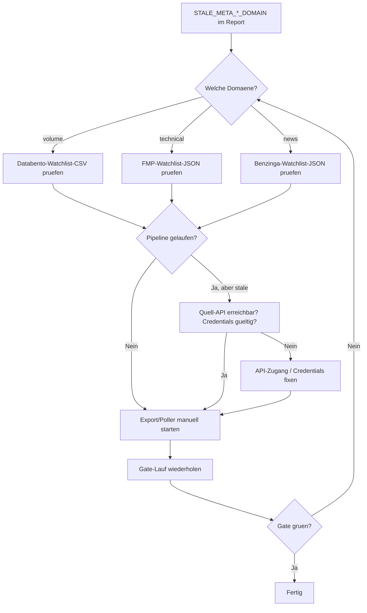

# SMC Branch Protection and Release Gates

This document defines the recommended governance setup for the SMC gate workflows.
It does not change SMC domain logic, heuristics, or workflow architecture.

## 1) Ziel

Die SMC-Gates sollen in der Praxis verbindlich genutzt werden, damit:

- Merges nach `main` nur mit schnellen, stabilen Mindest-Pruefungen erfolgen.
- tiefere Integrationssignale sichtbar bleiben, ohne PR-Flow unnoetig zu blockieren.
- Releases und TradingView-Publishes nur mit strikten, release-spezifischen Gates erfolgen.

## 2) Empfohlene Branch Protection fuer `main`

Empfehlung in GitHub Branch Protection (Settings > Branches > Branch protection rules):

- Require a pull request before merging: `enabled`
- Require status checks to pass before merging: `enabled`
- Required status checks (minimal blocking baseline):
  - `smc-fast-pr-gates / fast-gates`
- Optional zusaetzlich als required (falls Legacy-CI weiter merge-blocking bleiben soll):
  - `CI / validate`
- Require conversation resolution before merging: `enabled` (empfohlen)
- Require linear history: `enabled` (empfohlen)
- Allow squash merge: `enabled` (empfohlen)
- Allow merge commits: `disabled` (empfohlen)
- Allow rebase merge: `optional` nach Team-Praeferenz
- Allow force pushes: `disabled` (empfohlen)
- Allow deletions: `disabled` (empfohlen)

Hinweis: Diese Einstellungen sind Empfehlungen. Sie werden hier dokumentiert, aber nicht automatisch per Repo gesetzt.

## 3) Gate-Kategorien und konkrete Checks

### A) Merge-blocking fuer `main`

- Workflow: `smc-fast-pr-gates`
- Job/Check: `fast-gates`
- Sichtbarer Check-Name in Branch Protection: `smc-fast-pr-gates / fast-gates`

Optional zusaetzlich:

- Workflow: `CI`
- Job/Check: `validate`
- Sichtbarer Check-Name: `CI / validate`

### B) Nicht merge-blocking, aber sichtbar laufen lassen

- Workflow: `smc-deeper-integration-gates`
- Job/Check: `deeper-gates`
- Trigger: `push` auf `main`, `workflow_dispatch`, `schedule` (nightly)
- Zweck: breitere Integrations-/Health-Sichtbarkeit ohne PR-Blocking

### C) Nur vor Release/Publish verpflichtend

- Workflow: `smc-release-gates`
- Job/Check: `release-gates`
- Trigger: `release.published`, `workflow_dispatch`
- Innerhalb dieses Jobs verpflichtend:
  - Pre-release artifact refresh via `scripts/run_smc_pre_release_artifact_refresh.py`
  - Strict release gate run via `scripts/run_smc_release_gates.py`
  - Publish-contract verification (im Release-Gate-Skript enthalten)
  - Reference bundle smoke gate (im Release-Gate-Skript enthalten)
  - Release validation test matrix

## 3.1) Verbindliche Release-Referenzmenge

Die strikten Release-Gates und der Pre-Release-Refresh nutzen eine zentrale Default-Referenzmenge aus
`smc_integration/release_policy.py`:

- Referenzsymbole (12 liquide US-Equities ueber 10 Sektoren):
  `AAPL`, `MSFT`, `AMZN`, `JPM`, `JNJ`, `XOM`, `CAT`, `PG`, `NEE`, `AMT`, `META`, `LIN`
- Referenz-Timeframes: `5m`, `15m`, `1H`, `4H`
- Harte Frische-Schwelle (default): `604800` Sekunden (`7d`)

### Konfiguration per Umgebungsvariable oder CLI

Die Defaults koennen auf drei Ebenen ueberschrieben werden (Prioritaet: CLI > Env > Default):

| Parameter | Env-Variable | CLI-Argument |
|---|---|---|
| Symbole | `SMC_RELEASE_SYMBOLS` (CSV) | `--symbols` |
| Timeframes | `SMC_RELEASE_TIMEFRAMES` (CSV) | `--timeframes` |
| Stale-Schwelle | `SMC_RELEASE_STALE_SECONDS` (int) | `--stale-after-seconds` |

Beispiel: `SMC_RELEASE_SYMBOLS=TSLA,NVDA python scripts/run_smc_release_gates.py`

## 3.2) Freeze-Policy fuer `SMC++.pine`

- `SMC_Core_Engine.pine` ist der release-verbindliche Producer fuer TradingView-Validation,
  Dashboard-Consumer und Strategy-Consumer.
- `SMC++.pine` bleibt eingefrorener Kompatibilitaetspfad.
- Zulaessig fuer `SMC++.pine` sind nur Compile-/Runtime-Fixes,
  regressionswahrende Kompatibilitaetskorrekturen und zugehoerige Doku-Anpassungen.
- Nicht zulaessig fuer `SMC++.pine` sind neue Features, neue Produktlogik,
  neue Parallel-Interpretationen oder neue aktive Consumer-Anbindungen.
- Der Release-Validierungslauf muss fuer diese Freeze-Policy mindestens
  `tests/test_smc_long_dip_regressions.py` und `tests/test_smc_legacy_governance.py`
  enthalten.

### Evidence-Coverage-Schwellen

Die Gate-Evidence-Auswertung (`scripts/collect_smc_gate_evidence.py`) prueft zusaetzlich zur
Run-Anzahl auch die Breite der abgedeckten Symbole und Timeframes:

- `EVIDENCE_MIN_SYMBOL_COVERAGE = 5` — mindestens 5 verschiedene Symbole in OK-Runs.
- `EVIDENCE_MIN_TIMEFRAME_COVERAGE = 2` — mindestens 2 verschiedene Timeframes in OK-Runs.

`green_ready` wird nur `true`, wenn alle Kriterien erfuellt sind.

### Failure-Diagnostik

Wenn ein Release-Gate fehlschlaegt, enthaelt der Report ein `failure_reasons`-Array mit
strukturierten Ursachen-Codes:

| Reason-Code | Bedeutung |
|---|---|
| `STALE_DATA` | Manifest/Meta-Timestamps ueberschreiten die Frische-Schwelle. |
| `MISSING_ARTIFACT` | Erwartetes Artifact/Manifest fehlt. |
| `SMOKE_FAILURE` | Smoke-Check fuer ein Symbol/Timeframe-Paar fehlt oder fehlgeschlagen. |
| `INSUFFICIENT_SYMBOL_BREADTH` | Zu wenige verschiedene Symbole in der Referenzmenge. |
| `INSUFFICIENT_TIMEFRAME_BREADTH` | Zu wenige verschiedene Timeframes in der Referenzmenge. |
| `INSUFFICIENT_SUCCESSFUL_RUNS` | Zu wenige OK-Runs im Lookback-Fenster. |
| `PROVIDER_FAILURE` | Provider/Bundle/Refresh-Fehler. |

Die Evidence-Auswertung liefert analog ein `not_ready_reasons`-Array, wenn `green_ready = false`.

## 4) Fail vs Warn

- Merge-blocking:
  - Alles, was in required status checks liegt, blockiert Merge bei `fail`.
  - Empfohlen minimal: nur `smc-fast-pr-gates / fast-gates`.
- Sichtbare Warnungen (nicht merge-blocking):
  - `smc-deeper-integration-gates / deeper-gates` liefert tiefe Signale (inkl. degradations/warnings) fuer operative Nachverfolgung.
- Release-blocking:
  - `smc-release-gates / release-gates` ist release-verbindlich.
  - Release/Publish nur durchfuehren, wenn Gate `ok` ist oder Warnungen explizit begruendet und freigegeben sind.

## 5) Praktischer Ablauf fuer Entwickler

1. PR gegen `main` oeffnen.
2. Warten bis `smc-fast-pr-gates / fast-gates` gruen ist.
3. Optional tiefe Signale aus `smc-deeper-integration-gates / deeper-gates` pruefen (falls Lauf vorhanden).
4. Review/Conversation-Resolution abschliessen.
5. Merge (empfohlen: squash).
6. Bei release-relevanten Aenderungen vor Tag/Publish `smc-release-gates` manuell laufen lassen.
7. Erst nach erfolgreichem Release-Gate publizieren.

## 6) Praktischer Ablauf fuer Release/Publish

### Snapshot-/Bundle-bezogene Releases

1. Pre-release refresh laufen lassen: `scripts/run_smc_pre_release_artifact_refresh.py`.
2. `smc-release-gates / release-gates` erfolgreich ausfuehren (manuell oder per Release-Trigger).
3. Report `artifacts/ci/smc_pre_release_artifact_refresh_report.json` pruefen.
4. Report `artifacts/ci/smc_release_gates_report.json` pruefen.
5. Sicherstellen, dass fuer die Referenzmenge keine Missing-/Manifest-/Stale-Failures vorliegen.
6. Sicherstellen, dass Snapshot-Struktur sauber bleibt und `structure_context` nur additiv ist.

### TradingView Library Publish

1. Vor Publish Release-Gate erfolgreich.
2. Publish-Contract-Invarianten erfolgreich (im Release-Gate enthalten; basiert auf `scripts/verify_smc_micro_publish_contract.py`).
3. Referenz-Smoke-Checks erfolgreich (im Release-Gate enthalten).
4. Danach TradingView-Publish-Prozess gemaess Runbook starten.
5. Der manuelle TradingView-Validierungspfad bleibt `SMC_Core_Engine.pine` -> `SMC_Dashboard.pine` -> `SMC_Long_Strategy.pine`; `SMC++.pine` ist kein aktiver Publish- oder Consumer-Pfad mehr.

Bei Warnungen/Degradations:

- Core-Warnklassen werden im strict Release-Pfad zu harten Failures promoted.
- Nicht-Core-Warnungen bleiben sichtbar; optional kann der Lauf mit `--fail-on-warn` insgesamt verschaerft werden.
- Fuer Release/Pubish muss jede Warnung begruendet und dokumentiert werden (Issue/PR-Kommentar/Release Notes).

### Harte Release-Policy (fail-closed)

Im strict Release-Pfad werden diese Klassen nicht mehr als rein informative Signale behandelt:

- fehlendes Manifest oder fehlendes Referenz-Artifact
- kaputtes Manifest / unlesbare Manifeststruktur
- fehlender `generated_at`-Timestamp im Manifest
- stale Manifest-/Meta-Timestamps (ueber definierter Schwelle)
- fehlende oder fehlerhafte Smoke-/Bundle-Ergebnisse fuer Referenzpaare

PR-/Deeper-Gates duerfen weiterhin warn-orientiert bleiben; Release bleibt fail-closed.

## 6.1) Per-Domain-Staleness-Codes (meta_domain_diagnostics)

Neben den bestehenden Manifest-/Meta-Staleness-Codes (`STALE_MANIFEST_GENERATED_AT`,
`STALE_MANIFEST_FILE_MTIME`, `STALE_META_ASOF_TS`) gibt es pro Daten-Domaene
(Volume, Technical, News) eigene Degradation-Codes. Die Schwelle ist einheitlich
`_META_DOMAIN_STALE_HOURS = 48 h` (konfiguriert in `smc_integration/repo_sources.py`).

### Codes

| Code | Domaene | Bedeutung |
|---|---|---|
| `STALE_META_VOLUME_DOMAIN` | Volume | `volume_stale = true` – Volume-Meta (`asof_ts`) ist aelter als 48 h oder fehlt. |
| `STALE_META_TECHNICAL_DOMAIN` | Technical | `technical_stale = true` – Technical-Meta (`asof_ts`) ist aelter als 48 h oder fehlt. |
| `STALE_META_NEWS_DOMAIN` | News | `news_stale = true` – News-Meta (`asof_ts`) ist aelter als 48 h oder fehlt. |

### Verhalten nach Gate-Stufe

| Gate-Stufe | Auswirkung |
|---|---|
| Deeper / Nightly (`smc-deeper-integration-gates`) | Warnung / Degradation sichtbar; **nicht merge-blocking**. |
| Strict Release (`smc-release-gates`) | Promotion zu hartem Failure (`promoted_by: release_strict_policy`); **release-blocking**. |

### Felder in `meta_domain_diagnostics`

Fuer jede Domaene (volume, technical, news) stehen folgende Felder zur Verfuegung:

- `{domain}_source` – Name des Providers, der die Daten geliefert hat (z. B. `databento_watchlist_csv`, `fmp_watchlist_json`).
- `{domain}_asof_ts` – Epoch-Timestamp der Domaenen-Meta (`null` wenn nicht vorhanden).
- `{domain}_age_hours` – Alter in Stunden seit `asof_ts` (`null` wenn `asof_ts` fehlt).
- `{domain}_stale` – `true` wenn `age_hours > 48` oder `asof_ts` fehlt/ungueltig.
- `{domain}_fallback_used` – `true` wenn der primaere Provider nicht geliefert hat und ein Fallback-Provider genutzt wurde.

## 6.2) Operator-Handbuch: Domain-Staleness

### Typische Ursachen

| Code | Typische Ursache |
|---|---|
| `STALE_META_VOLUME_DOMAIN` | Databento-Watchlist-CSV nicht aktualisiert (Pipeline-Fehler, Export nicht gelaufen, CSV aelter als 48 h). |
| `STALE_META_TECHNICAL_DOMAIN` | FMP- oder TradingView-Watchlist-JSON nicht aktualisiert. Primaer-Provider fehlgeschlagen und Fallback ebenfalls veraltet. |
| `STALE_META_NEWS_DOMAIN` | Benzinga-Watchlist-JSON nicht aktualisiert oder News-Feed-Pipeline nicht gelaufen. |

### Sofortmassnahmen fuer Operatoren

1. **Report pruefen:** Im Health-/Gate-Report die `meta_domain_diagnostics` des betroffenen Symbols/Timeframes lesen. Dort stehen `{domain}_source`, `{domain}_age_hours` und `{domain}_asof_ts`.
2. **Provider-Pipeline pruefen:** Hat der zustaendige Export/Poller (Databento, FMP, Benzinga) zuletzt erfolgreich gelaufen?
3. **Manuellen Refresh ausloesen:** Den betroffenen Provider-Export erneut starten (z. B. Databento-Watchlist-Export, FMP-Refresh).
4. **Gate erneut laufen lassen:** Nach erfolgreichem Refresh den deeper- oder release-Gate-Lauf wiederholen.

### Wann ist es nur ein Warnsignal?

- Im **deeper/nightly**-Pfad: Domain-Staleness erzeugt eine sichtbare Degradation/Warning. Der CI-Lauf bleibt gruen (exit 0), solange `--fail-on-warn` nicht gesetzt ist. Kein Merge-Blocking.

### Wann blockiert es Release?

- Im **strict release**-Pfad (`smc-release-gates`): Jeder `STALE_META_*_DOMAIN`-Code wird zu einem harten Failure promoted (`promoted_by: release_strict_policy`). Release ist blockiert, bis die betroffene Domaene aufgefrischt wurde.

### Beispiel: `meta_domain_diagnostics` in einem Health-Report

```json
{
  "meta_domain_diagnostics": {
    "volume": "present",
    "volume_source": "databento_watchlist_csv",
    "volume_fallback_used": false,
    "volume_asof_ts": 1711497600.0,
    "volume_age_hours": 3.2,
    "volume_stale": false,
    "technical": "present",
    "technical_source": "tradingview_watchlist_json",
    "technical_fallback_used": true,
    "technical_asof_ts": 1711324800.0,
    "technical_age_hours": 51.2,
    "technical_stale": true,
    "news": "present",
    "news_source": "benzinga_watchlist_json",
    "news_fallback_used": false,
    "news_asof_ts": 1711494000.0,
    "news_age_hours": 4.2,
    "news_stale": false
  }
}
```

In diesem Beispiel wuerde `STALE_META_TECHNICAL_DOMAIN` emittiert, da `technical_age_hours > 48`.

### Evidence-Aggregation

Die Domain-Staleness-Codes werden vom Evidence-Collector (`scripts/collect_smc_gate_evidence.py`) separat aggregiert:

- `stale_domain_trend` – zaehlt je `STALE_META_*_DOMAIN`-Code die Haeufigkeit im Lookback-Fenster.
- `stale_domain_runs` – listet pro Code die betroffenen Report-Pfade und Timestamps auf.

### Decision Tree: Domain-Staleness beheben



## 7) Diese Checks in GitHub Branch Protection auswaehlen

Empfohlene Auswahl fuer `main`:

- Required: `smc-fast-pr-gates / fast-gates`
- Optional required (strenger): `CI / validate`
- Nicht required, aber beobachten:
  - `smc-deeper-integration-gates / deeper-gates`

Release-/Publish-verbindlich (nicht als PR-required fuer `main`):

- `smc-release-gates / release-gates`

## 8) Release-/Publish-Checklist

Vor Release oder TradingView-Publish:

- [ ] Pre-release refresh ist fuer die Referenzmenge erfolgreich durchgelaufen.
- [ ] `smc-release-gates / release-gates` ist gruen.
- [ ] Keine unbegruendeten `degradations_detected` oder `missing_artifacts` im Gate-Report.
- [ ] Keine Manifest-/Timestamp-/Stale-Verletzung fuer die Referenzsymbole und -timeframes.
- [ ] Referenz-Smoke-Checks sind gruen.
- [ ] Snapshot vs `structure_context` ist sauber (kein `structure_context` im Snapshot, nur additiv auf Bundle-Ebene).
- [ ] Publish-Contract-Invarianten sind gruen, wenn TradingView/Micro-Library betroffen ist.
- [ ] Keine lokalen Workspace-/Report-Artefakte im Commit (insb. `artifacts/` und temporaere Reports).
- [ ] Arbeitsbaum ist vor Tag/Release sauber (`git status --short` ohne unbeabsichtigte Aenderungen).
- [ ] Exakter Commit und Tag sind dokumentiert (Release Notes / changelog entry / manifest refs).

## 9) Operative Evidence-Phase (GELB -> GRUEN)

Ziel: Die bereits gehaertete Refresh-/Release-Kette ueber mehrere echte Nightly-/Release-Zyklen
operativ belegen, ohne SMC-Fachlogik oder Heuristiken weiter zu aendern.

Kleine verbindliche Baseline (Lookback-Fenster: `14` Tage):

- mindestens `3` erfolgreiche deeper/nightly-Health-Laeufe
- mindestens `2` erfolgreiche strict release-gate-Laeufe
- keine ungeklaerten harten Missing-/Stale-/Smoke-Core-Fehler im Lookback-Fenster

Hinweis: Diese Zielgroesse ist bewusst klein und praxisnah gehalten, um eine belastbare,
nicht ueberzogene Freigabeentscheidung zu ermoeglichen.

## 10) Welche Evidenz wird gesammelt

Die Gate-Skripte schreiben strukturierte JSON-Reports. Relevante Felder fuer die Nachverfolgung:

- `checked_at` / `checked_at_iso`
- `reference_symbols` / `reference_timeframes`
- `overall_status`
- `warnings` / `degradations_detected` / `failures`
- `runner.exit_code`
- `runtime_metadata.git_commit` sowie GitHub-Run-Metadaten (Workflow/Run-ID/Event/Ref)

Workflow-Artefakte:

- deeper/nightly:
  - `artifacts/ci/smc_deeper_refresh_report.json`
  - `artifacts/ci/smc_deeper_health_report.json`
  - `artifacts/ci/smc_deeper_evidence_summary.json`
- release:
  - `artifacts/ci/smc_pre_release_artifact_refresh_report.json`
  - `artifacts/ci/smc_release_gates_report.json`
  - `artifacts/ci/smc_release_evidence_summary.json`

## 11) Kompakte Evidence-Auswertung

Script: `scripts/collect_smc_gate_evidence.py`

Das Script aggregiert vorhandene JSON-Reports und liefert u. a.:

- `runs_total`, `runs_ok`, `runs_warn`, `runs_fail`
- `last_ok_at`, `last_fail_at`
- `recurring_failure_codes`
- `stale_trend`, `missing_trend`, `smoke_trend`
- `green_ready` gemaess obiger Baseline

Beispiel lokal:

`python scripts/collect_smc_gate_evidence.py --input-glob "artifacts/ci/smc_*_report.json" --output artifacts/ci/smc_evidence_summary.json`

## 12) Praktische GRUEN-Freigaberegel

Ein Wechsel von GELB auf GRUEN ist operativ vertretbar, wenn im Lookback-Fenster gleichzeitig gilt:

- Baseline fuer erfolgreiche deeper- und strict-release-Laeufe ist erfuellt,
- keine ungeklaerten harten Missing-/Stale-/Smoke-Core-Fehler verbleiben,
- die Report-Historie zeigt keine instabile Drift (keine wiederkehrenden neuen Core-Failure-Codes).

Bleiben diese Bedingungen nicht stabil erfuellt, bleibt die Ampel auf GELB (Freigabe bedingt).
